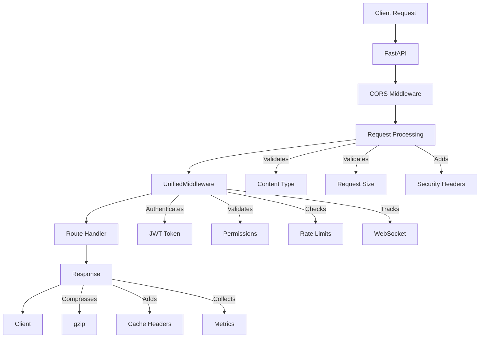

# Backend Service

The backend service provides the core functionality for the iPersona system, including interview analysis, prompt management, and data storage.

## Request-to-Response Flow

The application implements a comprehensive request processing pipeline:



### Key Features

1. **Request Processing**
   - Content type validation
   - Request size limits
   - Security headers
   - Form data processing
   - File upload handling

2. **Authentication & Authorization**
   - JWT token validation
   - Role-based access control
   - Permission validation
   - Rate limiting

3. **Response Enhancement**
   - Response compression
   - Cache control
   - Security headers
   - Error standardization

4. **Resource Management**
   - WebSocket connection tracking
   - Cache management
   - Background task handling
   - Resource cleanup

5. **Monitoring**
   - Request metrics
   - Error tracking
   - Performance monitoring
   - Health checks

## Directory Structure

```
backend/
├── api/                 # FastAPI routes and endpoints
├── core/               # Core system components
│   ├── services/      # Business services (Strapi, etc.)
│   ├── schemas/       # Data models and validation
│   ├── interfaces/    # Abstract interfaces
│   ├── metrics/       # Monitoring and metrics
│   └── utils/         # Utility functions
├── config/            # Configuration management
├── docs/              # Documentation
├── notebooks/         # Testing and example notebooks
├── prompt_manager/    # Prompt template management
├── scripts/           # Utility scripts
└── tests/             # Test suites
```

## Features

- Dynamic Strapi service for flexible data management
- Type-safe schema validation using Pydantic
- Prompt template management system
- Comprehensive test suite and example notebooks
- Docker and PM2 deployment support

## Prerequisites

- Python 3.8+
- Node.js 16+ (for PM2)
- Docker and Docker Compose (optional)
- uv package manager

## Development Setup

1. Create virtual environment:
```bash
python -m venv .venv
source .venv/bin/activate  # or .venv\Scripts\activate on Windows
```

2. Install dependencies:
```bash
pip install -r requirements.txt
pip install -r requirements-dev.txt  # for development
```

3. Configure environment:
```bash
cp .env.example .env
# Edit .env with your settings
```

4. Run development server:
```bash
uvicorn app:app --reload
```

## Testing

1. Run unit tests:
```bash
pytest tests/
```

2. Run notebooks:
```bash
jupyter lab notebooks/
```

Available notebooks:
- `01_strapi_service_test.ipynb`: Test Strapi service integration
- `02_prompt_manager_test.ipynb`: Test prompt management system
- `test_request_flow.ipynb`: Test request-to-response flow

## Production Deployment

### Using Docker

1. Build image:
```bash
docker build -t tenx-backend .
```

2. Run with Docker Compose:
```bash
docker-compose up -d
```

### Using PM2

1. Install PM2:
```bash
npm install -g pm2
```

2. Start service:
```bash
pm2 start ecosystem.config.js
```

3. Monitor:
```bash
pm2 monit
```

## API Documentation

Once running, access the API documentation at:
- Swagger UI: `http://localhost:8000/docs`
- ReDoc: `http://localhost:8000/redoc`

## Contributing

1. Follow the directory structure
2. Add tests for new features
3. Update documentation
4. Use type hints
5. Follow PEP 8 style guide

## License

MIT License - see LICENSE file for details 