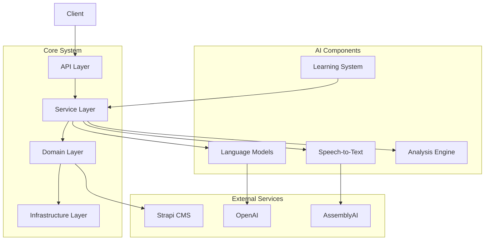

# AI System Guide

## Overview

This guide provides a comprehensive understanding of the iPersona backend system from an AI perspective. It details the system's architecture, design patterns, core abstractions, and areas for potential AI-driven improvements.

## System Architecture



## Code Organization

The backend system follows a clean architecture pattern with clear separation of concerns:

```
tenx_ipersona/backend/
├── core/                 # Core system components
│   ├── base/            # Base classes and abstractions
│   ├── cache/           # Caching infrastructure
│   ├── config/          # Configuration management
│   ├── resilience/      # Resilience patterns
│   ├── telemetry/       # Monitoring and metrics
│   └── utils/           # Utility functions
├── api/                 # API endpoints and routes
├── services/           # Business logic services
├── domain/            # Domain models and logic
├── infrastructure/    # External service adapters
└── ai/                # AI-specific components
    ├── llm/           # Language model integration
    ├── stt/           # Speech-to-text processing
    ├── analysis/      # Analysis and insights
    └── learning/      # Learning and adaptation
```

## Design Patterns

### 1. Protocol-Based Interfaces

The system uses Protocol classes for defining interfaces, enabling better type safety and flexibility:

```python
from typing import Protocol, runtime_checkable
from typing import Optional, List, Dict, Any

@runtime_checkable
class LanguageModel(Protocol):
    """Protocol for language model implementations."""
    
    async def generate_text(
        self,
        prompt: str,
        temperature: float = 0.7,
        max_tokens: int = 100,
        stop: Optional[List[str]] = None
    ) -> str:
        """Generate text response."""
        ...
        
    async def analyze_text(
        self,
        text: str,
        criteria: List[str]
    ) -> Dict[str, Any]:
        """Analyze text content."""
        ...
        
    async def extract_entities(
        self,
        text: str,
        entity_types: List[str]
    ) -> List[Dict[str, Any]]:
        """Extract entities from text."""
        ...

@runtime_checkable
class SpeechToText(Protocol):
    """Protocol for speech-to-text implementations."""
    
    async def transcribe_audio(
        self,
        audio_url: str,
        language: str = "en",
        speaker_labels: bool = False
    ) -> str:
        """Transcribe audio to text."""
        ...
        
    async def detect_language(
        self,
        audio_url: str
    ) -> str:
        """Detect audio language."""
        ...
        
    async def get_word_timestamps(
        self,
        audio_url: str
    ) -> List[Dict[str, Any]]:
        """Get word-level timestamps."""
        ...
```

### 2. Factory Pattern

Factories for creating AI component instances:

```python
class AIComponentFactory:
    """Factory for creating AI components."""
    
    def __init__(self, config: AIConfig):
        self._config = config
        self._components: Dict[str, Any] = {}
        
    def get_language_model(
        self,
        model_type: str = "gpt-4"
    ) -> LanguageModel:
        """Get language model instance."""
        key = f"llm:{model_type}"
        
        if key not in self._components:
            if model_type.startswith("gpt"):
                self._components[key] = OpenAIModel(
                    api_key=self._config.openai_key,
                    model=model_type
                )
            else:
                raise ValueError(f"Unknown model type: {model_type}")
                
        return self._components[key]
        
    def get_speech_to_text(
        self,
        provider: str = "assembly_ai"
    ) -> SpeechToText:
        """Get speech-to-text instance."""
        key = f"stt:{provider}"
        
        if key not in self._components:
            if provider == "assembly_ai":
                self._components[key] = AssemblyAIClient(
                    api_key=self._config.assembly_ai_key
                )
            else:
                raise ValueError(f"Unknown provider: {provider}")
                
        return self._components[key]
```

### 3. Strategy Pattern

Strategies for different AI processing approaches:

```python
class AnalysisStrategy(Protocol):
    """Protocol for analysis strategies."""
    
    async def analyze_interview(
        self,
        questions: List[str],
        answers: List[str]
    ) -> Dict[str, Any]:
        """Analyze interview responses."""
        ...

class StandardAnalysis(AnalysisStrategy):
    """Standard interview analysis strategy."""
    
    def __init__(
        self,
        language_model: LanguageModel,
        metrics: MetricsCollector
    ):
        self._language_model = language_model
        self._metrics = metrics
        
    async def analyze_interview(
        self,
        questions: List[str],
        answers: List[str]
    ) -> Dict[str, Any]:
        """Analyze using standard approach."""
        results = {}
        
        for q, a in zip(questions, answers):
            # Analyze response
            analysis = await self._language_model.analyze_text(
                a,
                criteria=[
                    "relevance",
                    "clarity",
                    "depth",
                    "confidence"
                ]
            )
            
            # Extract key points
            key_points = await self._language_model.extract_entities(
                a,
                entity_types=[
                    "skills",
                    "experience",
                    "achievements"
                ]
            )
            
            results[q] = {
                "analysis": analysis,
                "key_points": key_points
            }
            
        return results

class DeepAnalysis(AnalysisStrategy):
    """Deep interview analysis strategy."""
    
    def __init__(
        self,
        language_model: LanguageModel,
        metrics: MetricsCollector
    ):
        self._language_model = language_model
        self._metrics = metrics
        
    async def analyze_interview(
        self,
        questions: List[str],
        answers: List[str]
    ) -> Dict[str, Any]:
        """Analyze using deep approach."""
        # Combine all answers
        full_text = "\n".join(answers)
        
        # Perform deep analysis
        analysis = await self._language_model.analyze_text(
            full_text,
            criteria=[
                "personality_traits",
                "communication_style",
                "problem_solving",
                "cultural_fit"
            ]
        )
        
        # Generate insights
        insights = await self._language_model.generate_text(
            prompt=f"Analyze the following interview responses and provide key insights: {full_text}",
            temperature=0.7,
            max_tokens=500
        )
        
        return {
            "analysis": analysis,
            "insights": insights,
            "questions": {
                q: await self._analyze_question(q, a)
                for q, a in zip(questions, answers)
            }
        }
        
    async def _analyze_question(
        self,
        question: str,
        answer: str
    ) -> Dict[str, Any]:
        """Analyze individual question."""
        return await self._language_model.analyze_text(
            answer,
            criteria=[
                "relevance",
                "depth",
                "authenticity",
                "impact"
            ]
        )
```

## Core Abstractions

### 1. Interview Session

The core domain model for interview sessions:

```python
class InterviewSession:
    """Interview session domain model."""
    
    def __init__(
        self,
        session_id: UUID,
        user_id: UUID,
        questions: List[str],
        language: str = "en",
        analysis_strategy: Optional[AnalysisStrategy] = None
    ):
        self.id = session_id
        self.user_id = user_id
        self.questions = questions
        self.language = language
        self.answers: List[Optional[str]] = [None] * len(questions)
        self.current_question = 0
        self.status = "in_progress"
        self.analysis: Optional[Dict[str, Any]] = None
        self._strategy = analysis_strategy or StandardAnalysis()
        
    @property
    def is_complete(self) -> bool:
        """Check if session is complete."""
        return all(a is not None for a in self.answers)
        
    async def answer_question(
        self,
        answer: str,
        question_index: Optional[int] = None
    ) -> None:
        """Record answer for question."""
        idx = question_index if question_index is not None else self.current_question
        
        if idx < 0 or idx >= len(self.questions):
            raise ValueError("Invalid question index")
            
        self.answers[idx] = answer
        
        if question_index is None:
            self.current_question = min(
                self.current_question + 1,
                len(self.questions)
            )
            
        if self.is_complete:
            self.status = "completed"
            
    async def analyze(self) -> Dict[str, Any]:
        """Analyze interview responses."""
        if not self.is_complete:
            raise ValueError("Interview not complete")
            
        self.analysis = await self._strategy.analyze_interview(
            self.questions,
            self.answers
        )
        return self.analysis
```

### 2. AI Service

The service layer for AI operations:

```python
class AIService:
    """Service for AI operations."""
    
    def __init__(
        self,
        factory: AIComponentFactory,
        cache: CacheService,
        metrics: MetricsCollector,
        logger: LogManager
    ):
        self._factory = factory
        self._cache = cache
        self._metrics = metrics
        self._logger = logger
        
    async def process_audio(
        self,
        audio_url: str,
        language: Optional[str] = None
    ) -> str:
        """Process audio input."""
        # Check cache
        cache_key = f"transcript:{audio_url}"
        transcript = await self._cache.get(cache_key)
        
        if transcript:
            return transcript
            
        # Get STT client
        stt = self._factory.get_speech_to_text()
        
        try:
            # Detect language if not provided
            if not language:
                language = await stt.detect_language(audio_url)
                
            # Transcribe audio
            transcript = await stt.transcribe_audio(
                audio_url,
                language=language
            )
            
            # Cache result
            await self._cache.set(
                cache_key,
                transcript,
                ttl=3600
            )
            
            # Record metrics
            self._metrics.histogram(
                "audio_processing_duration",
                time.time() - start_time,
                {"language": language}
            )
            
            return transcript
            
        except Exception as e:
            self._logger.error(
                f"Audio processing failed: {e}",
                exc_info=True
            )
            raise
            
    async def analyze_response(
        self,
        question: str,
        answer: str,
        context: Optional[Dict[str, Any]] = None
    ) -> Dict[str, Any]:
        """Analyze interview response."""
        # Get language model
        llm = self._factory.get_language_model()
        
        try:
            # Build analysis prompt
            prompt = self._build_analysis_prompt(
                question,
                answer,
                context
            )
            
            # Generate analysis
            analysis = await llm.analyze_text(
                prompt,
                criteria=[
                    "relevance",
                    "clarity",
                    "depth",
                    "authenticity"
                ]
            )
            
            # Extract insights
            insights = await llm.generate_text(
                prompt=f"Provide key insights from this response: {answer}",
                temperature=0.7,
                max_tokens=200
            )
            
            return {
                "analysis": analysis,
                "insights": insights
            }
            
        except Exception as e:
            self._logger.error(
                f"Response analysis failed: {e}",
                exc_info=True
            )
            raise
            
    def _build_analysis_prompt(
        self,
        question: str,
        answer: str,
        context: Optional[Dict[str, Any]] = None
    ) -> str:
        """Build analysis prompt."""
        prompt = f"Question: {question}\nAnswer: {answer}\n\n"
        
        if context:
            prompt += "Context:\n"
            for key, value in context.items():
                prompt += f"{key}: {value}\n"
                
        prompt += "\nAnalyze this interview response considering:"
        prompt += "\n- Relevance to the question"
        prompt += "\n- Clarity of communication"
        prompt += "\n- Depth of understanding"
        prompt += "\n- Authenticity of response"
        
        return prompt
```

## Improvement Areas

### 1. Enhanced Language Models

Potential improvements for language model integration:

```python
class EnhancedLanguageModel(LanguageModel):
    """Enhanced language model with advanced capabilities."""
    
    async def generate_text(
        self,
        prompt: str,
        temperature: float = 0.7,
        max_tokens: int = 100,
        stop: Optional[List[str]] = None
    ) -> str:
        """Generate text with enhanced control."""
        # Add system context
        context = self._build_system_context()
        
        # Add few-shot examples
        examples = await self._get_relevant_examples(prompt)
        
        # Generate response
        response = await self._generate_with_retry(
            context=context,
            examples=examples,
            prompt=prompt,
            temperature=temperature,
            max_tokens=max_tokens,
            stop=stop
        )
        
        # Post-process response
        return await self._post_process_response(response)
        
    async def _build_system_context(self) -> str:
        """Build system context."""
        return """You are an AI assistant specialized in conducting interviews.
        Your role is to provide clear, relevant, and insightful responses
        while maintaining a professional and engaging conversation."""
        
    async def _get_relevant_examples(
        self,
        prompt: str
    ) -> List[Dict[str, str]]:
        """Get relevant few-shot examples."""
        # Search example database
        examples = await self._search_examples(prompt)
        
        # Filter and rank examples
        ranked_examples = self._rank_examples(examples, prompt)
        
        # Return top examples
        return ranked_examples[:3]
        
    async def _generate_with_retry(
        self,
        **kwargs: Any
    ) -> str:
        """Generate with retry logic."""
        max_retries = 3
        base_delay = 1.0
        
        for attempt in range(max_retries):
            try:
                return await self._client.generate(**kwargs)
                
            except Exception as e:
                if attempt == max_retries - 1:
                    raise
                    
                delay = base_delay * (2 ** attempt)
                await asyncio.sleep(delay)
```

### 2. Learning System

Implementation for continuous learning and improvement:

```python
class LearningSystem:
    """System for continuous learning and improvement."""
    
    def __init__(
        self,
        database: DatabaseService,
        metrics: MetricsCollector
    ):
        self._database = database
        self._metrics = metrics
        self._model = self._init_model()
        
    async def record_interaction(
        self,
        session_id: UUID,
        interaction_type: str,
        data: Dict[str, Any]
    ) -> None:
        """Record interaction for learning."""
        # Store interaction
        await self._database.store_interaction(
            session_id=session_id,
            type=interaction_type,
            data=data
        )
        
        # Update metrics
        self._metrics.counter(
            "interactions_recorded",
            1,
            {"type": interaction_type}
        )
        
    async def train(
        self,
        start_date: datetime,
        end_date: datetime
    ) -> None:
        """Train model on historical data."""
        # Get training data
        data = await self._database.get_interactions(
            start_date=start_date,
            end_date=end_date
        )
        
        # Prepare features
        features = self._prepare_features(data)
        
        # Train model
        self._model.train(features)
        
        # Update metrics
        self._metrics.gauge(
            "model_version",
            self._model.version
        )
        
    async def get_recommendations(
        self,
        session_id: UUID,
        context: Dict[str, Any]
    ) -> List[Dict[str, Any]]:
        """Get recommendations for session."""
        # Get session history
        history = await self._database.get_session_history(
            session_id
        )
        
        # Prepare input
        features = self._prepare_features({
            "history": history,
            "context": context
        })
        
        # Generate recommendations
        return self._model.predict(features)
```

### 3. Analysis Engine

Enhanced analysis capabilities:

```python
class AdvancedAnalysisEngine:
    """Advanced analysis engine."""
    
    def __init__(
        self,
        language_model: LanguageModel,
        learning_system: LearningSystem,
        metrics: MetricsCollector
    ):
        self._language_model = language_model
        self._learning_system = learning_system
        self._metrics = metrics
        
    async def analyze_session(
        self,
        session: InterviewSession
    ) -> Dict[str, Any]:
        """Perform advanced session analysis."""
        # Get historical context
        context = await self._get_historical_context(
            session.user_id
        )
        
        # Analyze responses
        response_analysis = await self._analyze_responses(
            session.questions,
            session.answers,
            context
        )
        
        # Generate insights
        insights = await self._generate_insights(
            session,
            response_analysis
        )
        
        # Get recommendations
        recommendations = await self._learning_system.get_recommendations(
            session.id,
            {
                "analysis": response_analysis,
                "insights": insights
            }
        )
        
        return {
            "response_analysis": response_analysis,
            "insights": insights,
            "recommendations": recommendations
        }
        
    async def _analyze_responses(
        self,
        questions: List[str],
        answers: List[str],
        context: Dict[str, Any]
    ) -> Dict[str, Any]:
        """Analyze individual responses."""
        results = {}
        
        for q, a in zip(questions, answers):
            # Analyze response
            analysis = await self._language_model.analyze_text(
                a,
                criteria=[
                    "relevance",
                    "clarity",
                    "depth",
                    "authenticity",
                    "emotional_tone",
                    "confidence_level"
                ]
            )
            
            # Extract entities
            entities = await self._language_model.extract_entities(
                a,
                entity_types=[
                    "skills",
                    "experience",
                    "achievements",
                    "values",
                    "goals"
                ]
            )
            
            results[q] = {
                "analysis": analysis,
                "entities": entities
            }
            
        return results
        
    async def _generate_insights(
        self,
        session: InterviewSession,
        analysis: Dict[str, Any]
    ) -> Dict[str, Any]:
        """Generate session insights."""
        # Combine all responses
        full_text = "\n".join(session.answers)
        
        # Generate overall analysis
        overall = await self._language_model.analyze_text(
            full_text,
            criteria=[
                "communication_style",
                "problem_solving",
                "cultural_fit",
                "potential_fit",
                "growth_potential"
            ]
        )
        
        # Generate recommendations
        recommendations = await self._language_model.generate_text(
            prompt=self._build_recommendation_prompt(
                session,
                analysis,
                overall
            ),
            temperature=0.7,
            max_tokens=500
        )
        
        return {
            "overall_analysis": overall,
            "recommendations": recommendations
        }
```

## Testing Strategy

### 1. AI Component Tests

```python
@pytest.mark.asyncio
async def test_language_model():
    """Test language model capabilities."""
    model = EnhancedLanguageModel(config)
    
    # Test text generation
    response = await model.generate_text(
        "What are your strengths?",
        temperature=0.7
    )
    assert len(response) > 0
    
    # Test analysis
    analysis = await model.analyze_text(
        "I have 5 years of experience in Python development",
        criteria=["relevance", "clarity"]
    )
    assert "relevance" in analysis
    assert "clarity" in analysis
    
    # Test entity extraction
    entities = await model.extract_entities(
        "I led a team of 5 developers and increased productivity by 30%",
        entity_types=["skills", "achievements"]
    )
    assert len(entities) > 0

@pytest.mark.asyncio
async def test_learning_system():
    """Test learning system capabilities."""
    system = LearningSystem(database, metrics)
    
    # Record interaction
    await system.record_interaction(
        session_id=uuid.uuid4(),
        interaction_type="response",
        data={
            "question": "What are your strengths?",
            "answer": "I am a quick learner"
        }
    )
    
    # Train model
    await system.train(
        start_date=datetime.now() - timedelta(days=30),
        end_date=datetime.now()
    )
    
    # Get recommendations
    recommendations = await system.get_recommendations(
        session_id=uuid.uuid4(),
        context={"role": "developer"}
    )
    assert len(recommendations) > 0
```

### 2. Integration Tests

```python
@pytest.mark.asyncio
async def test_interview_flow():
    """Test complete interview flow with AI components."""
    # Create session
    session = InterviewSession(
        session_id=uuid.uuid4(),
        user_id=uuid.uuid4(),
        questions=[
            "What are your strengths?",
            "Why do you want this role?"
        ]
    )
    
    # Process audio response
    audio_url = "test_audio.wav"
    transcript = await ai_service.process_audio(audio_url)
    await session.answer_question(transcript)
    
    # Analyze response
    analysis = await ai_service.analyze_response(
        session.questions[0],
        transcript
    )
    assert "analysis" in analysis
    assert "insights" in analysis
    
    # Complete session
    await session.answer_question(
        "I am passionate about technology"
    )
    
    # Generate final analysis
    final_analysis = await session.analyze()
    assert final_analysis is not None
```

### 3. Performance Tests

```python
@pytest.mark.performance
async def test_ai_performance():
    """Test AI component performance."""
    # Configure test
    num_requests = 100
    concurrent_requests = 10
    
    # Test language model
    async def test_generation():
        response = await language_model.generate_text(
            "Test prompt",
            max_tokens=50
        )
        assert len(response) > 0
        
    # Run concurrent requests
    start_time = time.time()
    tasks = [
        test_generation()
        for _ in range(num_requests)
    ]
    await asyncio.gather(*tasks)
    
    # Verify performance
    duration = time.time() - start_time
    assert duration < 30.0  # Max 30 seconds
```

## Monitoring and Metrics

### 1. AI-Specific Metrics

```python
class AIMetrics:
    """AI-specific metrics collection."""
    
    def __init__(self, collector: MetricsCollector):
        self._collector = collector
        
        # Register metrics
        self._collector.register(
            "llm_requests",
            MetricType.COUNTER,
            description="Language model request count",
            labels=["model", "operation"]
        )
        
        self._collector.register(
            "llm_latency",
            MetricType.HISTOGRAM,
            description="Language model request latency",
            labels=["model", "operation"]
        )
        
        self._collector.register(
            "llm_token_usage",
            MetricType.COUNTER,
            description="Language model token usage",
            labels=["model", "operation"]
        )
        
        self._collector.register(
            "stt_requests",
            MetricType.COUNTER,
            description="Speech-to-text request count",
            labels=["provider", "language"]
        )
        
        self._collector.register(
            "stt_latency",
            MetricType.HISTOGRAM,
            description="Speech-to-text processing latency",
            labels=["provider", "language"]
        )
        
        self._collector.register(
            "analysis_quality",
            MetricType.GAUGE,
            description="Analysis quality score",
            labels=["type"]
        )
```

### 2. Health Checks

```python
class AIHealthCheck:
    """Health check for AI components."""
    
    def __init__(
        self,
        language_model: LanguageModel,
        speech_to_text: SpeechToText,
        metrics: MetricsCollector
    ):
        self._language_model = language_model
        self._speech_to_text = speech_to_text
        self._metrics = metrics
        
    async def check_health(self) -> HealthResult:
        """Check AI component health."""
        results = {}
        
        # Check language model
        try:
            response = await self._language_model.generate_text(
                "Test prompt",
                max_tokens=10
            )
            results["language_model"] = {
                "status": "healthy",
                "latency": response.latency
            }
        except Exception as e:
            results["language_model"] = {
                "status": "unhealthy",
                "error": str(e)
            }
            
        # Check speech-to-text
        try:
            await self._speech_to_text.detect_language(
                "test_audio.wav"
            )
            results["speech_to_text"] = {
                "status": "healthy"
            }
        except Exception as e:
            results["speech_to_text"] = {
                "status": "unhealthy",
                "error": str(e)
            }
            
        # Update metrics
        for component, result in results.items():
            self._metrics.gauge(
                "ai_component_health",
                1 if result["status"] == "healthy" else 0,
                {"component": component}
            )
            
        return results
```

## Future Considerations

1. **Model Improvements**
   - Implement model versioning and A/B testing
   - Add support for fine-tuning on domain-specific data
   - Explore multi-model ensembles for improved accuracy

2. **Performance Optimization**
   - Implement request batching for improved throughput
   - Add caching layers for frequent queries
   - Optimize token usage and model selection

3. **Monitoring Enhancements**
   - Add detailed model performance tracking
   - Implement drift detection for model outputs
   - Add automated quality assessments

4. **Integration Opportunities**
   - Explore additional language model providers
   - Add support for more speech-to-text services
   - Implement sentiment analysis capabilities 