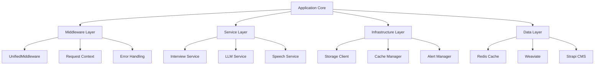
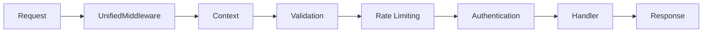
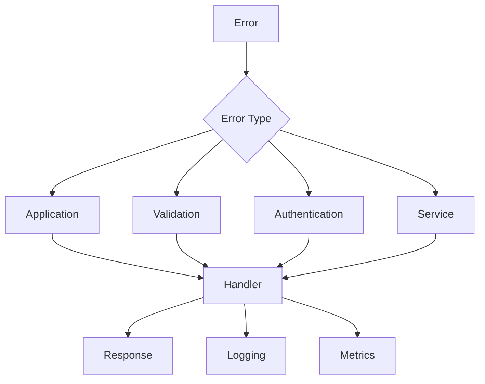

# Backend Architecture

## Overview

The TenX iPersona backend is built on a modular architecture that emphasizes maintainability, scalability, and reliability. This document outlines the key architectural components and their interactions.

## Core Components

## Middleware Architecture

The middleware layer provides a unified approach to request processing and cross-cutting concerns:

### UnifiedMiddleware Features

1. **Request Context**
   - Request ID generation
   - Timing tracking
   - Correlation IDs
   - Request metadata

2. **Validation**
   - Content length checks
   - Content type validation
   - JSON schema validation
   - Field size limits

3. **Rate Limiting**
   - Request rate tracking
   - Quota enforcement
   - Client identification
   - Rate limit headers

4. **Authentication**
   - Token validation
   - Permission checks
   - Role-based access
   - Session management

5. **Error Handling**
   - Error standardization
   - Status code mapping
   - Error context
   - Recovery actions

## Service Layer

The service layer implements core business logic:

1. **Interview Service**
   - Interview flow management
   - Question generation
   - Response processing
   - State management

2. **LLM Service**
   - Model integration
   - Prompt management
   - Response generation
   - Context handling

3. **Speech Service**
   - Text-to-speech
   - Speech-to-text
   - Audio processing
   - Stream management

## Infrastructure Layer

The infrastructure layer provides core functionality:

1. **Storage Client**
   - Data persistence
   - Query handling
   - Circuit breaking
   - Connection pooling

2. **Cache Manager**
   - Data caching
   - TTL management
   - Cache invalidation
   - Cache statistics

3. **Alert Manager**
   - Alert generation
   - Severity tracking
   - Recovery actions
   - Alert history

## Data Layer

The data layer manages persistent storage:

1. **Redis Cache**
   - Fast data access
   - Session storage
   - Rate limiting
   - Pub/sub messaging

2. **Weaviate**
   - Vector storage
   - Semantic search
   - Data indexing
   - Query optimization

3. **Strapi CMS**
   - Content management
   - API generation
   - Data modeling
   - Access control

## Error Handling

The application implements a standardized error handling approach:

## Resource Management

The application ensures proper resource management:

1. **Connection Pooling**
   - Database connections
   - HTTP clients
   - Cache connections
   - Service clients

2. **Cleanup Procedures**
   - Request cleanup
   - Cache invalidation
   - File cleanup
   - Memory management

3. **Health Monitoring**
   - Service health
   - Resource usage
   - Error rates
   - Performance metrics 