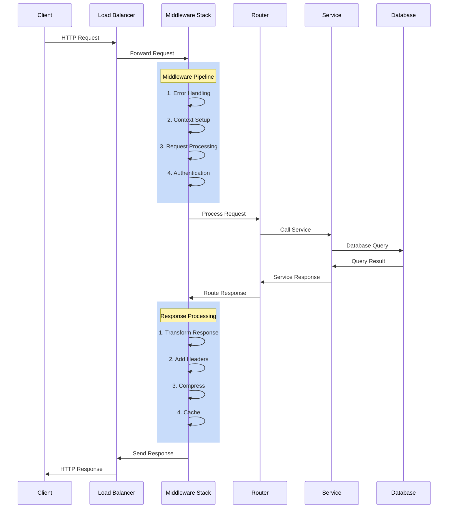
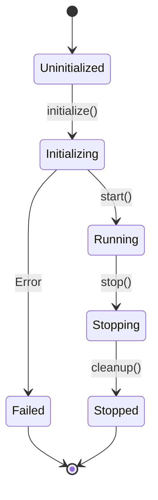
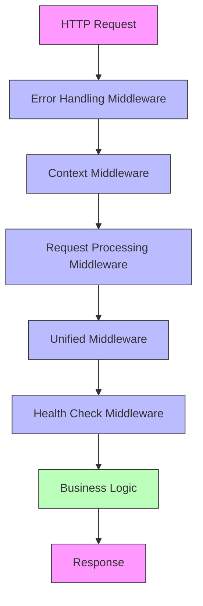
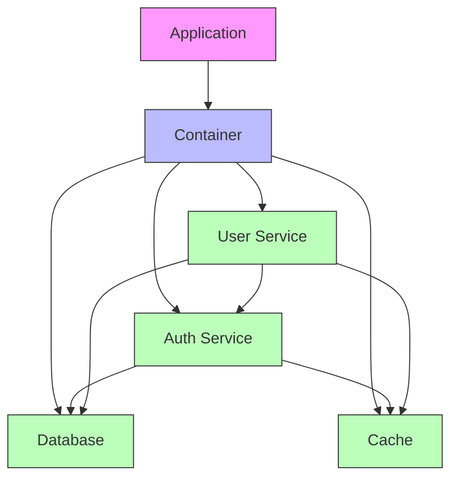
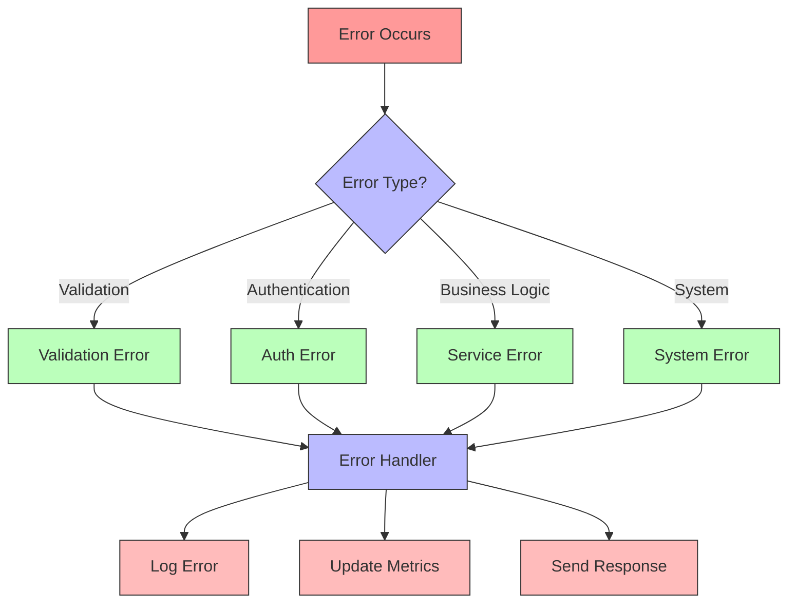
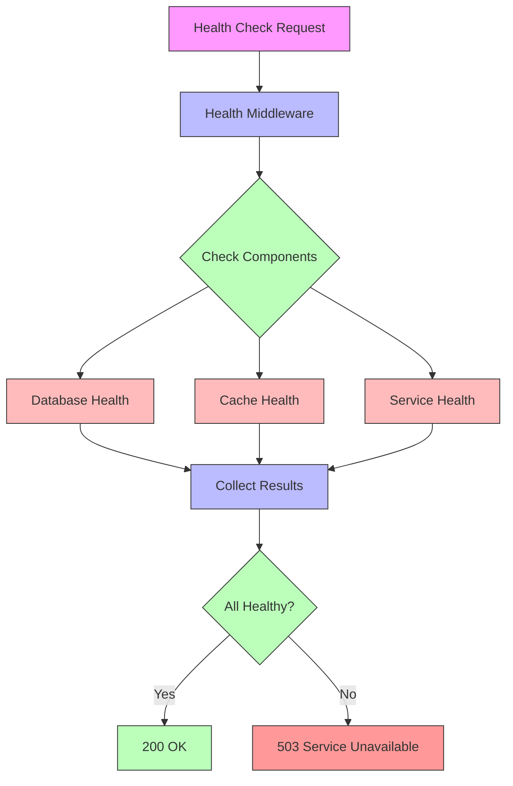
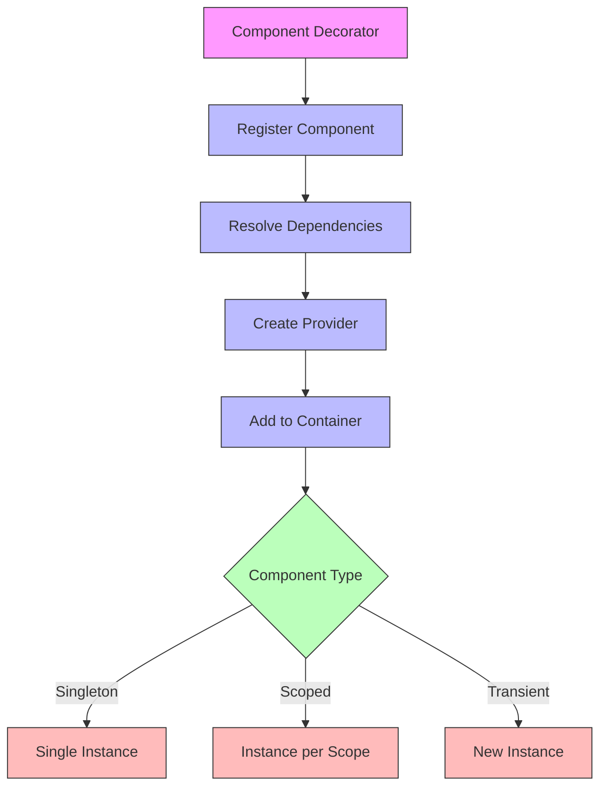

# Architecture Diagrams

## Request Flow

```mermaid
sequenceDiagram
    participant C as Client
    participant LB as Load Balancer
    participant M as Middleware Stack
    participant R as Router
    participant S as Service
    participant D as Database

    C->>LB: HTTP Request
    LB->>M: Forward Request
    
    rect rgb(200, 220, 250)
        Note over M: Middleware Pipeline
        M->>M: 1. Error Handling
        M->>M: 2. Context Setup
        M->>M: 3. Request Processing
        M->>M: 4. Authentication
    end
    
    M->>R: Process Request
    R->>S: Call Service
    S->>D: Database Query
    D->>S: Query Result
    S->>R: Service Response
    R->>M: Route Response
    
    rect rgb(200, 220, 250)
        Note over M: Response Processing
        M->>M: 1. Transform Response
        M->>M: 2. Add Headers
        M->>M: 3. Compress
        M->>M: 4. Cache
    end
    
    M->>LB: Send Response
    LB->>C: HTTP Response
```

## Component Lifecycle

```mermaid
stateDiagram-v2
    [*] --> Uninitialized
    Uninitialized --> Initializing: initialize()
    Initializing --> Running: start()
    Initializing --> Failed: Error
    Running --> Stopping: stop()
    Stopping --> Stopped: cleanup()
    Failed --> [*]
    Stopped --> [*]
```

## Middleware Stack

```mermaid
graph TD
    A[HTTP Request] --> B[Error Handling Middleware]
    B --> C[Context Middleware]
    C --> D[Request Processing Middleware]
    D --> E[Unified Middleware]
    E --> F[Health Check Middleware]
    F --> G[Business Logic]
    G --> H[Response]
    
    style A fill:#f9f,stroke:#333
    style B fill:#bbf,stroke:#333
    style C fill:#bbf,stroke:#333
    style D fill:#bbf,stroke:#333
    style E fill:#bbf,stroke:#333
    style F fill:#bbf,stroke:#333
    style G fill:#bfb,stroke:#333
    style H fill:#f9f,stroke:#333
```

## Component Dependencies

```mermaid
graph TD
    A[Application] --> B[Container]
    B --> C[Database]
    B --> D[Cache]
    B --> E[Auth Service]
    E --> C
    E --> D
    B --> F[User Service]
    F --> C
    F --> D
    F --> E
    
    style A fill:#f9f,stroke:#333
    style B fill:#bbf,stroke:#333
    style C fill:#bfb,stroke:#333
    style D fill:#bfb,stroke:#333
    style E fill:#bfb,stroke:#333
    style F fill:#bfb,stroke:#333
```

## Error Handling Flow

```mermaid
graph TD
    A[Error Occurs] --> B{Error Type?}
    B -->|Validation| C[Validation Error]
    B -->|Authentication| D[Auth Error]
    B -->|Business Logic| E[Service Error]
    B -->|System| F[System Error]
    
    C --> G[Error Handler]
    D --> G
    E --> G
    F --> G
    
    G --> H[Log Error]
    G --> I[Update Metrics]
    G --> J[Send Response]
    
    style A fill:#f99,stroke:#333
    style B fill:#bbf,stroke:#333
    style C fill:#bfb,stroke:#333
    style D fill:#bfb,stroke:#333
    style E fill:#bfb,stroke:#333
    style F fill:#bfb,stroke:#333
    style G fill:#bbf,stroke:#333
    style H fill:#fbb,stroke:#333
    style I fill:#fbb,stroke:#333
    style J fill:#fbb,stroke:#333
```

## Health Check System

```mermaid
graph TD
    A[Health Check Request] --> B[Health Middleware]
    B --> C{Check Components}
    C --> D[Database Health]
    C --> E[Cache Health]
    C --> F[Service Health]
    
    D --> G[Collect Results]
    E --> G
    F --> G
    
    G --> H{All Healthy?}
    H -->|Yes| I[200 OK]
    H -->|No| J[503 Service Unavailable]
    
    style A fill:#f9f,stroke:#333
    style B fill:#bbf,stroke:#333
    style C fill:#bfb,stroke:#333
    style D fill:#fbb,stroke:#333
    style E fill:#fbb,stroke:#333
    style F fill:#fbb,stroke:#333
    style G fill:#bbf,stroke:#333
    style H fill:#bfb,stroke:#333
    style I fill:#bfb,stroke:#333
    style J fill:#f99,stroke:#333
```

## Component Registration

```mermaid
graph TD
    A[Component Decorator] --> B[Register Component]
    B --> C[Resolve Dependencies]
    C --> D[Create Provider]
    D --> E[Add to Container]
    
    E --> F{Component Type}
    F -->|Singleton| G[Single Instance]
    F -->|Scoped| H[Instance per Scope]
    F -->|Transient| I[New Instance]
    
    style A fill:#f9f,stroke:#333
    style B fill:#bbf,stroke:#333
    style C fill:#bbf,stroke:#333
    style D fill:#bbf,stroke:#333
    style E fill:#bbf,stroke:#333
    style F fill:#bfb,stroke:#333
    style G fill:#fbb,stroke:#333
    style H fill:#fbb,stroke:#333
    style I fill:#fbb,stroke:#333
``` 