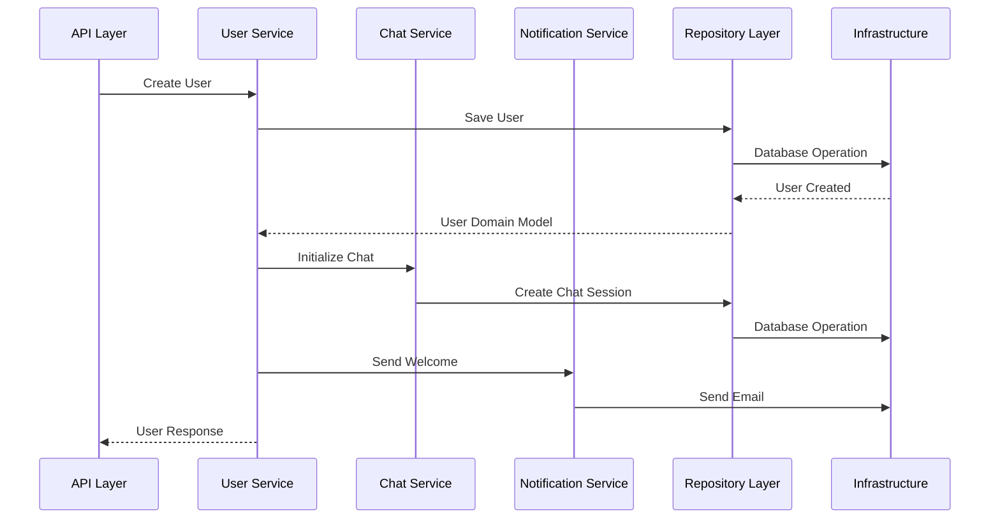
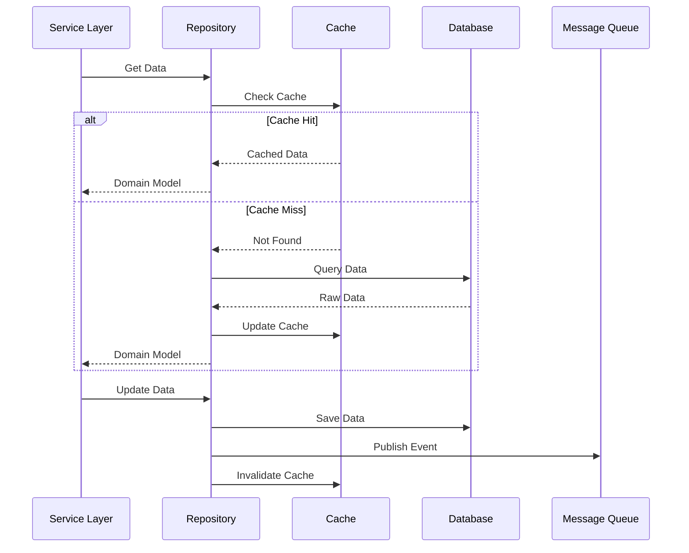
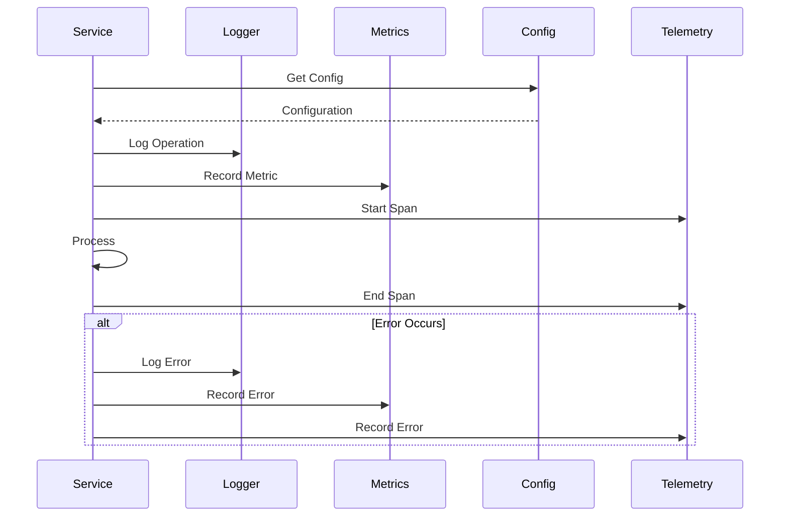
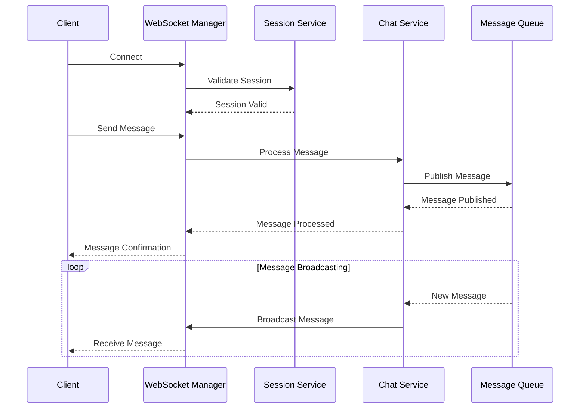
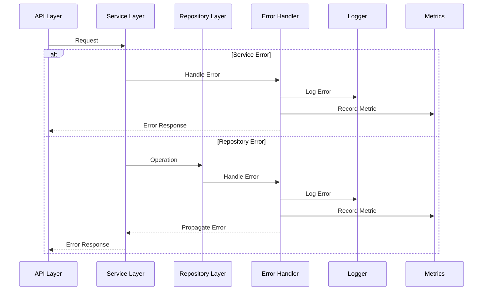
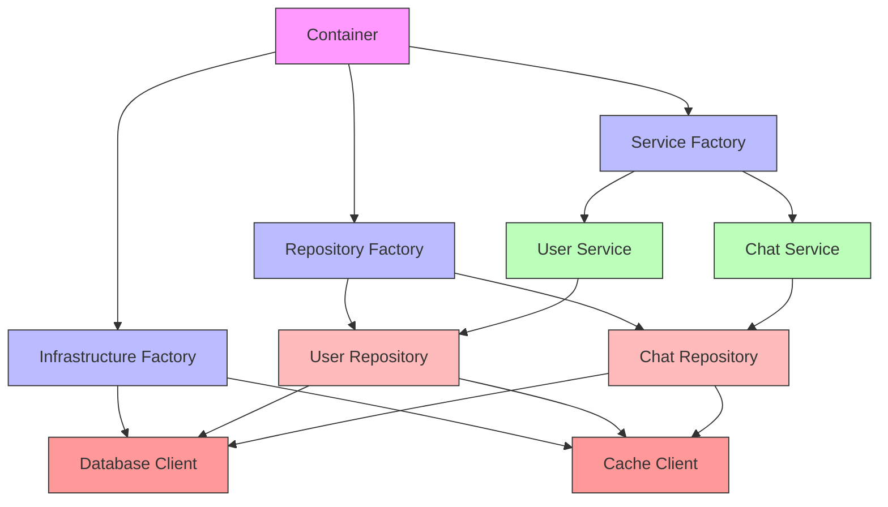

# Component Interactions

## Overview

This document illustrates how different components in the system interact with each other, showing the flow of data and control between layers and components.

## High-Level Component Architecture

```mermaid
graph TD
    subgraph "API Layer"
        A1[REST Controllers]
        A2[WebSocket Controllers]
        A3[GraphQL Resolvers]
    end
    
    subgraph "Service Layer"
        B1[User Service]
        B2[Chat Service]
        B3[Session Service]
        B4[Notification Service]
    end
    
    subgraph "Domain Layer"
        C1[User Domain]
        C2[Chat Domain]
        C3[Session Domain]
    end
    
    subgraph "Repository Layer"
        D1[User Repository]
        D2[Chat Repository]
        D3[Session Repository]
    end
    
    subgraph "Infrastructure Layer"
        E1[Database]
        E2[Cache]
        E3[Message Queue]
        E4[External APIs]
    end
    
    subgraph "Core Components"
        F1[Configuration]
        F2[Logging]
        F3[Telemetry]
        F4[Security]
    end
    
    A1 --> B1
    A1 --> B3
    A2 --> B2
    A3 --> B1
    
    B1 --> C1
    B2 --> C2
    B3 --> C3
    
    B1 --> D1
    B2 --> D2
    B3 --> D3
    
    D1 --> E1
    D1 --> E2
    D2 --> E1
    D2 --> E3
    D3 --> E2
    
    F1 -.-> B1
    F1 -.-> B2
    F1 -.-> B3
    F2 -.-> D1
    F2 -.-> D2
    F2 -.-> D3
    F3 -.-> E1
    F3 -.-> E2
    F4 -.-> A1
    F4 -.-> A2
    
    <!-- style A1 fill:#f9f,stroke:#333
    style A2 fill:#f9f,stroke:#333
    style A3 fill:#f9f,stroke:#333
    style B1 fill:#bbf,stroke:#333
    style B2 fill:#bbf,stroke:#333
    style B3 fill:#bbf,stroke:#333
    style B4 fill:#bbf,stroke:#333
    style C1 fill:#bfb,stroke:#333
    style C2 fill:#bfb,stroke:#333
    style C3 fill:#bfb,stroke:#333
    style D1 fill:#fbb,stroke:#333
    style D2 fill:#fbb,stroke:#333
    style D3 fill:#fbb,stroke:#333
    style E1 fill:#f99,stroke:#333
    style E2 fill:#f99,stroke:#333
    style E3 fill:#f99,stroke:#333
    style E4 fill:#f99,stroke:#333
    style F1 fill:#9ff,stroke:#333
    style F2 fill:#9ff,stroke:#333
    style F3 fill:#9ff,stroke:#333
    style F4 fill:#9ff,stroke:#333 -->
```

## Service Layer Interactions



## Repository-Infrastructure Interaction



## Core Component Usage



## WebSocket Communication



## Error Handling Flow



## Dependency Injection Flow



## Best Practices

1. **Clear Boundaries**
   - Well-defined interfaces between components
   - Explicit dependencies
   - Loose coupling

2. **Dependency Flow**
   - Dependencies flow inward
   - Core components are independent
   - Infrastructure depends on abstractions

3. **Error Propagation**
   - Consistent error handling
   - Error translation at boundaries
   - Proper logging and metrics

4. **Performance**
   - Efficient communication patterns
   - Proper use of caching
   - Asynchronous operations where appropriate

## Implementation Examples

### Service-Repository Interaction

```python
class UserService:
    def __init__(
        self,
        repository: UserRepository,
        notification_service: NotificationService
    ):
        self.repository = repository
        self.notification = notification_service
        
    async def create_user(self, user: User) -> User:
        # Domain logic
        user.validate()
        user.set_defaults()
        
        # Persistence
        created = await self.repository.create(user)
        
        # Side effects
        await self.notification.send_welcome(created)
        
        return created
```

### Repository-Infrastructure Interaction

```python
class UserRepository:
    def __init__(
        self,
        database: Database,
        cache: Cache,
        event_bus: EventBus
    ):
        self.db = database
        self.cache = cache
        self.events = event_bus
        
    async def get(self, id: str) -> Optional[User]:
        # Try cache
        cached = await self.cache.get(f"user:{id}")
        if cached:
            return User.from_cache(cached)
            
        # Database query
        result = await self.db.users.find_one({"_id": id})
        if not result:
            return None
            
        # Cache result
        user = User.from_db(result)
        await self.cache.set(f"user:{id}", user.to_cache())
        
        return user
```
``` 