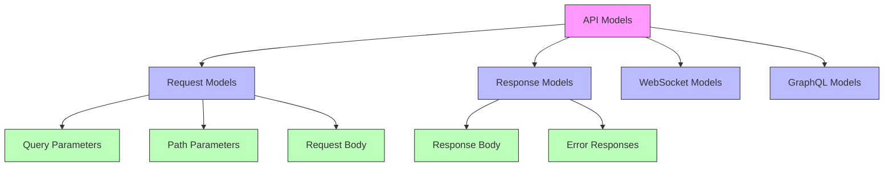

# API Models

## Overview

API models represent the interface between the system and external clients. They handle request/response data structures, validation, serialization, and API-specific concerns while keeping the domain models clean and independent.

## Structure



## Key Components

### 1. Request Models

Models for validating and structuring incoming requests:

```python
class CreateUserRequest(BaseModel):
    username: str = Field(..., min_length=3, max_length=50)
    email: EmailStr
    password: str = Field(..., min_length=8)
    role_id: Optional[str] = None
    
    @validator('username')
    def username_alphanumeric(cls, v):
        if not v.isalnum():
            raise ValueError('Username must be alphanumeric')
        return v
    
    def to_domain(self) -> User:
        return User(
            username=self.username,
            email=self.email,
            role_id=self.role_id
        )
```

### 2. Response Models

Models for formatting and validating outgoing responses:

```python
class UserResponse(BaseModel):
    id: str
    username: str
    email: str
    role: RoleResponse
    created_at: datetime
    
    @classmethod
    def from_domain(cls, user: User) -> "UserResponse":
        return cls(
            id=user.id,
            username=user.username,
            email=user.email,
            role=RoleResponse.from_domain(user.role),
            created_at=user.created_at
        )
        
    class Config:
        schema_extra = {
            "example": {
                "id": "123",
                "username": "john_doe",
                "email": "john@example.com",
                "role": {
                    "id": "456",
                    "name": "user"
                },
                "created_at": "2023-01-01T00:00:00Z"
            }
        }
```

### 3. WebSocket Models

Models for real-time communication:

```python
class WSMessage(BaseModel):
    type: str
    payload: Dict[str, Any]
    
    @classmethod
    def chat_message(cls, message: str, user_id: str) -> "WSMessage":
        return cls(
            type="chat_message",
            payload={
                "message": message,
                "user_id": user_id,
                "timestamp": datetime.utcnow().isoformat()
            }
        )
```

### 4. GraphQL Models

Models for GraphQL schema and operations:

```python
class UserType(ObjectType):
    id = ID(required=True)
    username = String(required=True)
    email = String(required=True)
    role = Field(lambda: RoleType)
    
    @staticmethod
    def resolve_role(root, info):
        return root.role
```

## API Patterns

### 1. Request Validation

Comprehensive input validation:

```python
class PaginationParams(BaseModel):
    page: int = Field(1, ge=1)
    per_page: int = Field(10, ge=1, le=100)
    
    def to_skip_limit(self) -> Tuple[int, int]:
        skip = (self.page - 1) * self.per_page
        return skip, self.per_page
        
    @validator('per_page')
    def validate_per_page(cls, v):
        if v > 100:
            raise ValueError('Maximum items per page is 100')
        return v
```

### 2. Response Formatting

Consistent response structure:

```python
class APIResponse(BaseModel):
    success: bool
    data: Optional[Any] = None
    error: Optional[str] = None
    meta: Optional[Dict[str, Any]] = None
    
    @classmethod
    def ok(cls, data: Any, meta: Optional[Dict[str, Any]] = None) -> "APIResponse":
        return cls(
            success=True,
            data=data,
            meta=meta
        )
        
    @classmethod
    def error(cls, message: str) -> "APIResponse":
        return cls(
            success=False,
            error=message
        )
```

### 3. Error Handling

API-specific error responses:

```python
class APIError(Exception):
    def __init__(
        self,
        message: str,
        status_code: int = 400,
        error_code: str = None
    ):
        self.message = message
        self.status_code = status_code
        self.error_code = error_code
        super().__init__(message)
        
    def to_response(self) -> Dict[str, Any]:
        return {
            "success": False,
            "error": {
                "message": self.message,
                "code": self.error_code
            }
        }
```

## Best Practices

1. **Clean Separation**
   - Keep API models separate from domain models
   - Handle API-specific concerns only
   - Use mappers for conversion

2. **Strong Validation**
   - Validate all inputs
   - Clear error messages
   - Security checks

3. **Documentation**
   - OpenAPI/Swagger specs
   - Examples and schemas
   - Error documentation

4. **Versioning**
   - Clear versioning strategy
   - Backward compatibility
   - Deprecation notices

## Testing

API models should be thoroughly tested:

```python
def test_create_user_request_validation():
    # Valid request
    request = CreateUserRequest(
        username="john_doe",
        email="john@example.com",
        password="secure123"
    )
    assert request.username == "john_doe"
    
    # Invalid username
    with pytest.raises(ValidationError):
        CreateUserRequest(
            username="j",  # too short
            email="john@example.com",
            password="secure123"
        )
```

## API Documentation Generation

Using API models for documentation:

```python
app = FastAPI(
    title="TenX iPersona API",
    description="API for user management and authentication",
    version="1.0.0",
    openapi_tags=[{
        "name": "users",
        "description": "User management operations"
    }]
)

@app.post(
    "/users",
    response_model=UserResponse,
    tags=["users"],
    summary="Create new user",
    status_code=201
)
async def create_user(
    request: CreateUserRequest,
    user_service: UserService = Depends(get_user_service)
):
    """
    Create a new user with the provided information.
    
    - **username**: Unique username for the user
    - **email**: Valid email address
    - **password**: Secure password (min 8 characters)
    """
    user = await user_service.create_user(request.to_domain())
    return UserResponse.from_domain(user)
```
``` 