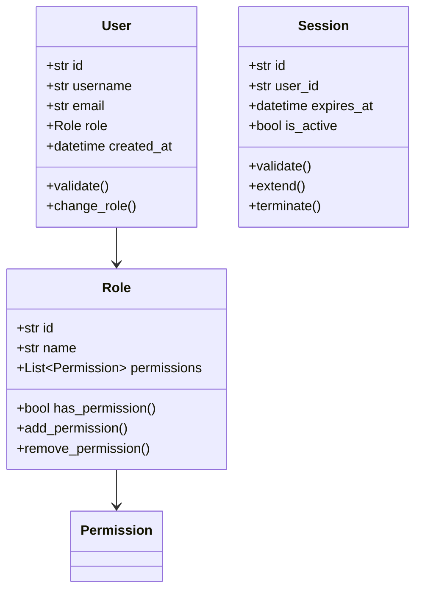

# Domain Models

## Overview

Domain models represent the core business concepts and rules in the system. They are pure Python classes that encapsulate business logic and invariants, independent of any infrastructure or persistence concerns.

## Structure



## Key Characteristics

1. **Pure Business Logic**
   - No infrastructure dependencies
   - No framework dependencies
   - No persistence logic

2. **Rich Domain Behavior**
   - Business rules as methods
   - State validation
   - Domain events

3. **Value Objects**
   - Immutable objects
   - Equality by value
   - Self-validating

## Domain Model Types

### 1. Entities
- Have identity
- Mutable state
- Lifecycle management

Example:
```python
@dataclass
class User:
    id: str
    username: str
    email: str
    role: Role
    created_at: datetime
    
    def change_role(self, new_role: Role) -> None:
        if not self.can_change_role(new_role):
            raise DomainError("Invalid role change")
        self.role = new_role
        
    def can_change_role(self, new_role: Role) -> bool:
        return self.role.allows_upgrade_to(new_role)
```

### 2. Value Objects
- No identity
- Immutable
- Equality by attributes

Example:
```python
@dataclass(frozen=True)
class EmailAddress:
    value: str
    
    def __post_init__(self):
        self.validate()
        
    def validate(self) -> None:
        if not re.match(r"[^@]+@[^@]+\.[^@]+", self.value):
            raise ValueError("Invalid email address")
```

### 3. Aggregates
- Cluster of domain objects
- Single unit of consistency
- Access through root

Example:
```python
class ChatSession:
    def __init__(self, id: str, participants: List[User]):
        self.id = id
        self.participants = participants
        self.messages: List[Message] = []
        
    def add_message(self, message: Message) -> None:
        if message.sender not in self.participants:
            raise DomainError("Sender not in session")
        self.messages.append(message)
        
    def remove_participant(self, user: User) -> None:
        if len(self.participants) <= 2:
            raise DomainError("Cannot remove from 1:1 chat")
        self.participants.remove(user)
```

## Domain Events

Domain models can emit events to notify of important state changes:

```python
class User:
    def __init__(self):
        self.events: List[DomainEvent] = []
        
    def change_email(self, new_email: str) -> None:
        old_email = self.email
        self.email = new_email
        self.events.append(
            EmailChangedEvent(
                user_id=self.id,
                old_email=old_email,
                new_email=new_email
            )
        )
```

## Validation Rules

1. **Attribute Validation**
   - Type checking
   - Range validation
   - Format validation

2. **State Validation**
   - Business rule checking
   - Invariant maintenance
   - Relationship validation

3. **Cross-Entity Validation**
   - Aggregate consistency
   - Reference integrity
   - Business constraints

## Best Practices

1. **Keep Models Clean**
   - No persistence logic
   - No serialization code
   - No external dependencies

2. **Rich Behavior**
   - Encapsulate business rules
   - Validate state changes
   - Emit domain events

3. **Immutable Where Possible**
   - Use value objects
   - Prevent invalid states
   - Thread-safe by design

4. **Clear Boundaries**
   - Define aggregates
   - Control access
   - Maintain invariants

## Testing

Domain models should be easily testable:

```python
def test_user_role_change():
    user = User(
        id="123",
        role=Role.USER
    )
    
    # Should not allow upgrade to admin
    with pytest.raises(DomainError):
        user.change_role(Role.ADMIN)
        
    # Should allow change to moderator
    user.change_role(Role.MODERATOR)
    assert user.role == Role.MODERATOR
``` 