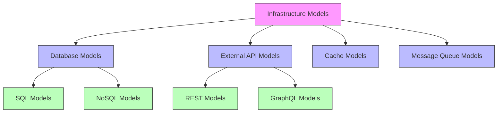

# Infrastructure Models

## Overview

Infrastructure models represent the system's interaction with external services, databases, and third-party APIs. They handle the technical concerns of data persistence, external communication, and infrastructure-specific operations.

## Structure



## Key Components

### 1. Database Models

Models that represent database schema and operations:

```python
class UserDBModel(BaseModel):
    __tablename__ = "users"
    
    id = Column(String, primary_key=True)
    username = Column(String, unique=True)
    email = Column(String, unique=True)
    role_id = Column(String, ForeignKey("roles.id"))
    created_at = Column(DateTime, default=datetime.utcnow)
    
    role = relationship("RoleDBModel", back_populates="users")
```

### 2. External API Models

Models for external API interaction:

```python
@dataclass
class StrapiUserModel:
    id: str
    attributes: Dict[str, Any]
    
    @classmethod
    def from_response(cls, data: Dict[str, Any]) -> "StrapiUserModel":
        return cls(
            id=data["id"],
            attributes=data["attributes"]
        )
    
    def to_domain(self) -> User:
        return User(
            id=self.id,
            username=self.attributes["username"],
            email=self.attributes["email"]
        )
```

### 3. Cache Models

Models for cache data representation:

```python
@dataclass
class CachedUser:
    key: str
    data: Dict[str, Any]
    expires_at: datetime
    
    @property
    def is_expired(self) -> bool:
        return datetime.utcnow() > self.expires_at
    
    def to_json(self) -> str:
        return json.dumps({
            "data": self.data,
            "expires_at": self.expires_at.isoformat()
        })
```

## Infrastructure Patterns

### 1. Model Mapping

Converting between domain and infrastructure models:

```python
class UserMapper:
    @staticmethod
    def to_db_model(user: User) -> UserDBModel:
        return UserDBModel(
            id=user.id,
            username=user.username,
            email=user.email,
            role_id=user.role.id
        )
    
    @staticmethod
    def from_db_model(db_user: UserDBModel) -> User:
        return User(
            id=db_user.id,
            username=db_user.username,
            email=db_user.email,
            role=RoleMapper.from_db_model(db_user.role)
        )
```

### 2. Query Building

Infrastructure-specific query construction:

```python
class UserQueryBuilder:
    def __init__(self):
        self.query = select(UserDBModel)
        
    def with_role(self, role_id: str) -> "UserQueryBuilder":
        self.query = self.query.filter(UserDBModel.role_id == role_id)
        return self
        
    def active_only(self) -> "UserQueryBuilder":
        self.query = self.query.filter(UserDBModel.is_active == True)
        return self
        
    def build(self) -> Select:
        return self.query
```

### 3. Resilience Patterns

Handling infrastructure failures:

```python
class ResilientApiClient:
    def __init__(self, retry_config: RetryConfig):
        self.retry_config = retry_config
        
    async def call_api(self, request: ApiRequest) -> ApiResponse:
        for attempt in range(self.retry_config.max_attempts):
            try:
                return await self._make_request(request)
            except TransientError as e:
                if attempt == self.retry_config.max_attempts - 1:
                    raise
                await self._wait_before_retry(attempt)
```

## Infrastructure Services

### 1. Database Service

```python
class DatabaseService:
    def __init__(self, connection_pool: Pool):
        self.pool = connection_pool
        
    async def execute(self, query: Select) -> Result:
        async with self.pool.acquire() as conn:
            return await conn.execute(query)
            
    async def transaction(self) -> Transaction:
        return await self.pool.transaction()
```

### 2. Cache Service

```python
class CacheService:
    def __init__(self, redis: Redis):
        self.redis = redis
        
    async def get(self, key: str) -> Optional[CachedUser]:
        data = await self.redis.get(key)
        if not data:
            return None
        return CachedUser.from_json(data)
        
    async def set(
        self,
        key: str,
        user: CachedUser,
        ttl: int
    ) -> None:
        await self.redis.set(
            key,
            user.to_json(),
            ex=ttl
        )
```

## Best Practices

1. **Clear Separation**
   - Keep infrastructure code isolated
   - Use interfaces for abstraction
   - Handle technical concerns only

2. **Error Handling**
   - Translate infrastructure errors
   - Implement retry logic
   - Handle timeouts properly

3. **Performance**
   - Connection pooling
   - Efficient queries
   - Proper caching

4. **Monitoring**
   - Log operations
   - Track metrics
   - Monitor health

## Testing

Infrastructure models should be tested with proper mocking:

```python
async def test_user_db_operations():
    # Setup mock database
    db = MockDatabase()
    
    # Create test user
    user = UserDBModel(
        username="test",
        email="test@example.com"
    )
    
    # Test operations
    await db.add(user)
    result = await db.query(UserDBModel).first()
    
    assert result.username == "test"
    assert result.email == "test@example.com"
``` 