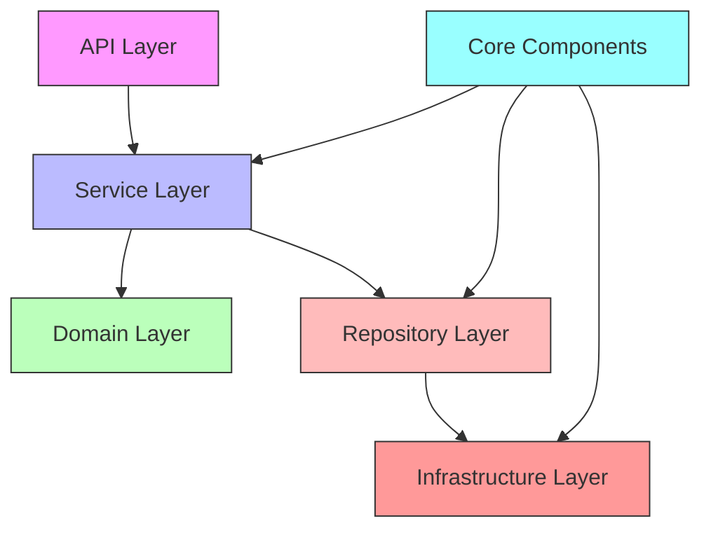
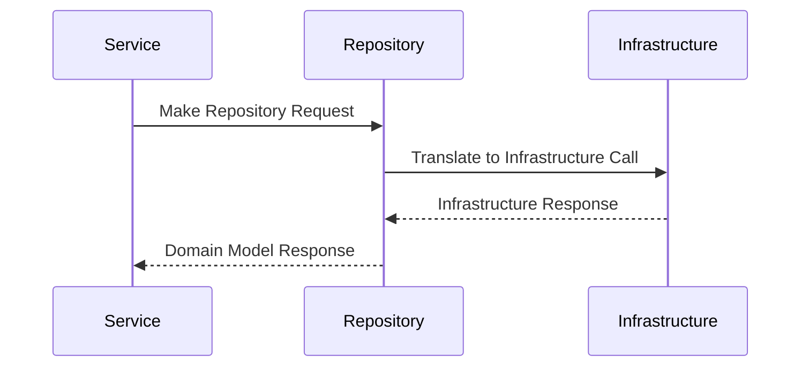
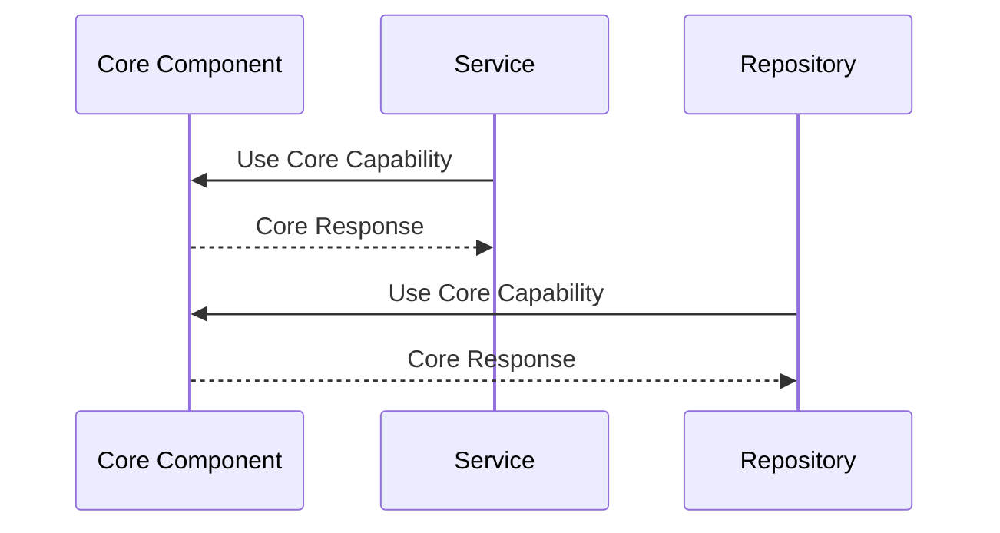

# Layer Interactions and Dependencies

## Overview

The system is built on a clear separation of concerns with three main layers and core components serving as the common denominator. This document describes how these layers interact and depend on each other.

## Layer Structure



## Core Components as Common Denominator

Core components provide fundamental capabilities used across all layers:

- Base classes and interfaces
- Configuration management
- Logging and telemetry
- Error handling
- Dependency injection
- Caching
- Resilience patterns

## Layer Responsibilities

### 1. API Layer
- Handles HTTP/WebSocket requests
- Request validation
- Response formatting
- Route management
- API documentation
- Authentication/Authorization

### 2. Service Layer
- Business logic implementation
- Transaction management
- Domain model manipulation
- Cross-cutting concerns
- Event handling
- Service composition

### 3. Domain Layer
- Business/Domain models
- Business rules
- Domain events
- Value objects
- Aggregates

### 4. Repository Layer
- Data access abstraction
- CRUD operations
- Query optimization
- Caching strategies
- Data mapping

### 5. Infrastructure Layer
- External service integration
- Database operations
- Message queues
- File systems
- Email services
- Third-party APIs

## Layer Interaction Patterns

### Service-Repository Interaction


### Core Component Usage


## Key Design Principles

1. **Dependency Direction**
   - Higher layers depend on lower layers
   - Infrastructure depends on abstractions
   - Core components are dependency-free

2. **Interface Segregation**
   - Each layer exposes clear interfaces
   - Implementation details are hidden
   - Dependencies are explicit

3. **Domain Model Isolation**
   - Domain models are pure business logic
   - No infrastructure concerns
   - No serialization details

4. **Repository Abstraction**
   - Services use repository interfaces
   - Infrastructure details hidden
   - Swappable implementations

## Example Interactions

### User Management Flow
```python
# Service Layer
class UserService:
    def __init__(self, user_repository: UserRepository):
        self.repository = user_repository
        
    async def create_user(self, user: UserModel):
        # Business logic
        validated_user = await self.validate_user(user)
        # Repository interaction
        return await self.repository.create(validated_user)

# Repository Layer
class UserRepository:
    def __init__(self, infrastructure: Infrastructure):
        self.infrastructure = infrastructure
        
    async def create(self, user: UserModel):
        # Transform to infrastructure model
        user_data = user.to_infrastructure()
        # Infrastructure interaction
        result = await self.infrastructure.create_user(user_data)
        # Transform back to domain model
        return UserModel.from_infrastructure(result)
```

## Best Practices

1. **Keep Core Components Pure**
   - No business logic in core
   - Focus on technical capabilities
   - Reusable across projects

2. **Clean Repository Interface**
   - Domain model parameters
   - Domain model returns
   - No infrastructure leaks

3. **Service Composition**
   - Services can use other services
   - Clear dependency chain
   - Avoid circular dependencies

4. **Infrastructure Isolation**
   - All external interaction in infrastructure
   - Clear error translation
   - Retry/resilience handling
``` 