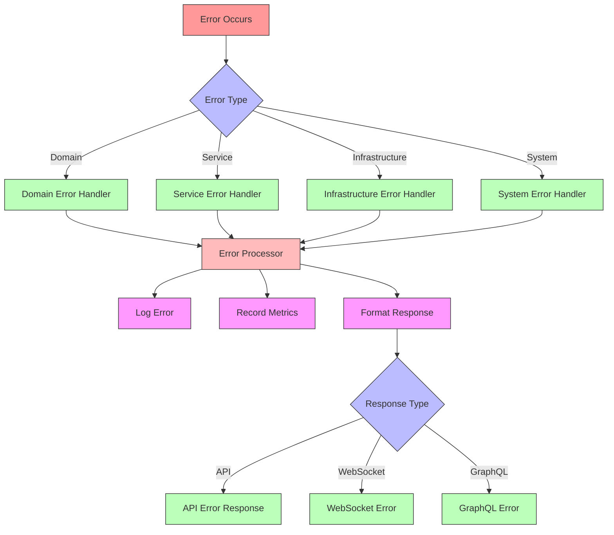

# Error Flow

## Overview

Error handling in the system follows a structured approach to ensure consistent error management, proper logging, and appropriate client responses. This document details the error handling patterns and flow.

## Error Flow Diagram



## Error Hierarchy

```python
class AppError(Exception):
    """Base application error."""
    def __init__(
        self,
        message: str,
        code: str = None,
        status_code: int = 500,
        details: Dict[str, Any] = None
    ):
        self.message = message
        self.code = code or self.__class__.__name__
        self.status_code = status_code
        self.details = details or {}
        super().__init__(message)

class DomainError(AppError):
    """Domain logic errors."""
    def __init__(self, message: str, code: str = None, details: Dict[str, Any] = None):
        super().__init__(
            message=message,
            code=code,
            status_code=400,
            details=details
        )

class ValidationError(DomainError):
    """Input validation errors."""
    def __init__(self, message: str, field: str = None):
        super().__init__(
            message=message,
            code="VALIDATION_ERROR",
            details={"field": field} if field else None
        )

class InfrastructureError(AppError):
    """Infrastructure/external service errors."""
    def __init__(self, message: str, service: str = None):
        super().__init__(
            message=message,
            code="INFRASTRUCTURE_ERROR",
            status_code=503,
            details={"service": service} if service else None
        )
```

## Error Handlers

### 1. Global Error Handler

```python
@app.exception_handler(AppError)
async def app_error_handler(request: Request, error: AppError) -> JSONResponse:
    # Log error
    logger.error(
        f"Application error: {error.code}",
        extra={
            "error_details": error.details,
            "request_id": request.state.request_id
        }
    )
    
    # Record metric
    metrics.increment(
        "application.errors",
        tags={
            "error_type": error.__class__.__name__,
            "error_code": error.code
        }
    )
    
    # Return formatted response
    return JSONResponse(
        status_code=error.status_code,
        content=ErrorResponse(
            success=False,
            error=ErrorDetail(
                message=error.message,
                code=error.code,
                details=error.details
            )
        ).dict()
    )
```

### 2. Domain Error Handler

```python
@app.exception_handler(DomainError)
async def domain_error_handler(request: Request, error: DomainError) -> JSONResponse:
    # Log with domain context
    logger.warning(
        f"Domain error: {error.code}",
        extra={
            "domain_context": error.details,
            "request_id": request.state.request_id
        }
    )
    
    return JSONResponse(
        status_code=error.status_code,
        content=ErrorResponse(
            success=False,
            error=ErrorDetail(
                message=error.message,
                code=error.code,
                details=error.details
            )
        ).dict()
    )
```

### 3. Infrastructure Error Handler

```python
@app.exception_handler(InfrastructureError)
async def infrastructure_error_handler(
    request: Request,
    error: InfrastructureError
) -> JSONResponse:
    # Log with infrastructure context
    logger.error(
        f"Infrastructure error: {error.code}",
        extra={
            "service": error.details.get("service"),
            "request_id": request.state.request_id
        }
    )
    
    # Alert on infrastructure issues
    await alert_service.send_alert(
        title=f"Infrastructure Error: {error.details.get('service')}",
        message=error.message,
        severity="high"
    )
    
    return JSONResponse(
        status_code=error.status_code,
        content=ErrorResponse(
            success=False,
            error=ErrorDetail(
                message="Service temporarily unavailable",
                code=error.code,
                details={"retry_after": 30}
            )
        ).dict()
    )
```

## Error Processing Pipeline

### 1. Error Detection

```python
class ErrorDetector:
    def __init__(self, metrics: MetricsManager):
        self.metrics = metrics
        
    async def process_error(self, error: Exception) -> AppError:
        # Convert to application error
        app_error = self.convert_error(error)
        
        # Record occurrence
        self.metrics.increment(
            "errors.detected",
            tags={"type": app_error.__class__.__name__}
        )
        
        return app_error
        
    def convert_error(self, error: Exception) -> AppError:
        if isinstance(error, AppError):
            return error
            
        if isinstance(error, ValueError):
            return ValidationError(str(error))
            
        return AppError(
            message="An unexpected error occurred",
            code="INTERNAL_ERROR"
        )
```

### 2. Error Logging

```python
class ErrorLogger:
    def __init__(self, logger: Logger):
        self.logger = logger
        
    async def log_error(
        self,
        error: AppError,
        context: Dict[str, Any]
    ) -> None:
        self.logger.error(
            message=error.message,
            extra={
                "error_code": error.code,
                "error_details": error.details,
                "context": context
            }
        )
```

### 3. Error Response Formatting

```python
class ErrorResponseFormatter:
    def format_error(self, error: AppError) -> Dict[str, Any]:
        base_response = {
            "success": False,
            "error": {
                "message": error.message,
                "code": error.code
            }
        }
        
        if error.details:
            base_response["error"]["details"] = error.details
            
        return base_response
```

## Error Handling Patterns

### 1. Service Layer Error Handling

```python
class UserService:
    async def create_user(self, user_data: Dict[str, Any]) -> User:
        try:
            # Validate input
            user = User.validate(user_data)
            
            # Check business rules
            await self.check_unique_email(user.email)
            
            # Save user
            return await self.repository.create(user)
            
        except ValidationError as e:
            # Handle validation errors
            raise DomainError(
                message="Invalid user data",
                code="INVALID_USER_DATA",
                details={"validation_errors": e.errors()}
            )
            
        except RepositoryError as e:
            # Handle persistence errors
            raise InfrastructureError(
                message="Failed to create user",
                service="database"
            )
```

### 2. Repository Layer Error Handling

```python
class UserRepository:
    async def create(self, user: User) -> User:
        try:
            # Convert to DB model
            db_user = UserMapper.to_db(user)
            
            # Save to database
            result = await self.db.users.insert_one(db_user)
            
            return UserMapper.from_db(result)
            
        except DuplicateKeyError as e:
            raise RepositoryError(
                message="User already exists",
                code="DUPLICATE_USER"
            )
            
        except DatabaseError as e:
            raise InfrastructureError(
                message="Database operation failed",
                service="mongodb"
            )
```

## Best Practices

1. **Error Classification**
   - Clear error hierarchy
   - Specific error types
   - Meaningful error codes

2. **Error Context**
   - Include relevant details
   - Add request context
   - Preserve stack traces

3. **Security**
   - Sanitize error messages
   - Hide internal details
   - Proper error logging

4. **Client Experience**
   - Clear error messages
   - Actionable feedback
   - Consistent format

## Testing

Error handling should be thoroughly tested:

```python
async def test_user_creation_errors():
    service = UserService(mock_repository)
    
    # Test validation error
    with pytest.raises(DomainError) as exc:
        await service.create_user({
            "email": "invalid-email"
        })
    assert exc.value.code == "INVALID_USER_DATA"
    
    # Test infrastructure error
    mock_repository.create.side_effect = DatabaseError()
    with pytest.raises(InfrastructureError) as exc:
        await service.create_user({
            "email": "valid@email.com"
        })
    assert exc.value.code == "INFRASTRUCTURE_ERROR"
``` 