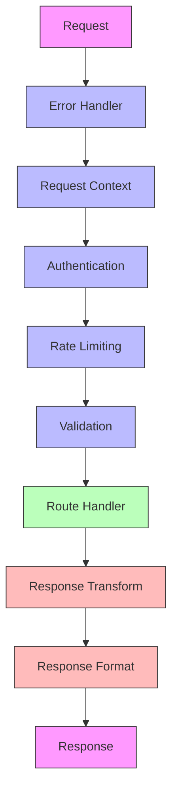

# Middleware Chain

## Overview

The middleware chain is a crucial part of request processing, providing a series of processing layers that handle cross-cutting concerns. This document details the middleware components and their interaction.

## Middleware Flow



## Middleware Components

### 1. Error Handler Middleware

Catches and processes all errors in the request pipeline:

```python
@middleware_component
class ErrorHandlerMiddleware:
    async def process(
        self,
        request: Request,
        call_next: Callable
    ) -> Response:
        try:
            return await call_next(request)
        except ValidationError as e:
            return JSONResponse(
                status_code=400,
                content=ErrorResponse.validation_error(e).dict()
            )
        except AuthenticationError as e:
            return JSONResponse(
                status_code=401,
                content=ErrorResponse.auth_error(e).dict()
            )
        except Exception as e:
            logger.error("Unhandled error", exc_info=e)
            return JSONResponse(
                status_code=500,
                content=ErrorResponse.server_error().dict()
            )
```

### 2. Request Context Middleware

Sets up request context and tracking:

```python
@middleware_component
class RequestContextMiddleware:
    async def process(
        self,
        request: Request,
        call_next: Callable
    ) -> Response:
        request_id = str(uuid.uuid4())
        correlation_id = request.headers.get(
            "X-Correlation-ID",
            request_id
        )
        
        context = RequestContext(
            request_id=request_id,
            correlation_id=correlation_id,
            start_time=time.time()
        )
        
        request.state.context = context
        
        try:
            response = await call_next(request)
            return self._add_context_headers(response, context)
        finally:
            context.duration = time.time() - context.start_time
            await self._log_request(request, context)
```

### 3. Authentication Middleware

Handles user authentication:

```python
@middleware_component
class AuthenticationMiddleware:
    def __init__(self, auth_service: AuthService):
        self.auth_service = auth_service
        
    async def process(
        self,
        request: Request,
        call_next: Callable
    ) -> Response:
        if self._should_skip_auth(request.url.path):
            return await call_next(request)
            
        token = self._extract_token(request)
        if not token:
            raise AuthenticationError("No token provided")
            
        user = await self.auth_service.validate_token(token)
        request.state.user = user
        
        return await call_next(request)
        
    def _should_skip_auth(self, path: str) -> bool:
        return path in ["/health", "/metrics", "/docs"]
```

### 4. Rate Limiting Middleware

Controls request rates:

```python
@middleware_component
class RateLimitMiddleware:
    def __init__(
        self,
        redis: Redis,
        rate_limit: int = 100,
        time_window: int = 60
    ):
        self.redis = redis
        self.rate_limit = rate_limit
        self.time_window = time_window
        
    async def process(
        self,
        request: Request,
        call_next: Callable
    ) -> Response:
        key = self._get_rate_limit_key(request)
        
        current = await self.redis.incr(key)
        if current == 1:
            await self.redis.expire(key, self.time_window)
            
        if current > self.rate_limit:
            raise RateLimitError(
                f"Rate limit exceeded. Try again in {self.time_window} seconds"
            )
            
        return await call_next(request)
```

### 5. Validation Middleware

Validates request data:

```python
@middleware_component
class ValidationMiddleware:
    async def process(
        self,
        request: Request,
        call_next: Callable
    ) -> Response:
        if request.method in ["POST", "PUT", "PATCH"]:
            content_type = request.headers.get("content-type", "")
            if "application/json" in content_type:
                try:
                    await request.json()
                except JSONDecodeError:
                    raise ValidationError("Invalid JSON payload")
                    
        return await call_next(request)
```

## Middleware Configuration

### 1. Middleware Registration

```python
def setup_middleware(app: FastAPI) -> None:
    app.add_middleware(ErrorHandlerMiddleware)
    app.add_middleware(
        RequestContextMiddleware,
        exclude_paths=["/health", "/metrics"]
    )
    app.add_middleware(
        AuthenticationMiddleware,
        auth_service=get_auth_service()
    )
    app.add_middleware(
        RateLimitMiddleware,
        redis=get_redis_client(),
        rate_limit=100,
        time_window=60
    )
    app.add_middleware(ValidationMiddleware)
```

### 2. Middleware Options

```python
@dataclass
class MiddlewareOptions:
    enabled: bool = True
    exclude_paths: List[str] = field(default_factory=list)
    include_paths: List[str] = field(default_factory=list)
    priority: int = 0
    
    def should_process(self, path: str) -> bool:
        if not self.enabled:
            return False
            
        if self.exclude_paths and path in self.exclude_paths:
            return False
            
        if self.include_paths and path not in self.include_paths:
            return False
            
        return True
```

## Middleware Patterns

### 1. Chain of Responsibility

```python
class MiddlewareChain:
    def __init__(self):
        self.middlewares: List[Middleware] = []
        
    def add(self, middleware: Middleware) -> None:
        self.middlewares.append(middleware)
        
    async def process(
        self,
        request: Request,
        handler: Callable
    ) -> Response:
        async def execute_middleware(index: int) -> Response:
            if index >= len(self.middlewares):
                return await handler(request)
                
            middleware = self.middlewares[index]
            return await middleware.process(
                request,
                lambda req: execute_middleware(index + 1)
            )
            
        return await execute_middleware(0)
```

### 2. Decorator Pattern

```python
def with_middleware(middleware_class: Type[Middleware]):
    def decorator(handler: Callable) -> Callable:
        async def wrapped(request: Request) -> Response:
            middleware = middleware_class()
            return await middleware.process(request, handler)
        return wrapped
    return decorator
```

## Best Practices

1. **Order Matters**
   - Error handling first
   - Context setup early
   - Validation before processing

2. **Performance**
   - Keep middleware lightweight
   - Cache when possible
   - Skip unnecessary processing

3. **Error Handling**
   - Catch specific exceptions
   - Proper error responses
   - Detailed logging

4. **Configuration**
   - Flexible options
   - Environment-based setup
   - Easy customization

## Testing

Middleware should be thoroughly tested:

```python
async def test_auth_middleware():
    middleware = AuthenticationMiddleware(auth_service)
    
    # Test valid token
    request = Request(scope={"type": "http"})
    request.headers["Authorization"] = "Bearer valid_token"
    
    response = await middleware.process(request, mock_handler)
    assert response.status_code == 200
    assert request.state.user is not None
    
    # Test invalid token
    request.headers["Authorization"] = "Bearer invalid_token"
    with pytest.raises(AuthenticationError):
        await middleware.process(request, mock_handler)
``` 