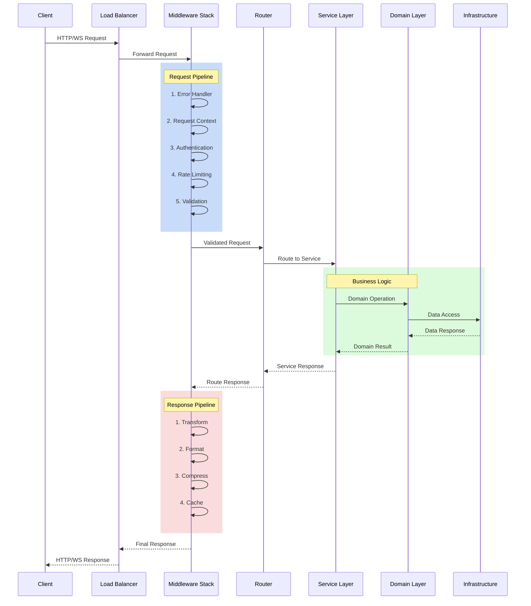
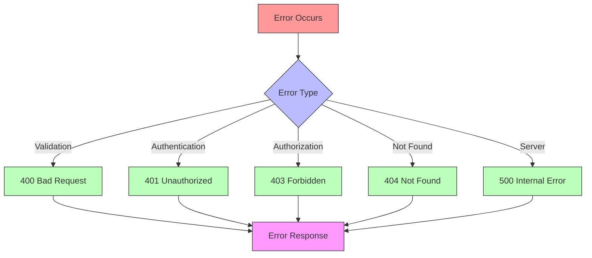

# Request Lifecycle

## Overview

This document describes the complete lifecycle of a request in the system, from initial receipt to final response. Understanding this flow is crucial for developers working with the system.

## Request Flow Diagram



## Detailed Flow Steps

### 1. Request Receipt

```python
@app.middleware("http")
async def request_middleware(request: Request, call_next):
    # Generate request ID
    request_id = str(uuid.uuid4())
    request.state.request_id = request_id
    
    # Start timing
    start_time = time.time()
    
    # Process request
    response = await call_next(request)
    
    # Record metrics
    duration = time.time() - start_time
    metrics.record_request_duration(duration)
    
    return response
```

### 2. Middleware Processing

The request passes through multiple middleware layers:

1. **Error Handling**
   - Global error catching
   - Error translation
   - Response formatting

2. **Request Context**
   - Request ID generation
   - Correlation ID tracking
   - Request timing

3. **Authentication**
   - Token validation
   - User identification
   - Permission checking

4. **Rate Limiting**
   - Request counting
   - Rate checking
   - Limit enforcement

5. **Validation**
   - Input validation
   - Schema checking
   - Type conversion

### 3. Route Resolution

The router matches the request to a handler:

```python
@router.post("/users")
async def create_user(
    request: CreateUserRequest,
    user_service: UserService = Depends(get_user_service)
):
    user = await user_service.create_user(request.to_domain())
    return UserResponse.from_domain(user)
```

### 4. Service Layer Processing

Services handle business logic:

```python
class UserService:
    def __init__(self, repository: UserRepository):
        self.repository = repository
        
    async def create_user(self, user: User) -> User:
        # Business logic
        await self.validate_unique_email(user.email)
        
        # Domain operations
        user.set_default_role()
        user.generate_verification_token()
        
        # Persistence
        created_user = await self.repository.create(user)
        
        # Side effects
        await self.send_welcome_email(created_user)
        
        return created_user
```

### 5. Domain Layer Operations

Domain models handle business rules:

```python
class User:
    def set_default_role(self):
        if not self.role:
            self.role = Role.default()
            
    def generate_verification_token(self):
        self.verification_token = Token.generate()
        self.verification_expires = datetime.utcnow() + timedelta(days=1)
```

### 6. Infrastructure Access

Repository layer handles data access:

```python
class UserRepository:
    async def create(self, user: User) -> User:
        # Convert to infrastructure model
        db_user = UserMapper.to_db(user)
        
        # Database operation
        result = await self.db.users.insert_one(db_user)
        
        # Cache operation
        await self.cache.set(f"user:{result.id}", user)
        
        return user
```

### 7. Response Processing

The response flows back through middleware:

1. **Transform**
   - Convert domain models
   - Format data
   - Add metadata

2. **Format**
   - JSON serialization
   - Content negotiation
   - Schema validation

3. **Compress**
   - GZIP compression
   - Binary optimization
   - Size reduction

4. **Cache**
   - Response caching
   - Cache headers
   - Cache control

## Error Flow

When errors occur, they flow through the error handling pipeline:



## Performance Considerations

1. **Async Processing**
   - Non-blocking operations
   - Concurrent requests
   - Resource pooling

2. **Caching Strategy**
   - Response caching
   - Data caching
   - Cache invalidation

3. **Resource Management**
   - Connection pooling
   - Memory usage
   - Thread/Process limits

## Monitoring Points

Key points for monitoring in the request lifecycle:

1. **Request Receipt**
   - Request rate
   - Payload size
   - Client info

2. **Processing Time**
   - Middleware duration
   - Service duration
   - Database time

3. **Response Metrics**
   - Response size
   - Status codes
   - Cache hits/misses

4. **Error Tracking**
   - Error rates
   - Error types
   - Stack traces

## Best Practices

1. **Request Context**
   - Always include request ID
   - Track correlation ID
   - Maintain user context

2. **Error Handling**
   - Catch all errors
   - Proper error translation
   - Detailed logging

3. **Performance**
   - Optimize critical paths
   - Use caching effectively
   - Monitor bottlenecks

4. **Security**
   - Validate all input
   - Proper authentication
   - Rate limiting
``` 