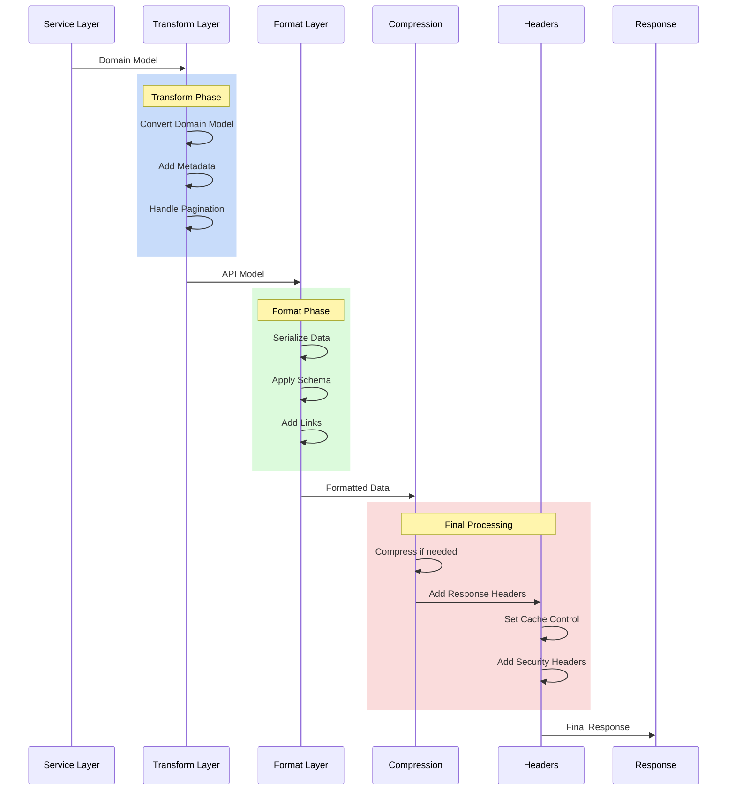

# Response Handling

## Overview

Response handling in the system follows a structured approach to ensure consistent, secure, and efficient responses across all endpoints. This document details the response processing pipeline and patterns.

## Response Flow



## Response Structure

### 1. Standard Success Response

```python
class StandardResponse(BaseModel):
    success: bool = True
    data: Optional[Any]
    meta: Optional[Dict[str, Any]] = None
    links: Optional[Dict[str, str]] = None
    
    @classmethod
    def ok(
        cls,
        data: Any,
        meta: Optional[Dict[str, Any]] = None,
        links: Optional[Dict[str, str]] = None
    ) -> "StandardResponse":
        return cls(
            data=data,
            meta=meta,
            links=links
        )
```

### 2. Error Response

```python
class ErrorResponse(BaseModel):
    success: bool = False
    error: ErrorDetail
    meta: Optional[Dict[str, Any]] = None
    
    @classmethod
    def error(
        cls,
        message: str,
        code: str,
        details: Optional[Dict[str, Any]] = None
    ) -> "ErrorResponse":
        return cls(
            error=ErrorDetail(
                message=message,
                code=code,
                details=details
            )
        )
```

### 3. Paginated Response

```python
class PaginatedResponse(BaseModel):
    success: bool = True
    data: List[Any]
    meta: PaginationMeta
    links: Optional[Dict[str, str]] = None
    
    @classmethod
    def paginate(
        cls,
        items: List[Any],
        total: int,
        page: int,
        per_page: int,
        base_url: str
    ) -> "PaginatedResponse":
        return cls(
            data=items,
            meta=PaginationMeta(
                total=total,
                page=page,
                per_page=per_page,
                pages=math.ceil(total / per_page)
            ),
            links=cls._generate_pagination_links(
                base_url, page, math.ceil(total / per_page)
            )
        )
```

## Response Processing Pipeline

### 1. Domain to API Model Conversion

```python
class ResponseTransformer:
    @staticmethod
    def transform_user(user: User) -> UserResponse:
        return UserResponse(
            id=user.id,
            username=user.username,
            email=user.email,
            role=RoleResponse.from_domain(user.role),
            created_at=user.created_at
        )
    
    @staticmethod
    def transform_list(
        items: List[Any],
        transform_func: Callable,
        paginate: bool = False,
        **pagination_args
    ) -> Union[List[Any], PaginatedResponse]:
        transformed = [transform_func(item) for item in items]
        if not paginate:
            return transformed
            
        return PaginatedResponse.paginate(
            items=transformed,
            **pagination_args
        )
```

### 2. Response Formatting

```python
class ResponseFormatter:
    def __init__(self, response: Any):
        self.response = response
        
    def format(self) -> Dict[str, Any]:
        if isinstance(self.response, BaseModel):
            return self.response.dict(
                exclude_none=True,
                by_alias=True
            )
        
        if isinstance(self.response, list):
            return [
                self.format_item(item)
                for item in self.response
            ]
            
        return self.format_item(self.response)
        
    def format_item(self, item: Any) -> Any:
        if hasattr(item, "to_response"):
            return item.to_response()
        return item
```

### 3. Compression

```python
class ResponseCompressor:
    def __init__(self, min_size: int = 1024):
        self.min_size = min_size
        
    async def compress(
        self,
        response: Response,
        accept_encoding: str
    ) -> Response:
        if len(response.body) < self.min_size:
            return response
            
        if "gzip" in accept_encoding:
            return await self._gzip_compress(response)
            
        if "deflate" in accept_encoding:
            return await self._deflate_compress(response)
            
        return response
```

### 4. Headers

```python
class ResponseHeaders:
    @staticmethod
    def add_security_headers(response: Response) -> None:
        response.headers["X-Content-Type-Options"] = "nosniff"
        response.headers["X-Frame-Options"] = "DENY"
        response.headers["X-XSS-Protection"] = "1; mode=block"
        response.headers["Strict-Transport-Security"] = "max-age=31536000"
        
    @staticmethod
    def add_cache_headers(
        response: Response,
        cache_control: str,
        max_age: int = 0
    ) -> None:
        response.headers["Cache-Control"] = cache_control
        if max_age > 0:
            response.headers["Max-Age"] = str(max_age)
```

## Response Patterns

### 1. Resource Response

```python
@router.get("/users/{user_id}")
async def get_user(
    user_id: str,
    user_service: UserService = Depends(get_user_service)
) -> StandardResponse:
    user = await user_service.get_user(user_id)
    return StandardResponse.ok(
        data=ResponseTransformer.transform_user(user),
        links={
            "self": f"/users/{user_id}",
            "update": f"/users/{user_id}",
            "delete": f"/users/{user_id}"
        }
    )
```

### 2. Collection Response

```python
@router.get("/users")
async def list_users(
    pagination: PaginationParams = Depends(),
    user_service: UserService = Depends(get_user_service)
) -> PaginatedResponse:
    users, total = await user_service.list_users(
        skip=pagination.skip,
        limit=pagination.limit
    )
    
    return PaginatedResponse.paginate(
        items=ResponseTransformer.transform_list(users),
        total=total,
        page=pagination.page,
        per_page=pagination.per_page,
        base_url="/users"
    )
```

### 3. Action Response

```python
@router.post("/users/{user_id}/verify")
async def verify_user(
    user_id: str,
    token: str,
    user_service: UserService = Depends(get_user_service)
) -> StandardResponse:
    await user_service.verify_user(user_id, token)
    return StandardResponse.ok(
        data={"message": "User verified successfully"},
        meta={"verified_at": datetime.utcnow().isoformat()}
    )
```

## Best Practices

1. **Consistency**
   - Use standard response formats
   - Consistent error handling
   - Uniform status codes

2. **Security**
   - Sanitize responses
   - Add security headers
   - Control data exposure

3. **Performance**
   - Use compression
   - Implement caching
   - Optimize payload size

4. **Documentation**
   - Clear response schemas
   - Error documentation
   - Example responses

## Testing

Response handling should be thoroughly tested:

```python
async def test_user_response_format():
    user = User(
        id="123",
        username="test_user",
        email="test@example.com"
    )
    
    response = StandardResponse.ok(
        data=ResponseTransformer.transform_user(user)
    )
    
    assert response.success is True
    assert response.data.id == "123"
    assert response.data.username == "test_user"
``` 