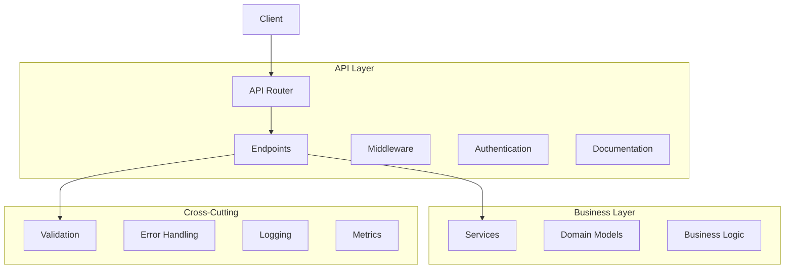

# API Components Guide

## Overview

The API components provide a robust and maintainable way to expose backend services through HTTP endpoints. These components ensure proper request handling, validation, error handling, and documentation.

## Architecture



## Components

### 1. API Router

Main FastAPI router configuration.

```python
from fastapi import FastAPI, APIRouter, Depends, HTTPException
from dependency_injector.wiring import inject, Provide
from typing import Optional, List, Dict, Any

# Create FastAPI application
app = FastAPI(
    title="iPersona API",
    description="Backend API for iPersona interview system",
    version="1.0.0",
    docs_url="/api/docs",
    redoc_url="/api/redoc",
    openapi_url="/api/openapi.json"
)

# Create API routers
interview_router = APIRouter(prefix="/api/interviews")
user_router = APIRouter(prefix="/api/users")
session_router = APIRouter(prefix="/api/sessions")

# Register routers
app.include_router(interview_router)
app.include_router(user_router)
app.include_router(session_router)

# Configure middleware
app.add_middleware(
    CORSMiddleware,
    allow_origins=["*"],
    allow_credentials=True,
    allow_methods=["*"],
    allow_headers=["*"]
)

@app.on_event("startup")
async def startup():
    """Initialize application resources."""
    # Initialize telemetry
    telemetry.initialize()
    
    # Start health checks
    health_monitor.start()
    
@app.on_event("shutdown")
async def shutdown():
    """Cleanup application resources."""
    # Stop health checks
    await health_monitor.stop()
    
    # Cleanup telemetry
    await telemetry.shutdown()
```

### 2. API Models

Pydantic models for request/response validation.

```python
from pydantic import BaseModel, Field, validator
from typing import Optional, List, Dict
from datetime import datetime
from uuid import UUID

class InterviewRequest(BaseModel):
    """Interview request model."""
    
    user_id: UUID = Field(
        ...,
        description="User ID"
    )
    questions: List[str] = Field(
        ...,
        min_items=1,
        max_items=10,
        description="List of interview questions"
    )
    language: str = Field(
        default="en",
        min_length=2,
        max_length=2,
        description="Interview language code"
    )
    duration: Optional[int] = Field(
        default=None,
        ge=60,
        le=3600,
        description="Interview duration in seconds"
    )
    
    @validator("questions")
    def validate_questions(cls, v: List[str]) -> List[str]:
        """Validate interview questions."""
        if not all(q.strip() for q in v):
            raise ValueError("Empty questions not allowed")
        return [q.strip() for q in v]

class InterviewResponse(BaseModel):
    """Interview response model."""
    
    id: UUID = Field(
        ...,
        description="Interview ID"
    )
    status: str = Field(
        ...,
        description="Interview status"
    )
    created_at: datetime = Field(
        ...,
        description="Interview creation timestamp"
    )
    questions: List[str] = Field(
        ...,
        description="Interview questions"
    )
    answers: Optional[List[str]] = Field(
        None,
        description="Interview answers"
    )
    analysis: Optional[Dict[str, Any]] = Field(
        None,
        description="Interview analysis results"
    )

class UserProfile(BaseModel):
    """User profile model."""
    
    id: UUID = Field(
        ...,
        description="User ID"
    )
    email: str = Field(
        ...,
        description="User email"
    )
    name: str = Field(
        ...,
        description="User name"
    )
    preferences: Optional[Dict[str, Any]] = Field(
        default={},
        description="User preferences"
    )
    created_at: datetime = Field(
        ...,
        description="Profile creation timestamp"
    )
    updated_at: datetime = Field(
        ...,
        description="Profile update timestamp"
    )

class SessionState(BaseModel):
    """Session state model."""
    
    id: UUID = Field(
        ...,
        description="Session ID"
    )
    user_id: UUID = Field(
        ...,
        description="User ID"
    )
    interview_id: UUID = Field(
        ...,
        description="Interview ID"
    )
    status: str = Field(
        ...,
        description="Session status"
    )
    current_question: int = Field(
        default=0,
        ge=0,
        description="Current question index"
    )
    answers: List[str] = Field(
        default=[],
        description="Recorded answers"
    )
    metadata: Dict[str, Any] = Field(
        default={},
        description="Session metadata"
    )
```

### 3. API Endpoints

FastAPI endpoint implementations.

```python
@interview_router.post(
    "/",
    response_model=InterviewResponse,
    status_code=201,
    tags=["interviews"]
)
@inject
async def create_interview(
    request: InterviewRequest,
    interview_service: InterviewService = Depends(
        Provide[Container.interview_service]
    )
) -> InterviewResponse:
    """Create new interview."""
    try:
        interview = await interview_service.create_interview(
            user_id=request.user_id,
            questions=request.questions,
            language=request.language,
            duration=request.duration
        )
        return interview
        
    except ValidationError as e:
        raise HTTPException(
            status_code=400,
            detail=str(e)
        )
    except ResourceError as e:
        raise HTTPException(
            status_code=500,
            detail=str(e)
        )

@interview_router.get(
    "/{interview_id}",
    response_model=InterviewResponse,
    tags=["interviews"]
)
@inject
async def get_interview(
    interview_id: UUID,
    interview_service: InterviewService = Depends(
        Provide[Container.interview_service]
    )
) -> InterviewResponse:
    """Get interview by ID."""
    try:
        interview = await interview_service.get_interview(interview_id)
        if not interview:
            raise HTTPException(
                status_code=404,
                detail="Interview not found"
            )
        return interview
        
    except ValidationError as e:
        raise HTTPException(
            status_code=400,
            detail=str(e)
        )
    except ResourceError as e:
        raise HTTPException(
            status_code=500,
            detail=str(e)
        )

@user_router.get(
    "/{user_id}",
    response_model=UserProfile,
    tags=["users"]
)
@inject
async def get_user_profile(
    user_id: UUID,
    user_service: UserService = Depends(
        Provide[Container.user_service]
    )
) -> UserProfile:
    """Get user profile."""
    try:
        profile = await user_service.get_profile(user_id)
        if not profile:
            raise HTTPException(
                status_code=404,
                detail="User not found"
            )
        return profile
        
    except ValidationError as e:
        raise HTTPException(
            status_code=400,
            detail=str(e)
        )
    except ResourceError as e:
        raise HTTPException(
            status_code=500,
            detail=str(e)
        )

@session_router.post(
    "/",
    response_model=SessionState,
    status_code=201,
    tags=["sessions"]
)
@inject
async def create_session(
    interview_id: UUID,
    user_id: UUID,
    session_service: SessionService = Depends(
        Provide[Container.session_service]
    )
) -> SessionState:
    """Create new interview session."""
    try:
        session = await session_service.create_session(
            interview_id=interview_id,
            user_id=user_id
        )
        return session
        
    except ValidationError as e:
        raise HTTPException(
            status_code=400,
            detail=str(e)
        )
    except ResourceError as e:
        raise HTTPException(
            status_code=500,
            detail=str(e)
        )
```

### 4. Middleware

Custom middleware components.

```python
from fastapi import Request, Response
from typing import Callable, Awaitable
import time

class TelemetryMiddleware:
    """Middleware for collecting telemetry data."""
    
    def __init__(
        self,
        app: FastAPI,
        telemetry: TelemetryManager
    ):
        self.app = app
        self._telemetry = telemetry
        
    async def __call__(
        self,
        request: Request,
        call_next: Callable[[Request], Awaitable[Response]]
    ) -> Response:
        """Process request with telemetry."""
        start_time = time.time()
        
        # Start request span
        with self._telemetry.start_span(
            "http_request",
            attributes={
                "method": request.method,
                "path": request.url.path
            }
        ) as span:
            try:
                # Process request
                response = await call_next(request)
                
                # Record metrics
                duration = time.time() - start_time
                self._telemetry.record_metric(
                    "http_request_duration",
                    duration,
                    {
                        "method": request.method,
                        "path": request.url.path,
                        "status": response.status_code
                    }
                )
                
                return response
                
            except Exception as e:
                # Record error
                span.record_exception(e)
                self._telemetry.record_metric(
                    "http_request_errors",
                    1,
                    {
                        "method": request.method,
                        "path": request.url.path,
                        "error": type(e).__name__
                    }
                )
                raise

class RateLimitMiddleware:
    """Middleware for rate limiting requests."""
    
    def __init__(
        self,
        app: FastAPI,
        rate_limiter: RateLimiter
    ):
        self.app = app
        self._rate_limiter = rate_limiter
        
    async def __call__(
        self,
        request: Request,
        call_next: Callable[[Request], Awaitable[Response]]
    ) -> Response:
        """Process request with rate limiting."""
        # Get client ID
        client_id = request.headers.get(
            "X-Client-ID",
            request.client.host
        )
        
        # Check rate limit
        if not await self._rate_limiter.allow_request(client_id):
            raise HTTPException(
                status_code=429,
                detail="Too many requests"
            )
            
        try:
            # Process request
            response = await call_next(request)
            return response
            
        finally:
            # Release rate limit
            await self._rate_limiter.release_request(client_id)
```

### 5. Error Handling

Global exception handlers.

```python
from fastapi.exceptions import RequestValidationError
from starlette.exceptions import HTTPException
from typing import Union

@app.exception_handler(RequestValidationError)
async def validation_exception_handler(
    request: Request,
    exc: RequestValidationError
) -> JSONResponse:
    """Handle request validation errors."""
    return JSONResponse(
        status_code=400,
        content={
            "message": "Validation error",
            "details": exc.errors()
        }
    )

@app.exception_handler(HTTPException)
async def http_exception_handler(
    request: Request,
    exc: HTTPException
) -> JSONResponse:
    """Handle HTTP exceptions."""
    return JSONResponse(
        status_code=exc.status_code,
        content={
            "message": exc.detail
        }
    )

@app.exception_handler(Exception)
async def general_exception_handler(
    request: Request,
    exc: Exception
) -> JSONResponse:
    """Handle general exceptions."""
    # Log error
    logger.error(
        f"Unhandled error: {exc}",
        exc_info=True
    )
    
    return JSONResponse(
        status_code=500,
        content={
            "message": "Internal server error"
        }
    )
```

## Integration

### 1. Service Integration

Example of integrating API with services.

```python
class InterviewService:
    """Interview service implementation."""
    
    def __init__(
        self,
        database: DatabaseService,
        cache: CacheService,
        openai: OpenAIClient,
        assembly_ai: AssemblyAIClient,
        metrics: MetricsCollector,
        logger: LogManager
    ):
        self._database = database
        self._cache = cache
        self._openai = openai
        self._assembly_ai = assembly_ai
        self._metrics = metrics
        self._logger = logger
        
    async def create_interview(
        self,
        user_id: UUID,
        questions: List[str],
        language: str,
        duration: Optional[int]
    ) -> InterviewResponse:
        """Create new interview."""
        try:
            # Create interview record
            interview = await self._database.create_interview(
                user_id=user_id,
                questions=questions,
                language=language,
                duration=duration
            )
            
            # Cache interview data
            await self._cache.set(
                f"interview:{interview.id}",
                interview,
                ttl=3600
            )
            
            # Record metric
            self._metrics.counter(
                "interviews_created",
                1,
                {"language": language}
            )
            
            return interview
            
        except Exception as e:
            self._logger.error(
                f"Failed to create interview: {e}",
                exc_info=True
            )
            raise ResourceError("Failed to create interview") from e
```

### 2. Authentication Integration

Example of JWT authentication integration.

```python
from fastapi.security import OAuth2PasswordBearer
from jose import JWTError, jwt
from datetime import datetime, timedelta

oauth2_scheme = OAuth2PasswordBearer(tokenUrl="token")

async def get_current_user(
    token: str = Depends(oauth2_scheme),
    user_service: UserService = Depends(
        Provide[Container.user_service]
    )
) -> UserProfile:
    """Get current authenticated user."""
    try:
        # Decode token
        payload = jwt.decode(
            token,
            settings.jwt_secret,
            algorithms=["HS256"]
        )
        
        # Get user ID from token
        user_id = UUID(payload.get("sub"))
        if not user_id:
            raise HTTPException(
                status_code=401,
                detail="Invalid token"
            )
            
        # Get user profile
        user = await user_service.get_profile(user_id)
        if not user:
            raise HTTPException(
                status_code=401,
                detail="User not found"
            )
            
        return user
        
    except JWTError:
        raise HTTPException(
            status_code=401,
            detail="Invalid token"
        )

@router.post("/token")
async def login(
    form_data: OAuth2PasswordRequestForm = Depends(),
    user_service: UserService = Depends(
        Provide[Container.user_service]
    )
) -> Dict[str, str]:
    """Authenticate user and return token."""
    # Verify credentials
    user = await user_service.authenticate(
        form_data.username,
        form_data.password
    )
    if not user:
        raise HTTPException(
            status_code=401,
            detail="Invalid credentials"
        )
        
    # Create token
    access_token = create_access_token(
        data={"sub": str(user.id)},
        expires_delta=timedelta(minutes=30)
    )
    
    return {
        "access_token": access_token,
        "token_type": "bearer"
    }
```

## Testing

### 1. API Tests

```python
from fastapi.testclient import TestClient
import pytest

@pytest.mark.asyncio
async def test_create_interview():
    """Test interview creation endpoint."""
    client = TestClient(app)
    
    # Create interview
    response = client.post(
        "/api/interviews",
        json={
            "user_id": "123e4567-e89b-12d3-a456-426614174000",
            "questions": ["Q1", "Q2"],
            "language": "en"
        }
    )
    
    assert response.status_code == 201
    data = response.json()
    assert "id" in data
    assert data["status"] == "created"
    assert len(data["questions"]) == 2

@pytest.mark.asyncio
async def test_get_interview():
    """Test interview retrieval endpoint."""
    client = TestClient(app)
    
    # Get interview
    response = client.get(
        "/api/interviews/123e4567-e89b-12d3-a456-426614174000"
    )
    
    assert response.status_code == 200
    data = response.json()
    assert data["id"] == "123e4567-e89b-12d3-a456-426614174000"
```

### 2. Integration Tests

```python
@pytest.mark.integration
async def test_interview_flow():
    """Test complete interview flow."""
    client = TestClient(app)
    
    # Create interview
    create_response = client.post(
        "/api/interviews",
        json={
            "user_id": "123e4567-e89b-12d3-a456-426614174000",
            "questions": ["Q1", "Q2"],
            "language": "en"
        }
    )
    assert create_response.status_code == 201
    interview_id = create_response.json()["id"]
    
    # Create session
    session_response = client.post(
        "/api/sessions",
        json={
            "interview_id": interview_id,
            "user_id": "123e4567-e89b-12d3-a456-426614174000"
        }
    )
    assert session_response.status_code == 201
    session_id = session_response.json()["id"]
    
    # Submit answers
    answers_response = client.post(
        f"/api/sessions/{session_id}/answers",
        json={
            "answers": ["A1", "A2"]
        }
    )
    assert answers_response.status_code == 200
    
    # Get results
    results_response = client.get(
        f"/api/interviews/{interview_id}"
    )
    assert results_response.status_code == 200
    data = results_response.json()
    assert len(data["answers"]) == 2
    assert data["status"] == "completed"
```

### 3. Load Tests

```python
import asyncio
import aiohttp
from typing import List

async def load_test_interviews(
    num_requests: int,
    concurrent_requests: int
) -> List[float]:
    """Run load test for interview creation."""
    async with aiohttp.ClientSession() as session:
        # Create tasks
        tasks = []
        for _ in range(num_requests):
            task = asyncio.create_task(
                create_interview(session)
            )
            tasks.append(task)
            
            if len(tasks) >= concurrent_requests:
                # Wait for batch to complete
                batch_results = await asyncio.gather(*tasks)
                response_times.extend(batch_results)
                tasks = []
                
        # Wait for remaining tasks
        if tasks:
            batch_results = await asyncio.gather(*tasks)
            response_times.extend(batch_results)
            
        return response_times

async def create_interview(
    session: aiohttp.ClientSession
) -> float:
    """Create interview and measure response time."""
    start_time = time.time()
    
    async with session.post(
        "http://localhost:8000/api/interviews",
        json={
            "user_id": "123e4567-e89b-12d3-a456-426614174000",
            "questions": ["Q1", "Q2"],
            "language": "en"
        }
    ) as response:
        await response.json()
        
    return time.time() - start_time

@pytest.mark.load
async def test_api_load():
    """Test API under load."""
    # Run load test
    response_times = await load_test_interviews(
        num_requests=1000,
        concurrent_requests=10
    )
    
    # Calculate statistics
    avg_time = sum(response_times) / len(response_times)
    max_time = max(response_times)
    p95_time = sorted(response_times)[int(len(response_times) * 0.95)]
    
    # Verify performance
    assert avg_time < 0.1  # Average < 100ms
    assert max_time < 0.5  # Max < 500ms
    assert p95_time < 0.2  # 95th percentile < 200ms
``` 