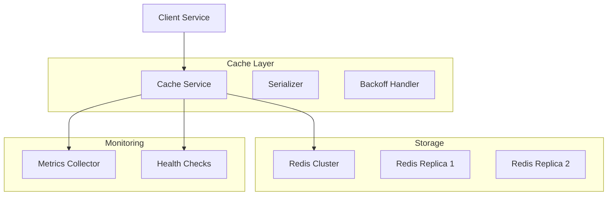

# Cache Service Component Guide

## Overview

The Cache service provides a high-performance, distributed caching layer using Redis with advanced features like type safety, metrics collection, and failure handling.

## Architecture



## Implementation

### 1. Cache Protocol
```python
@runtime_checkable
class CacheBackend(Protocol[KT, VT]):
    """Protocol for cache backend implementations."""
    
    async def get(self, key: KT) -> Optional[VT]:
        """Get value from cache."""
        ...
        
    async def set(
        self,
        key: KT,
        value: VT,
        ttl: Optional[int] = None
    ) -> None:
        """Set value in cache with optional TTL."""
        ...
        
    async def delete(self, key: KT) -> None:
        """Delete value from cache."""
        ...
        
    async def clear(self) -> None:
        """Clear all values from cache."""
        ...
        
    async def get_many(
        self,
        keys: Iterable[KT]
    ) -> Dict[KT, VT]:
        """Get multiple values from cache."""
        ...
        
    async def set_many(
        self,
        items: Dict[KT, VT],
        ttl: Optional[int] = None
    ) -> None:
        """Set multiple values in cache."""
        ...
```

### 2. Redis Implementation
```python
class RedisCache(CacheBackend[str, Any]):
    """Redis-based cache implementation."""
    
    def __init__(
        self,
        config: RedisCacheConfig,
        serializer: Optional[CacheSerializer] = None,
        metrics: Optional[MetricsCollector] = None
    ):
        self._redis = redis.Redis.from_url(
            config.url,
            encoding="utf-8",
            decode_responses=False,
            socket_timeout=config.timeout,
            socket_connect_timeout=config.connect_timeout,
            retry_on_timeout=True,
            health_check_interval=config.health_check_interval
        )
        self._serializer = serializer or JsonSerializer()
        self._metrics = metrics
        self._config = config
        
    @backoff.on_exception(
        backoff.expo,
        (redis.ConnectionError, redis.TimeoutError),
        max_tries=3
    )
    async def get(self, key: str) -> Optional[Any]:
        """Get value with automatic retry."""
        start_time = time.time()
        hit = False
        
        try:
            data = await self._redis.get(key)
            if data is None:
                return None
                
            hit = True
            return self._serializer.deserialize(data)
            
        except Exception as e:
            self._record_error("get", e)
            raise CacheError(f"Redis get error: {e}") from e
            
        finally:
            duration = time.time() - start_time
            self._record_metrics("get", duration, hit)
            
    async def set(
        self,
        key: str,
        value: Any,
        ttl: Optional[int] = None
    ) -> None:
        """Set value with metrics."""
        start_time = time.time()
        
        try:
            data = self._serializer.serialize(value)
            if ttl is not None:
                await self._redis.setex(key, ttl, data)
            else:
                await self._redis.set(key, data)
                
        except Exception as e:
            self._record_error("set", e)
            raise CacheError(f"Redis set error: {e}") from e
            
        finally:
            duration = time.time() - start_time
            self._record_metrics("set", duration, True)
```

### 3. Advanced Features

#### Pattern-Based Operations
```python
class PatternCache(CacheBackend[str, Any]):
    """Cache with pattern-based operations."""
    
    async def delete_pattern(self, pattern: str) -> int:
        """Delete all keys matching pattern."""
        keys = await self._redis.keys(pattern)
        if not keys:
            return 0
            
        return await self._redis.delete(*keys)
        
    async def get_pattern(
        self,
        pattern: str
    ) -> Dict[str, Any]:
        """Get all values matching pattern."""
        keys = await self._redis.keys(pattern)
        if not keys:
            return {}
            
        return await self.get_many(keys)
```

#### Cache Invalidation
```python
class InvalidationStrategy(Protocol):
    """Protocol for cache invalidation strategies."""
    
    async def invalidate(
        self,
        key: str,
        reason: str
    ) -> None:
        """Invalidate cache entry."""
        ...
        
class TimeBasedInvalidation(InvalidationStrategy):
    """Time-based cache invalidation."""
    
    async def invalidate(
        self,
        key: str,
        reason: str
    ) -> None:
        """Invalidate based on time rules."""
        if reason == "update":
            # Immediate invalidation
            await self._cache.delete(key)
        elif reason == "stale":
            # Refresh in background
            asyncio.create_task(self._refresh(key))
```

#### Cache Warming
```python
class CacheWarmer:
    """Background cache warming utility."""
    
    def __init__(
        self,
        cache: CacheBackend,
        compute_fn: Callable[[str], Awaitable[Any]],
        patterns: List[str]
    ):
        self._cache = cache
        self._compute = compute_fn
        self._patterns = patterns
        
    async def warm(self) -> None:
        """Warm cache for all patterns."""
        for pattern in self._patterns:
            keys = await self._find_keys(pattern)
            await self._warm_keys(keys)
            
    async def _warm_keys(self, keys: List[str]) -> None:
        """Warm specific keys in parallel."""
        tasks = [
            self._warm_key(key)
            for key in keys
        ]
        await asyncio.gather(*tasks)
```

## Performance Optimization

### 1. Connection Pooling
```python
class PooledRedisCache(RedisCache):
    """Redis cache with connection pooling."""
    
    def __init__(self, config: RedisCacheConfig):
        self._pool = redis.ConnectionPool(
            max_connections=config.max_connections,
            max_idle_time=config.max_idle_time,
            socket_timeout=config.timeout
        )
        self._redis = redis.Redis(
            connection_pool=self._pool,
            decode_responses=False
        )
```

### 2. Batch Operations
```python
class BatchOperation:
    """Batch operation helper."""
    
    def __init__(self, cache: CacheBackend):
        self._cache = cache
        self._pipeline = self._cache._redis.pipeline()
        
    async def __aenter__(self) -> "BatchOperation":
        return self
        
    async def __aexit__(self, *args) -> None:
        await self._pipeline.execute()
        
    async def set(self, key: str, value: Any) -> None:
        """Add set operation to batch."""
        self._pipeline.set(key, value)
```

### 3. Compression
```python
class CompressedSerializer(CacheSerializer):
    """Serializer with compression."""
    
    def __init__(self, compression_level: int = 6):
        self._level = compression_level
        
    def serialize(self, value: Any) -> bytes:
        """Serialize and compress value."""
        data = json.dumps(value).encode("utf-8")
        return zlib.compress(data, self._level)
        
    def deserialize(self, data: bytes) -> Any:
        """Decompress and deserialize value."""
        decompressed = zlib.decompress(data)
        return json.loads(decompressed.decode("utf-8"))
```

## Monitoring

### 1. Cache Metrics
```python
class CacheMetrics:
    """Cache-specific metrics."""
    
    def __init__(self, collector: MetricsCollector):
        self._collector = collector
        
        # Initialize metrics
        self._collector.register(
            "cache_operation_duration",
            MetricType.HISTOGRAM,
            description="Cache operation duration",
            labels=["operation"]
        )
        
        self._collector.register(
            "cache_hits",
            MetricType.COUNTER,
            description="Cache hit count",
            labels=["operation"]
        )
        
        self._collector.register(
            "cache_misses",
            MetricType.COUNTER,
            description="Cache miss count",
            labels=["operation"]
        )
        
        self._collector.register(
            "cache_errors",
            MetricType.COUNTER,
            description="Cache error count",
            labels=["operation", "error_type"]
        )
```

### 2. Health Checks
```python
class RedisHealth(HealthCheck):
    """Redis health check implementation."""
    
    async def check_health(self) -> HealthResult:
        """Check Redis health."""
        try:
            # Check basic connectivity
            await self._redis.ping()
            
            # Get stats
            info = await self._redis.info()
            used_memory = info["used_memory"]
            max_memory = info["maxmemory"]
            
            # Check memory usage
            memory_usage = used_memory / max_memory
            if memory_usage > 0.9:  # 90% threshold
                return {
                    "status": HealthStatus.DEGRADED,
                    "message": f"High memory usage: {memory_usage:.1%}"
                }
                
            return {
                "status": HealthStatus.HEALTHY,
                "details": {
                    "memory_usage": memory_usage,
                    "connected_clients": info["connected_clients"],
                    "uptime_seconds": info["uptime_in_seconds"]
                }
            }
            
        except Exception as e:
            return {
                "status": HealthStatus.UNHEALTHY,
                "message": str(e)
            }
```

## Testing

### 1. Unit Tests
```python
@pytest.mark.asyncio
async def test_redis_cache():
    """Test Redis cache operations."""
    cache = RedisCache(config)
    
    # Test basic operations
    await cache.set("key", "value")
    assert await cache.get("key") == "value"
    
    # Test TTL
    await cache.set("key", "value", ttl=1)
    assert await cache.get("key") == "value"
    await asyncio.sleep(1.1)
    assert await cache.get("key") is None
    
    # Test batch operations
    async with BatchOperation(cache) as batch:
        await batch.set("key1", "value1")
        await batch.set("key2", "value2")
    
    assert await cache.get("key1") == "value1"
    assert await cache.get("key2") == "value2"
```

### 2. Integration Tests
```python
@pytest.mark.integration
async def test_cache_integration():
    """Test cache integration."""
    container = Container()
    cache = container.cache_manager()
    metrics = container.metrics_collector()
    
    # Test with real Redis
    await cache.set("test", "value")
    assert await cache.get("test") == "value"
    
    # Check metrics
    stats = await metrics.get_metrics()
    assert stats["cache_hits"].value > 0
```

### 3. Performance Tests
```python
@pytest.mark.benchmark
async def test_cache_performance(benchmark):
    """Test cache performance."""
    async def operation():
        # Parallel operations
        await asyncio.gather(*(
            cache.get(f"key{i}")
            for i in range(100)
        ))
        
    result = await benchmark(operation)
    assert result.stats.mean < 0.1  # 100ms threshold
``` 