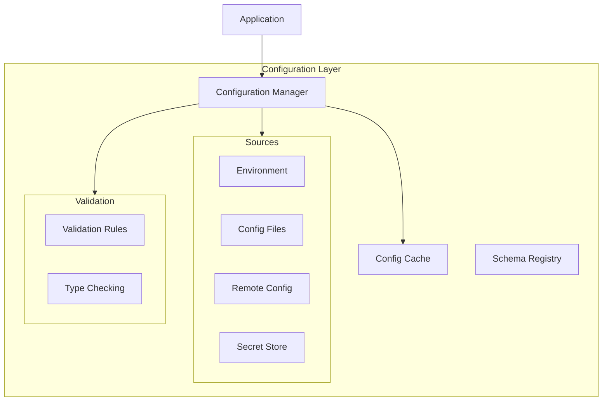

# Configuration Components Guide

## Overview

The configuration components provide a flexible and type-safe way to manage application settings, environment variables, and runtime configuration. These components ensure proper validation, loading, and access to configuration values.

## Architecture



## Components

### 1. Configuration Models

Type-safe configuration models using Pydantic.

```python
from pydantic import BaseModel, Field, validator
from typing import Optional, List, Dict, Any

class DatabaseConfig(BaseModel):
    """Database configuration."""
    
    url: str = Field(
        ...,
        description="Database connection URL"
    )
    max_connections: int = Field(
        default=10,
        ge=1,
        description="Maximum number of connections"
    )
    connect_timeout: float = Field(
        default=5.0,
        ge=0,
        description="Connection timeout in seconds"
    )
    pool_recycle: int = Field(
        default=3600,
        ge=0,
        description="Connection recycle time in seconds"
    )
    
    @validator("url")
    def validate_url(cls, v: str) -> str:
        """Validate database URL."""
        if not v.startswith(("postgresql://", "mysql://")):
            raise ValueError("Invalid database URL scheme")
        return v

class CacheConfig(BaseModel):
    """Cache configuration."""
    
    backend: str = Field(
        default="redis",
        description="Cache backend type"
    )
    url: str = Field(
        ...,
        description="Cache server URL"
    )
    ttl: int = Field(
        default=300,
        ge=0,
        description="Default TTL in seconds"
    )
    max_size: Optional[int] = Field(
        default=None,
        ge=0,
        description="Maximum cache size"
    )

class CircuitBreakerConfig(BaseModel):
    """Circuit breaker configuration."""
    
    failure_threshold: int = Field(
        default=5,
        ge=1,
        description="Number of failures before opening"
    )
    recovery_timeout: float = Field(
        default=30.0,
        ge=0,
        description="Recovery timeout in seconds"
    )
    half_open_calls: int = Field(
        default=3,
        ge=1,
        description="Number of calls to allow in half-open state"
    )

class MetricsConfig(BaseModel):
    """Metrics configuration."""
    
    enabled: bool = Field(
        default=True,
        description="Enable metrics collection"
    )
    host: str = Field(
        default="localhost",
        description="Metrics server host"
    )
    port: int = Field(
        default=9090,
        ge=0,
        description="Metrics server port"
    )
    export_interval: int = Field(
        default=60,
        ge=1,
        description="Metrics export interval in seconds"
    )

class AppConfig(BaseModel):
    """Application configuration."""
    
    env: str = Field(
        default="development",
        description="Environment name"
    )
    debug: bool = Field(
        default=False,
        description="Enable debug mode"
    )
    database: DatabaseConfig
    cache: CacheConfig
    circuit_breaker: CircuitBreakerConfig
    metrics: MetricsConfig
    log_level: str = Field(
        default="INFO",
        description="Logging level"
    )
```

### 2. Configuration Manager

Central component for managing configuration.

```python
class ConfigurationManager:
    """Configuration management service."""
    
    def __init__(
        self,
        schema: Type[BaseModel],
        sources: List[ConfigSource],
        cache: Optional[ConfigCache] = None
    ):
        self._schema = schema
        self._sources = sources
        self._cache = cache
        self._config: Optional[BaseModel] = None
        self._lock = asyncio.Lock()
        
    async def load(self) -> BaseModel:
        """Load configuration from sources."""
        async with self._lock:
            # Check cache first
            if self._cache:
                cached = await self._cache.get()
                if cached:
                    return cached
                    
            # Load from sources
            data: Dict[str, Any] = {}
            
            for source in self._sources:
                try:
                    source_data = await source.load()
                    data.update(source_data)
                except Exception as e:
                    logger.error(
                        f"Failed to load config from {source}: {e}"
                    )
                    
            # Validate and create config
            try:
                config = self._schema(**data)
            except ValidationError as e:
                raise ConfigError(f"Invalid configuration: {e}")
                
            # Cache if enabled
            if self._cache:
                await self._cache.set(config)
                
            self._config = config
            return config
            
    async def get(self) -> BaseModel:
        """Get current configuration."""
        if not self._config:
            return await self.load()
        return self._config
        
    async def reload(self) -> BaseModel:
        """Reload configuration from sources."""
        if self._cache:
            await self._cache.clear()
        return await self.load()
        
    def subscribe(
        self,
        callback: Callable[[BaseModel], Awaitable[None]]
    ) -> None:
        """Subscribe to configuration changes."""
        for source in self._sources:
            if isinstance(source, WatchableSource):
                source.subscribe(self._handle_change(callback))
                
    async def _handle_change(
        self,
        callback: Callable[[BaseModel], Awaitable[None]]
    ) -> None:
        """Handle configuration change."""
        try:
            new_config = await self.reload()
            await callback(new_config)
        except Exception as e:
            logger.error(f"Failed to handle config change: {e}")
```

### 3. Configuration Sources

Different sources for loading configuration.

```python
@runtime_checkable
class ConfigSource(Protocol):
    """Protocol for configuration sources."""
    
    async def load(self) -> Dict[str, Any]:
        """Load configuration data."""
        ...

class EnvironmentSource(ConfigSource):
    """Environment variables configuration source."""
    
    def __init__(self, prefix: str = "APP_"):
        self._prefix = prefix
        
    async def load(self) -> Dict[str, Any]:
        """Load from environment variables."""
        data = {}
        
        for key, value in os.environ.items():
            if key.startswith(self._prefix):
                # Remove prefix and convert to lowercase
                clean_key = key[len(self._prefix):].lower()
                
                # Handle nested keys
                parts = clean_key.split("__")
                current = data
                
                for part in parts[:-1]:
                    current = current.setdefault(part, {})
                    
                # Convert value type
                value = self._convert_value(value)
                current[parts[-1]] = value
                
        return data
        
    def _convert_value(self, value: str) -> Any:
        """Convert string value to appropriate type."""
        # Try boolean
        if value.lower() in ("true", "false"):
            return value.lower() == "true"
            
        # Try integer
        try:
            return int(value)
        except ValueError:
            pass
            
        # Try float
        try:
            return float(value)
        except ValueError:
            pass
            
        # Try list
        if value.startswith("[") and value.endswith("]"):
            return [
                v.strip()
                for v in value[1:-1].split(",")
                if v.strip()
            ]
            
        return value

class FileSource(ConfigSource):
    """File-based configuration source."""
    
    def __init__(
        self,
        path: str,
        format: str = "yaml",
        optional: bool = False
    ):
        self._path = path
        self._format = format
        self._optional = optional
        
    async def load(self) -> Dict[str, Any]:
        """Load from configuration file."""
        if not os.path.exists(self._path):
            if self._optional:
                return {}
            raise ConfigError(f"Config file not found: {self._path}")
            
        try:
            with open(self._path, "r") as f:
                if self._format == "yaml":
                    return yaml.safe_load(f)
                elif self._format == "json":
                    return json.load(f)
                else:
                    raise ConfigError(f"Unsupported format: {self._format}")
                    
        except Exception as e:
            raise ConfigError(f"Failed to load config file: {e}")

class VaultSource(ConfigSource):
    """HashiCorp Vault configuration source."""
    
    def __init__(
        self,
        url: str,
        token: str,
        path: str,
        optional: bool = False
    ):
        self._client = hvac.Client(
            url=url,
            token=token
        )
        self._path = path
        self._optional = optional
        
    async def load(self) -> Dict[str, Any]:
        """Load from Vault."""
        try:
            result = self._client.read(self._path)
            if not result:
                if self._optional:
                    return {}
                raise ConfigError(f"Vault path not found: {self._path}")
                
            return result["data"]
            
        except Exception as e:
            raise ConfigError(f"Failed to load from Vault: {e}")
```

### 4. Configuration Cache

Cache layer for configuration data.

```python
class ConfigCache:
    """Configuration cache."""
    
    def __init__(
        self,
        ttl: Optional[int] = None,
        namespace: str = "config"
    ):
        self._ttl = ttl
        self._namespace = namespace
        self._redis = redis.Redis()
        
    async def get(self) -> Optional[BaseModel]:
        """Get cached configuration."""
        try:
            data = await self._redis.get(self._namespace)
            if not data:
                return None
                
            return pickle.loads(data)
            
        except Exception as e:
            logger.error(f"Failed to get cached config: {e}")
            return None
            
    async def set(self, config: BaseModel) -> None:
        """Cache configuration."""
        try:
            data = pickle.dumps(config)
            await self._redis.set(
                self._namespace,
                data,
                ex=self._ttl
            )
        except Exception as e:
            logger.error(f"Failed to cache config: {e}")
            
    async def clear(self) -> None:
        """Clear cached configuration."""
        try:
            await self._redis.delete(self._namespace)
        except Exception as e:
            logger.error(f"Failed to clear cached config: {e}")
```

## Integration

### 1. Application Integration

Example of integrating configuration management.

```python
class Application:
    """Application with configuration management."""
    
    def __init__(self):
        self._config_manager = ConfigurationManager(
            schema=AppConfig,
            sources=[
                EnvironmentSource(prefix="APP_"),
                FileSource(
                    path="config.yaml",
                    optional=True
                ),
                VaultSource(
                    url=os.getenv("VAULT_URL"),
                    token=os.getenv("VAULT_TOKEN"),
                    path="secret/app",
                    optional=True
                )
            ],
            cache=ConfigCache(ttl=300)
        )
        
    async def start(self) -> None:
        """Start the application."""
        # Load initial configuration
        config = await self._config_manager.load()
        
        # Subscribe to changes
        self._config_manager.subscribe(self._handle_config_change)
        
        # Initialize components with config
        await self._init_components(config)
        
    async def _handle_config_change(
        self,
        config: AppConfig
    ) -> None:
        """Handle configuration changes."""
        try:
            # Update components with new config
            await self._update_components(config)
        except Exception as e:
            logger.error(f"Failed to apply config changes: {e}")
```

## Testing

### 1. Unit Tests

```python
@pytest.mark.asyncio
async def test_config_manager():
    """Test configuration manager."""
    # Create test sources
    sources = [
        EnvironmentSource(prefix="TEST_"),
        FileSource("test_config.yaml")
    ]
    
    # Create manager
    manager = ConfigurationManager(
        schema=AppConfig,
        sources=sources
    )
    
    # Test loading
    config = await manager.load()
    assert isinstance(config, AppConfig)
    assert config.env == "test"
    
    # Test reloading
    new_config = await manager.reload()
    assert new_config.env == "test"
```

### 2. Integration Tests

```python
@pytest.mark.integration
async def test_config_integration():
    """Test configuration integration."""
    app = Application()
    
    # Start application
    await app.start()
    
    # Verify config loaded
    config = await app._config_manager.get()
    assert config.database.url == "postgresql://localhost:5432/app"
    
    # Test config change
    os.environ["APP_DATABASE__URL"] = "postgresql://localhost:5432/new_db"
    await app._config_manager.reload()
    
    # Verify config updated
    new_config = await app._config_manager.get()
    assert new_config.database.url == "postgresql://localhost:5432/new_db"
```

### 3. Validation Tests

```python
def test_config_validation():
    """Test configuration validation."""
    # Test invalid database URL
    with pytest.raises(ValidationError):
        DatabaseConfig(url="invalid://localhost")
        
    # Test invalid connection count
    with pytest.raises(ValidationError):
        DatabaseConfig(
            url="postgresql://localhost",
            max_connections=0
        )
        
    # Test valid config
    config = DatabaseConfig(
        url="postgresql://localhost",
        max_connections=10,
        connect_timeout=5.0
    )
    assert config.url == "postgresql://localhost"
``` 