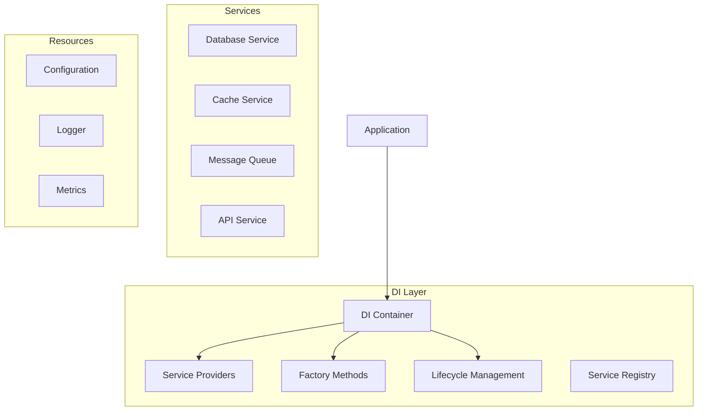

# Dependency Injection Components Guide

## Overview

The dependency injection components provide a flexible and maintainable way to manage component dependencies, service lifecycles, and application wiring. These components ensure proper initialization order, resource management, and testability.

## Architecture



## Components

### 1. Container Definition

The main dependency injection container.

```python
from dependency_injector import containers, providers
from typing import Optional, Dict, Any

class Container(containers.DeclarativeContainer):
    """Dependency injection container."""
    
    # Configuration
    config = providers.Configuration()
    
    # Core services
    logger = providers.Singleton(
        LogManager,
        config=config.logging
    )
    
    metrics = providers.Singleton(
        MetricsCollector,
        config=config.metrics
    )
    
    telemetry = providers.Singleton(
        TelemetryManager,
        logger=logger,
        metrics=metrics,
        config=config.telemetry
    )
    
    # Database
    database = providers.Singleton(
        DatabaseService,
        config=config.database,
        metrics=metrics,
        logger=logger
    )
    
    # Cache
    cache = providers.Singleton(
        CacheService,
        config=config.cache,
        metrics=metrics,
        logger=logger
    )
    
    # Message queue
    queue = providers.Singleton(
        MessageQueue,
        config=config.queue,
        metrics=metrics,
        logger=logger
    )
    
    # API clients
    openai_client = providers.Singleton(
        OpenAIClient,
        config=config.openai,
        metrics=metrics,
        logger=logger
    )
    
    assembly_ai_client = providers.Singleton(
        AssemblyAIClient,
        config=config.assembly_ai,
        metrics=metrics,
        logger=logger
    )
    
    strapi_client = providers.Singleton(
        StrapiClient,
        config=config.strapi,
        metrics=metrics,
        logger=logger
    )
    
    # Services
    interview_service = providers.Singleton(
        InterviewService,
        openai=openai_client,
        assembly_ai=assembly_ai_client,
        database=database,
        cache=cache,
        queue=queue,
        metrics=metrics,
        logger=logger
    )
    
    user_service = providers.Singleton(
        UserService,
        database=database,
        cache=cache,
        strapi=strapi_client,
        metrics=metrics,
        logger=logger
    )
    
    session_service = providers.Singleton(
        SessionService,
        database=database,
        cache=cache,
        strapi=strapi_client,
        metrics=metrics,
        logger=logger
    )
```

### 2. Service Providers

Factory methods for creating service instances.

```python
class ServiceProvider:
    """Base class for service providers."""
    
    def __init__(
        self,
        container: Container,
        service_type: type,
        config_key: str
    ):
        self._container = container
        self._service_type = service_type
        self._config_key = config_key
        self._instance: Optional[Any] = None
        
    async def get(self) -> Any:
        """Get service instance."""
        if not self._instance:
            config = self._container.config.get(self._config_key)
            self._instance = self._service_type(
                config=config,
                metrics=self._container.metrics(),
                logger=self._container.logger()
            )
            await self._instance.initialize()
            
        return self._instance
        
    async def shutdown(self) -> None:
        """Shutdown service instance."""
        if self._instance:
            await self._instance.shutdown()
            self._instance = None

class DatabaseProvider(ServiceProvider):
    """Database service provider."""
    
    def __init__(self, container: Container):
        super().__init__(
            container,
            DatabaseService,
            "database"
        )
        
    async def get(self) -> DatabaseService:
        """Get database service instance."""
        instance = await super().get()
        return instance

class CacheProvider(ServiceProvider):
    """Cache service provider."""
    
    def __init__(self, container: Container):
        super().__init__(
            container,
            CacheService,
            "cache"
        )
        
    async def get(self) -> CacheService:
        """Get cache service instance."""
        instance = await super().get()
        return instance
```

### 3. Service Factory

Factory for creating service instances with dependencies.

```python
class ServiceFactory:
    """Factory for creating service instances."""
    
    def __init__(self, container: Container):
        self._container = container
        self._providers: Dict[str, ServiceProvider] = {}
        
    def register_provider(
        self,
        name: str,
        provider: ServiceProvider
    ) -> None:
        """Register service provider."""
        self._providers[name] = provider
        
    async def create_service(
        self,
        service_type: type,
        dependencies: Optional[Dict[str, str]] = None
    ) -> Any:
        """Create service instance with dependencies."""
        # Get dependencies
        deps = {}
        if dependencies:
            for key, provider_name in dependencies.items():
                provider = self._providers.get(provider_name)
                if not provider:
                    raise ValueError(
                        f"Provider not found: {provider_name}"
                    )
                deps[key] = await provider.get()
                
        # Create service
        return service_type(
            config=self._get_config(service_type),
            metrics=self._container.metrics(),
            logger=self._container.logger(),
            **deps
        )
        
    def _get_config(self, service_type: type) -> Any:
        """Get configuration for service type."""
        config_key = service_type.__name__.lower()
        return self._container.config.get(config_key)
```

### 4. Service Registry

Registry for managing service instances.

```python
class ServiceRegistry:
    """Registry for managing service instances."""
    
    def __init__(self):
        self._services: Dict[str, Any] = {}
        self._factory: Optional[ServiceFactory] = None
        
    def set_factory(self, factory: ServiceFactory) -> None:
        """Set service factory."""
        self._factory = factory
        
    async def get_service(
        self,
        name: str,
        service_type: type,
        dependencies: Optional[Dict[str, str]] = None
    ) -> Any:
        """Get or create service instance."""
        if name not in self._services:
            if not self._factory:
                raise ValueError("Service factory not set")
                
            service = await self._factory.create_service(
                service_type,
                dependencies
            )
            self._services[name] = service
            
        return self._services[name]
        
    async def shutdown(self) -> None:
        """Shutdown all services."""
        for service in self._services.values():
            if hasattr(service, "shutdown"):
                await service.shutdown()
        self._services.clear()
```

## Integration

### 1. Application Integration

Example of integrating dependency injection.

```python
class Application:
    """Application with dependency injection."""
    
    def __init__(self):
        # Create container
        self._container = Container()
        
        # Configure container
        self._container.config.from_dict({
            "database": {
                "url": "postgresql://localhost:5432/app",
                "max_connections": 10
            },
            "cache": {
                "url": "redis://localhost:6379/0",
                "ttl": 300
            },
            "queue": {
                "url": "amqp://localhost:5672",
                "prefetch_count": 10
            }
        })
        
        # Create service factory
        self._factory = ServiceFactory(self._container)
        
        # Register providers
        self._factory.register_provider(
            "database",
            DatabaseProvider(self._container)
        )
        self._factory.register_provider(
            "cache",
            CacheProvider(self._container)
        )
        
        # Create service registry
        self._registry = ServiceRegistry()
        self._registry.set_factory(self._factory)
        
    async def start(self) -> None:
        """Start the application."""
        try:
            # Get required services
            interview_service = await self._registry.get_service(
                "interview",
                InterviewService,
                {
                    "database": "database",
                    "cache": "cache"
                }
            )
            
            user_service = await self._registry.get_service(
                "user",
                UserService,
                {
                    "database": "database",
                    "cache": "cache"
                }
            )
            
            # Start services
            await interview_service.start()
            await user_service.start()
            
        except Exception as e:
            logger.error(f"Failed to start application: {e}")
            await self.shutdown()
            raise
            
    async def shutdown(self) -> None:
        """Shutdown the application."""
        await self._registry.shutdown()
```

### 2. Service Integration

Example of a service using dependency injection.

```python
class InterviewService:
    """Interview service with injected dependencies."""
    
    def __init__(
        self,
        config: InterviewConfig,
        database: DatabaseService,
        cache: CacheService,
        metrics: MetricsCollector,
        logger: LogManager
    ):
        self._config = config
        self._database = database
        self._cache = cache
        self._metrics = metrics
        self._logger = logger
        
    async def start(self) -> None:
        """Start the service."""
        self._logger.info("Starting interview service")
        
        # Initialize resources
        await self._database.connect()
        await self._cache.connect()
        
        self._metrics.gauge(
            "interview_service_status",
            1,
            {"status": "running"}
        )
        
    async def shutdown(self) -> None:
        """Shutdown the service."""
        self._logger.info("Shutting down interview service")
        
        # Cleanup resources
        await self._database.disconnect()
        await self._cache.disconnect()
        
        self._metrics.gauge(
            "interview_service_status",
            0,
            {"status": "stopped"}
        )
```

## Testing

### 1. Unit Tests

```python
@pytest.mark.asyncio
async def test_service_factory():
    """Test service factory."""
    # Create container with test config
    container = Container()
    container.config.from_dict({
        "test_service": {
            "setting": "value"
        }
    })
    
    # Create factory
    factory = ServiceFactory(container)
    
    # Register test provider
    provider = MockProvider(container)
    factory.register_provider("test", provider)
    
    # Create service
    service = await factory.create_service(
        TestService,
        {"dependency": "test"}
    )
    
    assert isinstance(service, TestService)
    assert service.config.setting == "value"
```

### 2. Integration Tests

```python
@pytest.mark.integration
async def test_service_integration():
    """Test service integration."""
    app = Application()
    
    # Start application
    await app.start()
    
    # Get service
    service = await app._registry.get_service(
        "interview",
        InterviewService,
        {
            "database": "database",
            "cache": "cache"
        }
    )
    
    assert isinstance(service, InterviewService)
    
    # Test service operations
    result = await service.process_interview(
        user_id="test",
        questions=["Q1", "Q2"]
    )
    assert result is not None
    
    # Shutdown
    await app.shutdown()
```

### 3. Mock Tests

```python
class MockContainer(containers.DeclarativeContainer):
    """Mock container for testing."""
    
    config = providers.Configuration()
    
    logger = providers.Singleton(MockLogger)
    metrics = providers.Singleton(MockMetrics)
    
    database = providers.Singleton(
        MockDatabase,
        config=config.database
    )
    
    cache = providers.Singleton(
        MockCache,
        config=config.cache
    )

@pytest.mark.asyncio
async def test_service_with_mocks():
    """Test service with mock dependencies."""
    # Create mock container
    container = MockContainer()
    container.config.from_dict({
        "database": {"url": "mock://db"},
        "cache": {"url": "mock://cache"}
    })
    
    # Create service
    service = InterviewService(
        config=InterviewConfig(),
        database=container.database(),
        cache=container.cache(),
        metrics=container.metrics(),
        logger=container.logger()
    )
    
    # Test with mock dependencies
    await service.start()
    
    result = await service.process_interview(
        user_id="test",
        questions=["Q1"]
    )
    assert result is not None
    
    await service.shutdown()
``` 