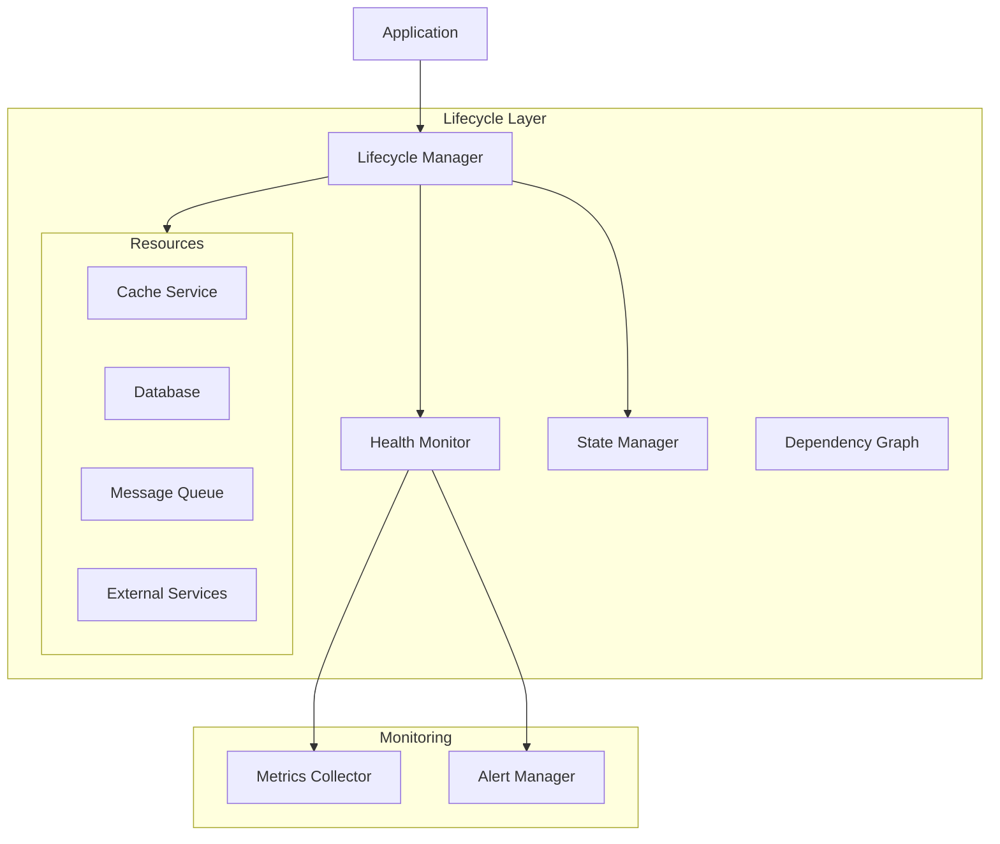

# Lifecycle Management Components Guide

## Overview

The lifecycle management components provide a framework for managing the lifecycle of system resources, including initialization, startup, shutdown, and health monitoring. These components ensure proper resource management and graceful system operation.

## Architecture



## Components

### 1. Lifecycle Protocol

The base protocol for lifecycle-aware components.

```python
@runtime_checkable
class LifecycleAware(Protocol):
    """Protocol for lifecycle-aware components."""
    
    @property
    def name(self) -> str:
        """Get component name."""
        ...
        
    @property
    def state(self) -> LifecycleState:
        """Get current lifecycle state."""
        ...
        
    @property
    def dependencies(self) -> List[str]:
        """Get component dependencies."""
        ...
        
    async def initialize(self) -> None:
        """Initialize the component."""
        ...
        
    async def start(self) -> None:
        """Start the component."""
        ...
        
    async def stop(self) -> None:
        """Stop the component."""
        ...
        
    async def check_health(self) -> HealthResult:
        """Check component health."""
        ...

class LifecycleState(Enum):
    """Component lifecycle states."""
    
    UNINITIALIZED = "uninitialized"
    INITIALIZING = "initializing"
    INITIALIZED = "initialized"
    STARTING = "starting"
    RUNNING = "running"
    STOPPING = "stopping"
    STOPPED = "stopped"
    FAILED = "failed"
```

### 2. Lifecycle Manager

The main component for managing lifecycle-aware resources.

```python
class LifecycleManager:
    """Manager for lifecycle-aware components."""
    
    def __init__(
        self,
        metrics: Optional[MetricsCollector] = None,
        logger: Optional[LogManager] = None
    ):
        self._metrics = metrics
        self._logger = logger
        self._components: Dict[str, LifecycleAware] = {}
        self._state = LifecycleState.UNINITIALIZED
        self._lock = asyncio.Lock()
        
    def register(
        self,
        component: LifecycleAware,
        dependencies: Optional[List[str]] = None
    ) -> None:
        """Register a lifecycle-aware component."""
        if component.name in self._components:
            raise ValueError(f"Component {component.name} already registered")
            
        self._components[component.name] = component
        
        if dependencies:
            # Validate dependencies
            for dep in dependencies:
                if dep not in self._components:
                    raise ValueError(f"Dependency {dep} not found")
                    
            component.dependencies.extend(dependencies)
            
    async def initialize(self) -> None:
        """Initialize all components in dependency order."""
        async with self._lock:
            if self._state != LifecycleState.UNINITIALIZED:
                raise LifecycleError("Manager already initialized")
                
            self._state = LifecycleState.INITIALIZING
            
            try:
                # Sort components by dependencies
                components = self._sort_components()
                
                # Initialize components
                for component in components:
                    try:
                        self._log_lifecycle_event(
                            component.name,
                            "initializing"
                        )
                        await component.initialize()
                        self._log_lifecycle_event(
                            component.name,
                            "initialized"
                        )
                        
                    except Exception as e:
                        self._log_lifecycle_event(
                            component.name,
                            "initialization_failed",
                            error=str(e)
                        )
                        raise
                        
                self._state = LifecycleState.INITIALIZED
                
            except Exception as e:
                self._state = LifecycleState.FAILED
                raise LifecycleError(
                    f"Initialization failed: {str(e)}"
                ) from e
                
    async def start(self) -> None:
        """Start all components in dependency order."""
        async with self._lock:
            if self._state != LifecycleState.INITIALIZED:
                raise LifecycleError("Manager not initialized")
                
            self._state = LifecycleState.STARTING
            
            try:
                # Sort components by dependencies
                components = self._sort_components()
                
                # Start components
                for component in components:
                    try:
                        self._log_lifecycle_event(
                            component.name,
                            "starting"
                        )
                        await component.start()
                        self._log_lifecycle_event(
                            component.name,
                            "started"
                        )
                        
                    except Exception as e:
                        self._log_lifecycle_event(
                            component.name,
                            "start_failed",
                            error=str(e)
                        )
                        raise
                        
                self._state = LifecycleState.RUNNING
                
            except Exception as e:
                self._state = LifecycleState.FAILED
                raise LifecycleError(
                    f"Startup failed: {str(e)}"
                ) from e
                
    async def stop(self) -> None:
        """Stop all components in reverse dependency order."""
        async with self._lock:
            if self._state not in {
                LifecycleState.RUNNING,
                LifecycleState.FAILED
            }:
                raise LifecycleError("Manager not running")
                
            self._state = LifecycleState.STOPPING
            
            try:
                # Sort components in reverse order
                components = reversed(self._sort_components())
                
                # Stop components
                for component in components:
                    try:
                        self._log_lifecycle_event(
                            component.name,
                            "stopping"
                        )
                        await component.stop()
                        self._log_lifecycle_event(
                            component.name,
                            "stopped"
                        )
                        
                    except Exception as e:
                        self._log_lifecycle_event(
                            component.name,
                            "stop_failed",
                            error=str(e)
                        )
                        # Continue stopping other components
                        
                self._state = LifecycleState.STOPPED
                
            except Exception as e:
                self._state = LifecycleState.FAILED
                raise LifecycleError(
                    f"Shutdown failed: {str(e)}"
                ) from e
                
    async def check_health(self) -> HealthResult:
        """Check health of all components."""
        results = {}
        overall_status = HealthStatus.HEALTHY
        
        for name, component in self._components.items():
            try:
                result = await component.check_health()
                results[name] = result
                
                if result["status"] == HealthStatus.UNHEALTHY:
                    overall_status = HealthStatus.UNHEALTHY
                elif (
                    result["status"] == HealthStatus.DEGRADED and
                    overall_status == HealthStatus.HEALTHY
                ):
                    overall_status = HealthStatus.DEGRADED
                    
            except Exception as e:
                results[name] = {
                    "status": HealthStatus.UNHEALTHY,
                    "error": str(e)
                }
                overall_status = HealthStatus.UNHEALTHY
                
        return {
            "status": overall_status,
            "components": results
        }
        
    def _sort_components(self) -> List[LifecycleAware]:
        """Sort components by dependencies."""
        # Build dependency graph
        graph = {
            name: set(component.dependencies)
            for name, component in self._components.items()
        }
        
        # Check for cycles
        visited = set()
        temp = set()
        
        def check_cycles(node: str) -> None:
            if node in temp:
                raise LifecycleError(f"Circular dependency found: {node}")
            if node in visited:
                return
                
            temp.add(node)
            for dep in graph[node]:
                check_cycles(dep)
            temp.remove(node)
            visited.add(node)
            
        for node in graph:
            check_cycles(node)
            
        # Topological sort
        sorted_names = []
        visited = set()
        
        def visit(node: str) -> None:
            if node in visited:
                return
            for dep in graph[node]:
                visit(dep)
            visited.add(node)
            sorted_names.append(node)
            
        for node in graph:
            visit(node)
            
        return [
            self._components[name]
            for name in sorted_names
        ]
        
    def _log_lifecycle_event(
        self,
        component: str,
        event: str,
        error: Optional[str] = None
    ) -> None:
        """Log lifecycle event."""
        if self._logger:
            context = {
                "component": component,
                "event": event
            }
            if error:
                context["error"] = error
                
            self._logger.log(
                "info" if not error else "error",
                f"Lifecycle event: {event}",
                context
            )
            
        if self._metrics:
            labels = {
                "component": component,
                "event": event
            }
            self._metrics.record(
                "lifecycle_events",
                1,
                labels
            )
```

### 3. Resource Management

Example of a lifecycle-aware resource.

```python
class DatabaseResource(LifecycleAware):
    """Lifecycle-aware database resource."""
    
    def __init__(
        self,
        config: DatabaseConfig,
        metrics: Optional[MetricsCollector] = None
    ):
        self._config = config
        self._metrics = metrics
        self._client = None
        self._state = LifecycleState.UNINITIALIZED
        
    @property
    def name(self) -> str:
        return "database"
        
    @property
    def state(self) -> LifecycleState:
        return self._state
        
    @property
    def dependencies(self) -> List[str]:
        return []
        
    async def initialize(self) -> None:
        """Initialize database connection."""
        try:
            self._state = LifecycleState.INITIALIZING
            
            # Create client
            self._client = AsyncClient(
                self._config.url,
                max_connections=self._config.max_connections,
                connect_timeout=self._config.connect_timeout
            )
            
            # Test connection
            await self._client.ping()
            
            self._state = LifecycleState.INITIALIZED
            
        except Exception as e:
            self._state = LifecycleState.FAILED
            raise ResourceError(f"Database initialization failed: {e}") from e
            
    async def start(self) -> None:
        """Start database operations."""
        try:
            self._state = LifecycleState.STARTING
            
            # Create connection pool
            await self._client.create_pool()
            
            # Initialize schemas
            await self._init_schemas()
            
            self._state = LifecycleState.RUNNING
            
        except Exception as e:
            self._state = LifecycleState.FAILED
            raise ResourceError(f"Database startup failed: {e}") from e
            
    async def stop(self) -> None:
        """Stop database operations."""
        try:
            self._state = LifecycleState.STOPPING
            
            if self._client:
                await self._client.close()
                
            self._state = LifecycleState.STOPPED
            
        except Exception as e:
            self._state = LifecycleState.FAILED
            raise ResourceError(f"Database shutdown failed: {e}") from e
            
    async def check_health(self) -> HealthResult:
        """Check database health."""
        try:
            if not self._client:
                return {
                    "status": HealthStatus.UNHEALTHY,
                    "message": "Database not initialized"
                }
                
            # Check connection
            await self._client.ping()
            
            # Get stats
            stats = await self._client.get_stats()
            
            return {
                "status": HealthStatus.HEALTHY,
                "details": {
                    "connections": stats["active_connections"],
                    "operations": stats["operations_per_second"],
                    "latency": stats["average_latency"]
                }
            }
            
        except Exception as e:
            return {
                "status": HealthStatus.UNHEALTHY,
                "message": str(e)
            }
```

## Integration

### 1. Application Integration

Example of integrating lifecycle management into an application.

```python
class Application:
    """Application with lifecycle management."""
    
    def __init__(self, config: AppConfig):
        self._config = config
        self._lifecycle = LifecycleManager(
            metrics=MetricsCollector(),
            logger=LogManager()
        )
        
        # Register components
        self._register_components()
        
    def _register_components(self) -> None:
        """Register application components."""
        # Database
        database = DatabaseResource(self._config.database)
        self._lifecycle.register(database)
        
        # Cache
        cache = CacheResource(self._config.cache)
        self._lifecycle.register(cache, ["database"])
        
        # Message queue
        queue = QueueResource(self._config.queue)
        self._lifecycle.register(queue, ["database"])
        
        # API service
        api = ApiService(self._config.api)
        self._lifecycle.register(
            api,
            ["database", "cache", "queue"]
        )
        
    async def run(self) -> None:
        """Run the application."""
        try:
            # Initialize components
            await self._lifecycle.initialize()
            
            # Start components
            await self._lifecycle.start()
            
            # Wait for shutdown signal
            await self._wait_for_shutdown()
            
        finally:
            # Stop components
            await self._lifecycle.stop()
            
    async def check_health(self) -> HealthResult:
        """Check application health."""
        return await self._lifecycle.check_health()
```

## Monitoring

### 1. Lifecycle Metrics

```python
class LifecycleMetrics:
    """Lifecycle-specific metrics."""
    
    def __init__(self, collector: MetricsCollector):
        self._collector = collector
        
        # Register metrics
        self._collector.register(
            "lifecycle_events",
            MetricType.COUNTER,
            description="Lifecycle event count",
            labels=["component", "event"]
        )
        
        self._collector.register(
            "component_state",
            MetricType.GAUGE,
            description="Component state",
            labels=["component"]
        )
        
        self._collector.register(
            "initialization_duration",
            MetricType.HISTOGRAM,
            description="Component initialization duration",
            labels=["component"]
        )
        
        self._collector.register(
            "startup_duration",
            MetricType.HISTOGRAM,
            description="Component startup duration",
            labels=["component"]
        )
```

### 2. Health Monitoring

```python
class HealthMonitor:
    """Health monitoring service."""
    
    def __init__(
        self,
        lifecycle: LifecycleManager,
        config: HealthConfig
    ):
        self._lifecycle = lifecycle
        self._config = config
        self._status = HealthStatus.UNKNOWN
        
    async def monitor(self) -> None:
        """Monitor component health."""
        while True:
            try:
                result = await self._lifecycle.check_health()
                new_status = result["status"]
                
                if new_status != self._status:
                    self._handle_status_change(
                        self._status,
                        new_status,
                        result
                    )
                    self._status = new_status
                    
            except Exception as e:
                logger.error(f"Health check failed: {e}")
                
            await asyncio.sleep(self._config.check_interval)
            
    def _handle_status_change(
        self,
        old_status: HealthStatus,
        new_status: HealthStatus,
        result: HealthResult
    ) -> None:
        """Handle health status change."""
        if new_status == HealthStatus.UNHEALTHY:
            # Send alert
            alert = Alert(
                severity="critical",
                message="System health degraded",
                details=result
            )
            asyncio.create_task(self._send_alert(alert))
```

## Testing

### 1. Unit Tests

```python
@pytest.mark.asyncio
async def test_lifecycle_manager():
    """Test lifecycle manager functionality."""
    manager = LifecycleManager()
    
    # Create mock components
    component1 = MockComponent("comp1")
    component2 = MockComponent("comp2", ["comp1"])
    
    # Register components
    manager.register(component1)
    manager.register(component2)
    
    # Test initialization
    await manager.initialize()
    assert component1.state == LifecycleState.INITIALIZED
    assert component2.state == LifecycleState.INITIALIZED
    
    # Test startup
    await manager.start()
    assert component1.state == LifecycleState.RUNNING
    assert component2.state == LifecycleState.RUNNING
    
    # Test shutdown
    await manager.stop()
    assert component1.state == LifecycleState.STOPPED
    assert component2.state == LifecycleState.STOPPED
```

### 2. Integration Tests

```python
@pytest.mark.integration
async def test_lifecycle_integration():
    """Test lifecycle integration."""
    app = Application(AppConfig())
    
    # Start application
    await app.run()
    
    # Check component health
    result = await app.check_health()
    assert result["status"] == HealthStatus.HEALTHY
    
    # Verify metrics
    metrics = app._lifecycle._metrics.get_metrics()
    assert metrics["lifecycle_events"].value > 0
```

### 3. Failure Tests

```python
@pytest.mark.asyncio
async def test_lifecycle_failures():
    """Test lifecycle failure handling."""
    manager = LifecycleManager()
    
    # Create failing component
    component = FailingComponent("failing")
    manager.register(component)
    
    # Test initialization failure
    with pytest.raises(LifecycleError):
        await manager.initialize()
    assert component.state == LifecycleState.FAILED
    
    # Test health check
    result = await manager.check_health()
    assert result["status"] == HealthStatus.UNHEALTHY
``` 