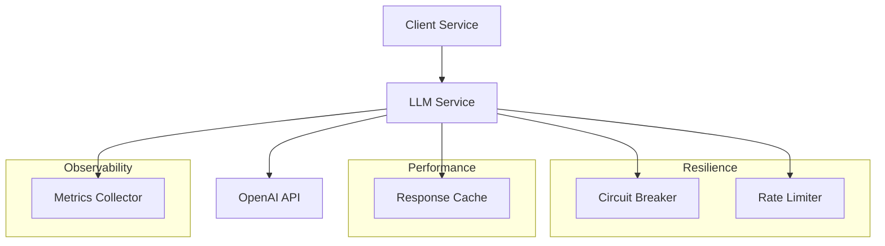

# LLM Service Component Guide

## Overview

The LLM (Large Language Model) service provides a resilient, observable interface to OpenAI's GPT models with advanced caching and error handling.

## Architecture



## Implementation

### 1. Service Interface
```python
@runtime_checkable
class LLMProvider(Protocol):
    """Protocol for LLM service providers."""
    
    async def generate_response(
        self,
        prompt: str,
        *,
        temperature: float = 0.7,
        max_tokens: int = 1000,
        stream: bool = False
    ) -> Union[str, AsyncIterator[str]]:
        """Generate response from LLM."""
        ...
        
    async def generate_embeddings(
        self,
        texts: list[str]
    ) -> list[list[float]]:
        """Generate embeddings for texts."""
        ...
        
    def get_token_count(self, text: str) -> int:
        """Get token count for text."""
        ...
```

### 2. OpenAI Implementation
```python
class OpenAIProvider(LLMProvider):
    """OpenAI-based LLM provider implementation."""
    
    def __init__(
        self,
        config: OpenAIConfig,
        cache_manager: Optional[CacheManager] = None,
        metrics_collector: Optional[MetricsCollector] = None
    ):
        self._client = AsyncOpenAI(api_key=config.api_key)
        self._config = config
        self._cache = cache_manager
        self._metrics = metrics_collector
        self._tokenizer = tiktoken.encoding_for_model(config.model)
        
    @retry_with_backoff(max_attempts=3)
    @circuit_breaker("openai_api")
    @rate_limiter("openai_api")
    async def generate_response(
        self,
        prompt: str,
        **kwargs
    ) -> Union[str, AsyncIterator[str]]:
        """Generate response with resilience patterns."""
        cache_key = self._get_cache_key(prompt, kwargs)
        
        # Check cache first
        if self._cache and not kwargs.get("stream", False):
            if cached := await self._cache.get(cache_key):
                self._record_metric("cache_hit")
                return cached
                
        # Generate response
        try:
            start_time = time.time()
            response = await self._client.chat.completions.create(
                model=self._config.model,
                messages=[{"role": "user", "content": prompt}],
                **kwargs
            )
            duration = time.time() - start_time
            
            # Record metrics
            self._record_metric(
                "request_duration",
                duration,
                labels={"model": self._config.model}
            )
            
            # Cache response if not streaming
            if self._cache and not kwargs.get("stream", False):
                text = response.choices[0].message.content
                await self._cache.set(
                    cache_key,
                    text,
                    ttl=self._config.cache_ttl
                )
                return text
                
            # Return streaming response
            return self._stream_response(response) if kwargs.get("stream") else response.choices[0].message.content
            
        except Exception as e:
            self._record_metric("error", labels={"type": type(e).__name__})
            raise LLMError(f"OpenAI API error: {e}") from e
            
    async def _stream_response(
        self,
        response: AsyncIterator[ChatCompletion]
    ) -> AsyncIterator[str]:
        """Stream response chunks."""
        try:
            async for chunk in response:
                if content := chunk.choices[0].delta.content:
                    yield content
        except Exception as e:
            self._record_metric("stream_error", labels={"type": type(e).__name__})
            raise LLMError(f"Stream error: {e}") from e
```

### 3. Configuration
```python
@dataclass
class OpenAIConfig:
    """OpenAI provider configuration."""
    api_key: SecretStr
    model: str = "gpt-4-1106-preview"
    temperature: float = 0.7
    max_tokens: int = 2000
    cache_ttl: int = 3600  # 1 hour
    timeout: float = 30.0
    streaming: bool = True
    
    # Resilience settings
    retry_attempts: int = 3
    retry_initial_delay: float = 1.0
    retry_max_delay: float = 30.0
    circuit_breaker_threshold: int = 5
    circuit_breaker_recovery: int = 60
    rate_limit_requests: int = 10
    rate_limit_window: int = 60
```

## Usage Examples

### 1. Basic Usage
```python
llm = OpenAIProvider(config)
response = await llm.generate_response("Translate to French: Hello, world!")
print(response)  # Bonjour, le monde!
```

### 2. Streaming Responses
```python
async for chunk in llm.generate_response("Tell me a story", stream=True):
    print(chunk, end="", flush=True)
```

### 3. With Error Handling
```python
try:
    response = await llm.generate_response(prompt)
except LLMError as e:
    if isinstance(e.__cause__, RateLimitError):
        await asyncio.sleep(60)  # Wait and retry
    elif isinstance(e.__cause__, CircuitBreakerError):
        response = await fallback_llm.generate_response(prompt)
    else:
        raise
```

### 4. With Context Manager
```python
async with llm_context() as llm:
    response = await llm.generate_response(prompt)
    embeddings = await llm.generate_embeddings([text])
```

## Performance Optimization

### 1. Caching Strategy
```python
class LLMCache:
    """Specialized cache for LLM responses."""
    
    def __init__(self, cache: CacheManager):
        self._cache = cache
        self._pending: Dict[str, asyncio.Event] = {}
        
    async def get_or_compute(
        self,
        key: str,
        compute_fn: Callable[[], Awaitable[str]]
    ) -> str:
        """Get from cache or compute with deduplication."""
        if cached := await self._cache.get(key):
            return cached
            
        # Deduplicate concurrent requests
        if key in self._pending:
            await self._pending[key].wait()
            return await self._cache.get(key)
            
        # Compute and cache
        event = asyncio.Event()
        self._pending[key] = event
        try:
            result = await compute_fn()
            await self._cache.set(key, result)
            return result
        finally:
            event.set()
            del self._pending[key]
```

### 2. Batch Processing
```python
class BatchProcessor:
    """Batch processor for LLM requests."""
    
    def __init__(self, batch_size: int = 10, wait_time: float = 0.1):
        self._batch_size = batch_size
        self._wait_time = wait_time
        self._queue: asyncio.Queue[Request] = asyncio.Queue()
        self._task = asyncio.create_task(self._process_batches())
        
    async def add(self, request: Request) -> Response:
        """Add request to batch."""
        future = asyncio.Future()
        await self._queue.put((request, future))
        return await future
        
    async def _process_batches(self):
        """Process requests in batches."""
        while True:
            batch = []
            try:
                # Collect batch
                while len(batch) < self._batch_size:
                    try:
                        request = await asyncio.wait_for(
                            self._queue.get(),
                            self._wait_time
                        )
                        batch.append(request)
                    except asyncio.TimeoutError:
                        break
                        
                if not batch:
                    continue
                    
                # Process batch
                responses = await self._llm.generate_batch([r[0] for r in batch])
                
                # Return results
                for (_, future), response in zip(batch, responses):
                    future.set_result(response)
                    
            except Exception as e:
                for _, future in batch:
                    if not future.done():
                        future.set_exception(e)
```

## Monitoring and Metrics

### 1. Key Metrics
```python
class LLMMetrics:
    """Metrics for LLM service."""
    
    def __init__(self, collector: MetricsCollector):
        self._collector = collector
        
        # Initialize metrics
        self._collector.register(
            "llm_request_duration",
            MetricType.HISTOGRAM,
            description="LLM request duration in seconds",
            labels=["model", "operation"]
        )
        
        self._collector.register(
            "llm_token_count",
            MetricType.HISTOGRAM,
            description="Token count per request",
            labels=["model", "operation"]
        )
        
        self._collector.register(
            "llm_errors",
            MetricType.COUNTER,
            description="LLM errors by type",
            labels=["model", "error_type"]
        )
        
        self._collector.register(
            "llm_cache_hits",
            MetricType.COUNTER,
            description="Cache hit count",
            labels=["model"]
        )
```

### 2. Health Checks
```python
class LLMHealth(HealthCheck):
    """Health check for LLM service."""
    
    async def check_health(self) -> HealthResult:
        try:
            # Test basic functionality
            response = await self._llm.generate_response(
                "test",
                max_tokens=5
            )
            
            # Check error rates
            error_rate = await self._get_error_rate()
            
            if error_rate > 0.1:  # 10% error rate threshold
                return {
                    "status": HealthStatus.DEGRADED,
                    "message": f"High error rate: {error_rate:.2%}"
                }
                
            return {
                "status": HealthStatus.HEALTHY,
                "details": {
                    "error_rate": error_rate,
                    "model": self._llm._config.model
                }
            }
            
        except Exception as e:
            return {
                "status": HealthStatus.UNHEALTHY,
                "message": str(e)
            }
```

## Testing

### 1. Unit Tests
```python
@pytest.mark.asyncio
async def test_llm_provider():
    """Test LLM provider functionality."""
    config = OpenAIConfig(api_key="test")
    llm = OpenAIProvider(config)
    
    # Test basic generation
    response = await llm.generate_response("test")
    assert isinstance(response, str)
    assert len(response) > 0
    
    # Test streaming
    chunks = []
    async for chunk in llm.generate_response("test", stream=True):
        chunks.append(chunk)
    assert len(chunks) > 0
    
    # Test error handling
    with pytest.raises(LLMError):
        await llm.generate_response("test" * 10000)  # Too long
```

### 2. Integration Tests
```python
@pytest.mark.integration
async def test_llm_integration():
    """Test LLM integration with other components."""
    container = Container()
    llm = container.llm_provider()
    cache = container.cache_manager()
    
    # Test caching
    prompt = "test prompt"
    response1 = await llm.generate_response(prompt)
    response2 = await llm.generate_response(prompt)
    assert response1 == response2  # Should hit cache
    
    # Test metrics
    metrics = container.metrics_collector()
    stats = await metrics.get_metrics()
    assert "llm_request_duration" in stats
```

### 3. Performance Tests
```python
@pytest.mark.benchmark
async def test_llm_performance(benchmark):
    """Test LLM performance."""
    async def operation():
        responses = await asyncio.gather(*(
            llm.generate_response("test")
            for _ in range(10)
        ))
        return responses
        
    result = await benchmark(operation)
    assert len(result) == 10
``` 