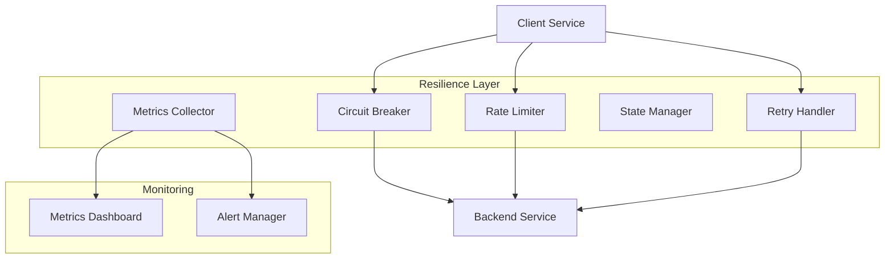

# Resilience Components Guide

## Overview

The resilience components provide fault tolerance and stability through circuit breakers, rate limiters, and retry mechanisms. These components help prevent cascading failures and ensure system stability under load.

## Architecture



## Components

### 1. Circuit Breaker

The circuit breaker prevents cascading failures by temporarily stopping operations when a service is failing.

```python
@runtime_checkable
class CircuitBreaker(Protocol):
    """Protocol for circuit breaker implementations."""
    
    @property
    def state(self) -> CircuitState:
        """Get current circuit state."""
        ...
        
    async def allow_request(self) -> bool:
        """Check if request is allowed."""
        ...
        
    async def record_success(self) -> None:
        """Record successful request."""
        ...
        
    async def record_failure(self) -> None:
        """Record failed request."""
        ...
        
    async def reset(self) -> None:
        """Reset circuit state."""
        ...

class DefaultCircuitBreaker(CircuitBreaker):
    """Default circuit breaker implementation."""
    
    def __init__(
        self,
        failure_threshold: int,
        recovery_timeout: float,
        half_open_calls: int,
        metrics: Optional[MetricsCollector] = None
    ):
        self._failure_threshold = failure_threshold
        self._recovery_timeout = recovery_timeout
        self._half_open_calls = half_open_calls
        self._metrics = metrics
        self._state = CircuitState.CLOSED
        self._failures = 0
        self._last_failure_time = 0.0
        self._half_open_successes = 0
        
    async def allow_request(self) -> bool:
        """Check if request should be allowed."""
        current_state = await self._get_state()
        
        if current_state == CircuitState.OPEN:
            # Check if recovery timeout has elapsed
            if time.time() - self._last_failure_time >= self._recovery_timeout:
                self._state = CircuitState.HALF_OPEN
                self._half_open_successes = 0
                return True
            return False
            
        if current_state == CircuitState.HALF_OPEN:
            # Allow limited requests in half-open state
            return self._half_open_successes < self._half_open_calls
            
        return True
        
    async def record_success(self) -> None:
        """Record successful request."""
        if self._state == CircuitState.HALF_OPEN:
            self._half_open_successes += 1
            if self._half_open_successes >= self._half_open_calls:
                # Transition back to closed state
                self._state = CircuitState.CLOSED
                self._failures = 0
                self._record_state_change("closed")
                
    async def record_failure(self) -> None:
        """Record failed request."""
        self._failures += 1
        self._last_failure_time = time.time()
        
        if self._state == CircuitState.CLOSED:
            if self._failures >= self._failure_threshold:
                self._state = CircuitState.OPEN
                self._record_state_change("open")
                
        elif self._state == CircuitState.HALF_OPEN:
            self._state = CircuitState.OPEN
            self._record_state_change("open")
```

### 2. Rate Limiter

The rate limiter controls request rates to prevent overload and ensure fair resource usage.

```python
@runtime_checkable
class RateLimiter(Protocol):
    """Protocol for rate limiter implementations."""
    
    async def acquire(self, key: str) -> bool:
        """Attempt to acquire permission."""
        ...
        
    async def release(self, key: str) -> None:
        """Release acquired permission."""
        ...
        
    def get_limit(self, key: str) -> int:
        """Get current limit for key."""
        ...

class TokenBucketRateLimiter(RateLimiter):
    """Token bucket rate limiter implementation."""
    
    def __init__(
        self,
        burst_limit: int,
        refill_rate: float,
        window_size: float,
        metrics: Optional[MetricsCollector] = None
    ):
        self._burst_limit = burst_limit
        self._refill_rate = refill_rate
        self._window_size = window_size
        self._metrics = metrics
        self._buckets: Dict[str, TokenBucket] = {}
        self._lock = asyncio.Lock()
        
    async def acquire(self, key: str) -> bool:
        """Attempt to acquire a token."""
        async with self._lock:
            bucket = self._get_bucket(key)
            allowed = await bucket.acquire()
            
            if allowed:
                self._record_metrics("allowed", key)
            else:
                self._record_metrics("rejected", key)
                
            return allowed
            
    async def release(self, key: str) -> None:
        """Release a token back to the bucket."""
        async with self._lock:
            bucket = self._get_bucket(key)
            await bucket.release()
            
    def _get_bucket(self, key: str) -> TokenBucket:
        """Get or create token bucket for key."""
        if key not in self._buckets:
            self._buckets[key] = TokenBucket(
                self._burst_limit,
                self._refill_rate,
                self._window_size
            )
        return self._buckets[key]
```

### 3. Retry Handler

The retry handler automatically retries failed operations with exponential backoff.

```python
@runtime_checkable
class RetryHandler(Protocol):
    """Protocol for retry handlers."""
    
    async def execute(
        self,
        operation: Callable[[], Awaitable[T]],
        max_retries: int,
        retry_exceptions: Tuple[Type[Exception], ...],
        initial_delay: float,
        max_delay: float,
        exponential_base: float,
        jitter: bool = True
    ) -> T:
        """Execute operation with retries."""
        ...

class ExponentialRetryHandler(RetryHandler):
    """Exponential backoff retry handler."""
    
    def __init__(self, metrics: Optional[MetricsCollector] = None):
        self._metrics = metrics
        
    async def execute(
        self,
        operation: Callable[[], Awaitable[T]],
        max_retries: int,
        retry_exceptions: Tuple[Type[Exception], ...],
        initial_delay: float,
        max_delay: float,
        exponential_base: float,
        jitter: bool = True
    ) -> T:
        """Execute operation with exponential backoff retries."""
        attempt = 0
        last_exception = None
        
        while attempt <= max_retries:
            try:
                start_time = time.time()
                result = await operation()
                
                # Record success metrics
                duration = time.time() - start_time
                self._record_metrics("success", attempt, duration)
                
                return result
                
            except retry_exceptions as e:
                attempt += 1
                last_exception = e
                
                if attempt > max_retries:
                    break
                    
                # Calculate delay
                delay = min(
                    initial_delay * (exponential_base ** (attempt - 1)),
                    max_delay
                )
                
                if jitter:
                    delay *= random.uniform(0.5, 1.5)
                    
                # Record retry metrics
                self._record_metrics("retry", attempt, delay)
                
                await asyncio.sleep(delay)
                
        # Record failure metrics
        self._record_metrics("failure", attempt, 0)
        
        raise RetryError(
            f"Operation failed after {attempt} attempts"
        ) from last_exception
```

## Integration

### 1. Resilience Wrapper

Combine circuit breaker, rate limiter, and retry handler.

```python
class ResilienceWrapper:
    """Wrapper combining multiple resilience patterns."""
    
    def __init__(
        self,
        circuit_breaker: CircuitBreaker,
        rate_limiter: RateLimiter,
        retry_handler: RetryHandler
    ):
        self._circuit_breaker = circuit_breaker
        self._rate_limiter = rate_limiter
        self._retry_handler = retry_handler
        
    async def execute(
        self,
        operation: Callable[[], Awaitable[T]],
        key: str,
        retry_config: RetryConfig
    ) -> T:
        """Execute operation with all resilience patterns."""
        if not await self._circuit_breaker.allow_request():
            raise CircuitBreakerError("Circuit is open")
            
        if not await self._rate_limiter.acquire(key):
            raise RateLimitError("Rate limit exceeded")
            
        try:
            result = await self._retry_handler.execute(
                operation,
                **retry_config.dict()
            )
            
            await self._circuit_breaker.record_success()
            return result
            
        except Exception as e:
            await self._circuit_breaker.record_failure()
            raise
            
        finally:
            await self._rate_limiter.release(key)
```

### 2. Service Integration

Example of integrating resilience patterns into a service.

```python
class ResilientService:
    """Service with resilience patterns."""
    
    def __init__(
        self,
        resilience: ResilienceWrapper,
        metrics: MetricsCollector
    ):
        self._resilience = resilience
        self._metrics = metrics
        
    async def execute_operation(
        self,
        operation_id: str,
        operation: Callable[[], Awaitable[T]]
    ) -> T:
        """Execute operation with resilience patterns."""
        start_time = time.time()
        
        try:
            result = await self._resilience.execute(
                operation,
                key=operation_id,
                retry_config=RetryConfig(
                    max_retries=3,
                    initial_delay=1.0,
                    max_delay=5.0,
                    exponential_base=2.0
                )
            )
            
            duration = time.time() - start_time
            self._record_success(operation_id, duration)
            
            return result
            
        except Exception as e:
            duration = time.time() - start_time
            self._record_failure(operation_id, duration, type(e))
            raise
```

## Monitoring

### 1. Metrics

```python
class ResilienceMetrics:
    """Resilience-specific metrics."""
    
    def __init__(self, collector: MetricsCollector):
        self._collector = collector
        
        # Circuit breaker metrics
        self._collector.register(
            "circuit_state",
            MetricType.GAUGE,
            description="Circuit breaker state",
            labels=["circuit_id"]
        )
        
        self._collector.register(
            "circuit_failures",
            MetricType.COUNTER,
            description="Circuit breaker failure count",
            labels=["circuit_id"]
        )
        
        # Rate limiter metrics
        self._collector.register(
            "rate_limit_allowed",
            MetricType.COUNTER,
            description="Rate limit allowed requests",
            labels=["key"]
        )
        
        self._collector.register(
            "rate_limit_rejected",
            MetricType.COUNTER,
            description="Rate limit rejected requests",
            labels=["key"]
        )
        
        # Retry metrics
        self._collector.register(
            "retry_attempts",
            MetricType.HISTOGRAM,
            description="Retry attempt counts",
            labels=["operation"]
        )
        
        self._collector.register(
            "retry_duration",
            MetricType.HISTOGRAM,
            description="Retry operation duration",
            labels=["operation", "outcome"]
        )
```

### 2. Health Checks

```python
class ResilienceHealth(HealthCheck):
    """Resilience health check implementation."""
    
    def __init__(
        self,
        circuit_breaker: CircuitBreaker,
        rate_limiter: RateLimiter
    ):
        self._circuit_breaker = circuit_breaker
        self._rate_limiter = rate_limiter
        
    async def check_health(self) -> HealthResult:
        """Check resilience component health."""
        circuit_state = self._circuit_breaker.state
        
        if circuit_state == CircuitState.OPEN:
            return {
                "status": HealthStatus.DEGRADED,
                "message": "Circuit breaker is open"
            }
            
        return {
            "status": HealthStatus.HEALTHY,
            "details": {
                "circuit_state": circuit_state.value,
                "rate_limit_capacity": self._rate_limiter.get_limit("default")
            }
        }
```

## Testing

### 1. Unit Tests

```python
@pytest.mark.asyncio
async def test_circuit_breaker():
    """Test circuit breaker behavior."""
    breaker = DefaultCircuitBreaker(
        failure_threshold=3,
        recovery_timeout=5.0,
        half_open_calls=2
    )
    
    # Test initial state
    assert breaker.state == CircuitState.CLOSED
    assert await breaker.allow_request()
    
    # Test transition to open
    for _ in range(3):
        await breaker.record_failure()
        
    assert breaker.state == CircuitState.OPEN
    assert not await breaker.allow_request()
    
    # Test recovery
    await asyncio.sleep(5.1)
    assert await breaker.allow_request()
    assert breaker.state == CircuitState.HALF_OPEN
    
    # Test successful recovery
    await breaker.record_success()
    await breaker.record_success()
    assert breaker.state == CircuitState.CLOSED
```

### 2. Integration Tests

```python
@pytest.mark.integration
async def test_resilience_integration():
    """Test resilience pattern integration."""
    container = Container()
    service = container.resilient_service()
    metrics = container.metrics_collector()
    
    async def operation():
        return "success"
        
    # Test successful operation
    result = await service.execute_operation(
        "test_op",
        operation
    )
    assert result == "success"
    
    # Check metrics
    stats = await metrics.get_metrics()
    assert stats["circuit_state"].value == CircuitState.CLOSED.value
    assert stats["rate_limit_allowed"].value > 0
```

### 3. Load Tests

```python
@pytest.mark.load
async def test_rate_limiter_load():
    """Test rate limiter under load."""
    limiter = TokenBucketRateLimiter(
        burst_limit=10,
        refill_rate=1.0,
        window_size=1.0
    )
    
    # Generate concurrent requests
    async def make_request():
        return await limiter.acquire("test")
        
    results = await asyncio.gather(*(
        make_request()
        for _ in range(20)
    ))
    
    # Verify rate limiting
    assert sum(results) <= 10  # Only burst_limit requests allowed
``` 