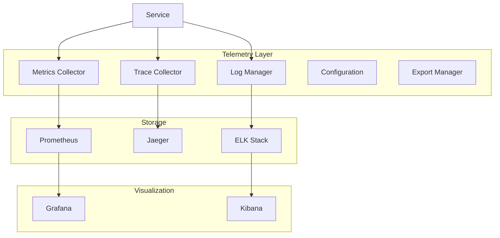

# Telemetry Components Guide

## Overview

The telemetry components provide comprehensive monitoring, logging, and tracing capabilities for the backend system. These components help track system health, performance metrics, and operational insights.

## Architecture



## Components

### 1. Metrics Collector

The metrics collector tracks various performance and operational metrics.

```python
@runtime_checkable
class MetricsCollector(Protocol):
    """Protocol for metrics collection."""
    
    def register(
        self,
        name: str,
        metric_type: MetricType,
        description: str,
        labels: Optional[List[str]] = None,
        unit: Optional[str] = None
    ) -> None:
        """Register a new metric."""
        ...
        
    def record(
        self,
        name: str,
        value: float,
        labels: Optional[Dict[str, str]] = None
    ) -> None:
        """Record a metric value."""
        ...
        
    async def export(self) -> None:
        """Export collected metrics."""
        ...

class PrometheusCollector(MetricsCollector):
    """Prometheus metrics collector implementation."""
    
    def __init__(self, config: MetricsConfig):
        self._config = config
        self._metrics: Dict[str, Any] = {}
        self._registry = CollectorRegistry()
        
    def register(
        self,
        name: str,
        metric_type: MetricType,
        description: str,
        labels: Optional[List[str]] = None,
        unit: Optional[str] = None
    ) -> None:
        """Register a Prometheus metric."""
        if name in self._metrics:
            return
            
        labels = labels or []
        
        if metric_type == MetricType.COUNTER:
            self._metrics[name] = Counter(
                name,
                description,
                labelnames=labels,
                registry=self._registry
            )
            
        elif metric_type == MetricType.GAUGE:
            self._metrics[name] = Gauge(
                name,
                description,
                labelnames=labels,
                registry=self._registry
            )
            
        elif metric_type == MetricType.HISTOGRAM:
            self._metrics[name] = Histogram(
                name,
                description,
                labelnames=labels,
                registry=self._registry
            )
            
    def record(
        self,
        name: str,
        value: float,
        labels: Optional[Dict[str, str]] = None
    ) -> None:
        """Record a metric value."""
        if name not in self._metrics:
            raise ValueError(f"Metric {name} not registered")
            
        metric = self._metrics[name]
        labels = labels or {}
        
        if isinstance(metric, Counter):
            metric.inc(value, **labels)
        elif isinstance(metric, Gauge):
            metric.set(value, **labels)
        elif isinstance(metric, Histogram):
            metric.observe(value, **labels)
            
    async def export(self) -> None:
        """Export metrics to Prometheus."""
        if not self._config.export_enabled:
            return
            
        try:
            push_to_gateway(
                self._config.gateway_url,
                job=self._config.job_name,
                registry=self._registry
            )
        except Exception as e:
            logger.error(f"Failed to export metrics: {e}")
```

### 2. Trace Collector

The trace collector manages distributed tracing across services.

```python
@runtime_checkable
class TraceCollector(Protocol):
    """Protocol for trace collection."""
    
    def start_span(
        self,
        name: str,
        parent: Optional[SpanContext] = None,
        kind: SpanKind = SpanKind.INTERNAL,
        attributes: Optional[Dict[str, str]] = None
    ) -> Span:
        """Start a new trace span."""
        ...
        
    def inject_context(
        self,
        carrier: Dict[str, str],
        context: Optional[SpanContext] = None
    ) -> None:
        """Inject trace context into carrier."""
        ...
        
    def extract_context(
        self,
        carrier: Dict[str, str]
    ) -> Optional[SpanContext]:
        """Extract trace context from carrier."""
        ...

class JaegerCollector(TraceCollector):
    """Jaeger trace collector implementation."""
    
    def __init__(self, config: TraceConfig):
        self._config = config
        self._tracer = self._init_tracer()
        
    def _init_tracer(self) -> Tracer:
        """Initialize Jaeger tracer."""
        return Config(
            service_name=self._config.service_name,
            sampler=ConstSampler(True),
            reporter=Reporter(
                agent_host=self._config.agent_host,
                agent_port=self._config.agent_port
            )
        ).initialize_tracer()
        
    def start_span(
        self,
        name: str,
        parent: Optional[SpanContext] = None,
        kind: SpanKind = SpanKind.INTERNAL,
        attributes: Optional[Dict[str, str]] = None
    ) -> Span:
        """Start a new trace span."""
        span = self._tracer.start_span(
            operation_name=name,
            child_of=parent,
            tags={
                "span.kind": kind.value,
                **(attributes or {})
            }
        )
        return span
        
    def inject_context(
        self,
        carrier: Dict[str, str],
        context: Optional[SpanContext] = None
    ) -> None:
        """Inject trace context into carrier."""
        self._tracer.inject(
            span_context=context or self._tracer.active_span.context,
            format=Format.HTTP_HEADERS,
            carrier=carrier
        )
        
    def extract_context(
        self,
        carrier: Dict[str, str]
    ) -> Optional[SpanContext]:
        """Extract trace context from carrier."""
        try:
            return self._tracer.extract(
                format=Format.HTTP_HEADERS,
                carrier=carrier
            )
        except Exception:
            return None
```

### 3. Log Manager

The log manager handles structured logging with context.

```python
@runtime_checkable
class LogManager(Protocol):
    """Protocol for log management."""
    
    def configure(
        self,
        level: str,
        format: str,
        handlers: List[str]
    ) -> None:
        """Configure logging settings."""
        ...
        
    def log(
        self,
        level: str,
        message: str,
        context: Optional[Dict[str, Any]] = None
    ) -> None:
        """Log a message with context."""
        ...
        
    def add_context(
        self,
        **kwargs: Any
    ) -> ContextManager[None]:
        """Add context to log records."""
        ...

class StructuredLogger(LogManager):
    """Structured logging implementation."""
    
    def __init__(self, config: LogConfig):
        self._config = config
        self._logger = logging.getLogger(config.logger_name)
        self._context: ContextVar[Dict[str, Any]] = ContextVar(
            "log_context",
            default={}
        )
        
    def configure(
        self,
        level: str,
        format: str,
        handlers: List[str]
    ) -> None:
        """Configure logging settings."""
        self._logger.setLevel(level)
        
        formatter = logging.Formatter(format)
        
        for handler_type in handlers:
            if handler_type == "console":
                handler = logging.StreamHandler()
            elif handler_type == "file":
                handler = logging.FileHandler(
                    self._config.log_file,
                    encoding="utf-8"
                )
            else:
                continue
                
            handler.setFormatter(formatter)
            self._logger.addHandler(handler)
            
    def log(
        self,
        level: str,
        message: str,
        context: Optional[Dict[str, Any]] = None
    ) -> None:
        """Log a message with context."""
        context = {
            **self._context.get(),
            **(context or {})
        }
        
        record = logging.LogRecord(
            name=self._logger.name,
            level=getattr(logging, level.upper()),
            pathname=__file__,
            lineno=0,
            msg=message,
            args=(),
            exc_info=None
        )
        
        # Add context to record
        for key, value in context.items():
            setattr(record, key, value)
            
        self._logger.handle(record)
        
    @contextmanager
    def add_context(self, **kwargs: Any) -> Iterator[None]:
        """Add context to log records."""
        token = self._context.set({
            **self._context.get(),
            **kwargs
        })
        try:
            yield
        finally:
            self._context.reset(token)
```

## Integration

### 1. Telemetry Manager

Combine metrics, tracing, and logging components.

```python
class TelemetryManager:
    """Manager for all telemetry components."""
    
    def __init__(
        self,
        metrics: MetricsCollector,
        tracer: TraceCollector,
        logger: LogManager,
        config: TelemetryConfig
    ):
        self._metrics = metrics
        self._tracer = tracer
        self._logger = logger
        self._config = config
        
    async def start_operation(
        self,
        name: str,
        context: Optional[Dict[str, Any]] = None
    ) -> AsyncContextManager[None]:
        """Start operation with telemetry."""
        span = self._tracer.start_span(name)
        
        # Add trace ID to context
        trace_id = format_trace_id(span.context.trace_id)
        context = {
            **(context or {}),
            "trace_id": trace_id
        }
        
        self._logger.log(
            "info",
            f"Starting operation: {name}",
            context
        )
        
        try:
            with self._logger.add_context(**context):
                yield
                
        except Exception as e:
            self._logger.log(
                "error",
                f"Operation failed: {str(e)}",
                context
            )
            span.set_tag("error", True)
            raise
            
        finally:
            span.finish()
            
    def record_metric(
        self,
        name: str,
        value: float,
        labels: Optional[Dict[str, str]] = None
    ) -> None:
        """Record a metric with current context."""
        try:
            self._metrics.record(name, value, labels)
        except Exception as e:
            self._logger.log(
                "error",
                f"Failed to record metric: {str(e)}"
            )
```

### 2. Service Integration

Example of integrating telemetry into a service.

```python
class TelemetryAwareService:
    """Service with telemetry integration."""
    
    def __init__(self, telemetry: TelemetryManager):
        self._telemetry = telemetry
        
    async def execute_operation(
        self,
        operation_id: str,
        params: Dict[str, Any]
    ) -> Any:
        """Execute operation with telemetry."""
        context = {
            "operation_id": operation_id,
            "params": params
        }
        
        async with self._telemetry.start_operation(
            "execute_operation",
            context
        ):
            start_time = time.time()
            
            try:
                result = await self._perform_operation(params)
                
                duration = time.time() - start_time
                self._telemetry.record_metric(
                    "operation_duration",
                    duration,
                    {"operation": operation_id}
                )
                
                return result
                
            except Exception as e:
                self._telemetry.record_metric(
                    "operation_failures",
                    1,
                    {"operation": operation_id}
                )
                raise
```

## Monitoring

### 1. Metrics Dashboard

Example Grafana dashboard configuration.

```python
class MetricsDashboard:
    """Grafana dashboard configuration."""
    
    def __init__(self, config: DashboardConfig):
        self._config = config
        
    def create_dashboard(self) -> Dict[str, Any]:
        """Create Grafana dashboard configuration."""
        return {
            "title": "Service Telemetry",
            "panels": [
                # Operation Duration
                {
                    "title": "Operation Duration",
                    "type": "graph",
                    "targets": [{
                        "expr": "histogram_quantile(0.95, sum(rate(operation_duration_bucket[5m])) by (le, operation))",
                        "legendFormat": "{{operation}}"
                    }]
                },
                # Error Rate
                {
                    "title": "Error Rate",
                    "type": "graph",
                    "targets": [{
                        "expr": "sum(rate(operation_failures_total[5m])) by (operation) / sum(rate(operation_total[5m])) by (operation)",
                        "legendFormat": "{{operation}}"
                    }]
                },
                # Active Traces
                {
                    "title": "Active Traces",
                    "type": "stat",
                    "targets": [{
                        "expr": "sum(jaeger_tracer_started_spans) - sum(jaeger_tracer_finished_spans)"
                    }]
                }
            ]
        }
```

### 2. Log Analysis

Example log analysis configuration.

```python
class LogAnalysis:
    """Log analysis configuration."""
    
    def __init__(self, config: AnalysisConfig):
        self._config = config
        
    def create_index_pattern(self) -> Dict[str, Any]:
        """Create Elasticsearch index pattern."""
        return {
            "title": self._config.index_pattern,
            "timeFieldName": "@timestamp",
            "fields": [
                {"name": "@timestamp", "type": "date"},
                {"name": "level", "type": "keyword"},
                {"name": "message", "type": "text"},
                {"name": "trace_id", "type": "keyword"},
                {"name": "operation_id", "type": "keyword"},
                {"name": "duration", "type": "float"}
            ]
        }
        
    def create_visualizations(self) -> List[Dict[str, Any]]:
        """Create Kibana visualizations."""
        return [
            # Log Level Distribution
            {
                "title": "Log Levels",
                "type": "pie",
                "params": {
                    "field": "level",
                    "size": 10
                }
            },
            # Error Timeline
            {
                "title": "Errors Over Time",
                "type": "line",
                "params": {
                    "field": "@timestamp",
                    "interval": "1h",
                    "query": "level:ERROR"
                }
            },
            # Slow Operations
            {
                "title": "Slow Operations",
                "type": "table",
                "params": {
                    "field": "operation_id",
                    "metrics": ["avg:duration", "max:duration"],
                    "sort": [{"duration": "desc"}],
                    "size": 20
                }
            }
        ]
```

## Testing

### 1. Unit Tests

```python
@pytest.mark.asyncio
async def test_telemetry_manager():
    """Test telemetry manager functionality."""
    metrics = MockMetricsCollector()
    tracer = MockTraceCollector()
    logger = MockLogManager()
    
    telemetry = TelemetryManager(
        metrics,
        tracer,
        logger,
        TelemetryConfig()
    )
    
    async with telemetry.start_operation(
        "test_operation",
        {"param": "value"}
    ):
        # Record metric
        telemetry.record_metric(
            "test_metric",
            1.0,
            {"label": "value"}
        )
        
    # Verify spans
    assert len(tracer.spans) == 1
    assert tracer.spans[0].name == "test_operation"
    
    # Verify metrics
    assert metrics.get_value("test_metric") == 1.0
    
    # Verify logs
    assert len(logger.records) == 2  # Start and end
    assert "test_operation" in logger.records[0].message
```

### 2. Integration Tests

```python
@pytest.mark.integration
async def test_telemetry_integration():
    """Test telemetry integration."""
    container = Container()
    service = container.telemetry_aware_service()
    
    result = await service.execute_operation(
        "test_op",
        {"param": "value"}
    )
    
    # Verify metrics in Prometheus
    response = requests.get(
        "http://localhost:9090/api/v1/query",
        params={
            "query": 'operation_duration{operation="test_op"}'
        }
    )
    assert response.status_code == 200
    assert len(response.json()["data"]["result"]) > 0
    
    # Verify traces in Jaeger
    response = requests.get(
        "http://localhost:16686/api/traces",
        params={
            "service": "test_service",
            "operation": "test_op"
        }
    )
    assert response.status_code == 200
    assert len(response.json()["data"]) > 0
```

### 3. Load Tests

```python
@pytest.mark.load
async def test_telemetry_performance():
    """Test telemetry performance under load."""
    telemetry = container.telemetry_manager()
    
    async def operation():
        async with telemetry.start_operation("load_test"):
            telemetry.record_metric("test_counter", 1)
            await asyncio.sleep(0.1)
            
    # Run concurrent operations
    start_time = time.time()
    await asyncio.gather(*(
        operation()
        for _ in range(100)
    ))
    duration = time.time() - start_time
    
    # Verify performance
    assert duration < 2.0  # Max 2 seconds for 100 operations
``` 