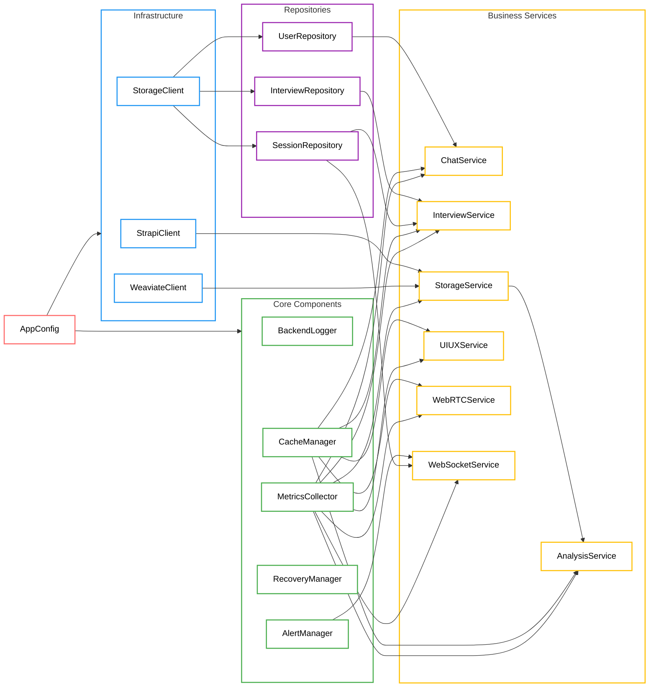

# Dependency Injection Summary

## Overview

This document outlines the dependency injection structure and component relationships in the iPersona backend application. The dependency container manages the lifecycle and dependencies of all core components, infrastructure clients, repositories, and business services.

## Dependency Graph

