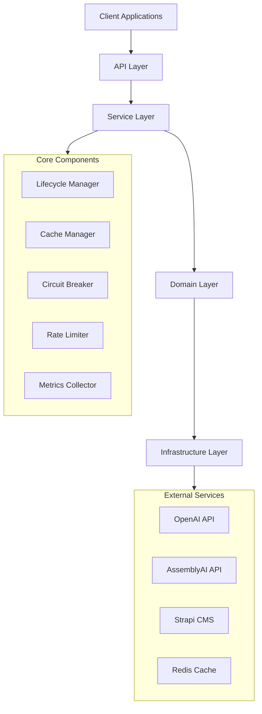

# iPersona Backend Developer Guide

## Table of Contents
1. [Overview](#overview)
2. [Architecture](#architecture)
3. [Tech Stack](#tech-stack)
4. [Development Setup](#development-setup)
5. [Core Components](#core-components)
6. [Testing Guide](#testing-guide)
7. [Best Practices](#best-practices)
8. [Advanced Topics](#advanced-topics)

## Overview

The iPersona backend is a modern, scalable system designed to support AI-driven interview interactions. It follows clean architecture principles and emphasizes type safety, resilience, and observability.

Key Features:
- Protocol-based interfaces for flexibility
- Comprehensive resilience patterns
- Advanced caching strategies
- Robust monitoring and metrics
- AI service integration

## Architecture

The system follows a layered architecture with clear separation of concerns:



### Directory Structure

```
tenx_ipersona/backend/
├── api/                 # FastAPI routes and endpoints
├── core/               # Core system components
│   ├── base/          # Base classes and abstractions
│   ├── cache/         # Caching infrastructure
│   ├── config/        # Configuration management
│   ├── resilience/    # Resilience patterns
│   ├── telemetry/     # Monitoring and metrics
│   └── utils/         # Utility functions
├── services/          # Business logic services
├── domain/           # Domain models and logic
├── infrastructure/   # External service adapters
└── tests/            # Test suites
```

## Tech Stack

### Core Technologies
- Python 3.11+
- FastAPI
- Redis
- Prometheus
- OpenAI
- AssemblyAI

### Development Tools
- Poetry (dependency management)
- Black (code formatting)
- Mypy (static type checking)
- Pytest (testing framework)
- Docker (containerization)

### External Services
- OpenAI API (language models)
- AssemblyAI (speech-to-text)
- Strapi CMS (content management)
- Redis (caching)

## Development Setup

### Prerequisites
- Python 3.11+
- Poetry
- Docker
- Redis

### Installation

1. Clone the repository:
```bash
git clone https://github.com/your-org/tenx_ipersona.git
cd tenx_ipersona/backend
```

2. Install dependencies:
```bash
poetry install
```

3. Set up environment variables:
```bash
cp .env.example .env
# Edit .env with your configuration
```

4. Start Redis:
```bash
docker-compose up -d redis
```

5. Run the development server:
```bash
poetry run uvicorn api.main:app --reload
```

### Environment Configuration

Key environment variables:
```env
# API Settings
API_HOST=0.0.0.0
API_PORT=8000
API_DEBUG=true

# OpenAI
OPENAI_API_KEY=your-key
OPENAI_MODEL=gpt-4
OPENAI_TEMPERATURE=0.7

# AssemblyAI
ASSEMBLY_AI_KEY=your-key

# Redis
REDIS_HOST=localhost
REDIS_PORT=6379
REDIS_DB=0

# Circuit Breaker
CIRCUIT_BREAKER_FAILURE_THRESHOLD=5
CIRCUIT_BREAKER_RECOVERY_TIMEOUT=30

# Rate Limiter
RATE_LIMITER_BURST_LIMIT=10
RATE_LIMITER_WINDOW_SIZE=60
```

## Core Components

### 1. Lifecycle Manager

The lifecycle manager handles component initialization, startup, and shutdown:

```python
from typing import Protocol

class LifecycleAware(Protocol):
    """Protocol for lifecycle-aware components."""
    
    async def initialize(self) -> None:
        """Initialize the component."""
        ...
        
    async def start(self) -> None:
        """Start the component."""
        ...
        
    async def stop(self) -> None:
        """Stop the component."""
        ...

class LifecycleManager:
    """Manages component lifecycles."""
    
    def __init__(self):
        self._components: List[LifecycleAware] = []
        
    def register(self, component: LifecycleAware) -> None:
        """Register a component."""
        self._components.append(component)
        
    async def start_all(self) -> None:
        """Start all components."""
        for component in self._components:
            await component.start()
            
    async def stop_all(self) -> None:
        """Stop all components."""
        for component in reversed(self._components):
            await component.stop()
```

### 2. Cache Manager

The cache manager provides a unified interface for caching:

```python
from typing import Optional, TypeVar, Generic

KT = TypeVar("KT")
VT = TypeVar("VT")

class CacheManager(Generic[KT, VT]):
    """Generic cache manager."""
    
    def __init__(self, redis_client: Redis):
        self._redis = redis_client
        
    async def get(self, key: KT) -> Optional[VT]:
        """Get value from cache."""
        return await self._redis.get(key)
        
    async def set(
        self,
        key: KT,
        value: VT,
        ttl: Optional[int] = None
    ) -> None:
        """Set value in cache."""
        await self._redis.set(key, value, ex=ttl)
        
    async def delete(self, key: KT) -> None:
        """Delete value from cache."""
        await self._redis.delete(key)
```

### 3. Circuit Breaker

The circuit breaker implements the circuit breaker pattern:

```python
from enum import Enum
from typing import Callable, TypeVar

T = TypeVar("T")

class CircuitState(Enum):
    """Circuit breaker states."""
    CLOSED = "closed"
    OPEN = "open"
    HALF_OPEN = "half_open"

class CircuitBreaker:
    """Circuit breaker implementation."""
    
    def __init__(
        self,
        failure_threshold: int,
        recovery_timeout: float
    ):
        self._failure_threshold = failure_threshold
        self._recovery_timeout = recovery_timeout
        self._state = CircuitState.CLOSED
        self._failures = 0
        
    async def execute(
        self,
        func: Callable[..., T],
        *args,
        **kwargs
    ) -> T:
        """Execute function with circuit breaker."""
        if self._state == CircuitState.OPEN:
            if await self._should_attempt_recovery():
                self._state = CircuitState.HALF_OPEN
            else:
                raise CircuitBreakerError("Circuit is open")
                
        try:
            result = await func(*args, **kwargs)
            
            if self._state == CircuitState.HALF_OPEN:
                self._state = CircuitState.CLOSED
                self._failures = 0
                
            return result
            
        except Exception as e:
            self._failures += 1
            
            if self._failures >= self._failure_threshold:
                self._state = CircuitState.OPEN
                self._last_failure = time.time()
                
            raise
```

### 4. Rate Limiter

The rate limiter implements token bucket rate limiting:

```python
class RateLimiter:
    """Token bucket rate limiter."""
    
    def __init__(
        self,
        burst_limit: int,
        window_size: float
    ):
        self._burst_limit = burst_limit
        self._window_size = window_size
        self._tokens = burst_limit
        self._last_update = time.time()
        
    async def acquire(self) -> bool:
        """Acquire a token."""
        now = time.time()
        time_passed = now - self._last_update
        
        # Replenish tokens
        self._tokens = min(
            self._burst_limit,
            self._tokens + time_passed * (self._burst_limit / self._window_size)
        )
        
        if self._tokens >= 1:
            self._tokens -= 1
            self._last_update = now
            return True
            
        return False
```

### 5. Metrics Collector

The metrics collector handles metrics collection and export:

```python
from enum import Enum
from typing import Dict, Any

class MetricType(Enum):
    """Metric types."""
    COUNTER = "counter"
    GAUGE = "gauge"
    HISTOGRAM = "histogram"

class MetricsCollector:
    """Metrics collection and export."""
    
    def __init__(self):
        self._metrics: Dict[str, Any] = {}
        
    def counter(
        self,
        name: str,
        value: float = 1,
        labels: Optional[Dict[str, str]] = None
    ) -> None:
        """Increment counter."""
        key = self._get_key(name, labels)
        self._metrics.setdefault(key, 0)
        self._metrics[key] += value
        
    def gauge(
        self,
        name: str,
        value: float,
        labels: Optional[Dict[str, str]] = None
    ) -> None:
        """Set gauge value."""
        key = self._get_key(name, labels)
        self._metrics[key] = value
        
    def histogram(
        self,
        name: str,
        value: float,
        labels: Optional[Dict[str, str]] = None
    ) -> None:
        """Record histogram value."""
        key = self._get_key(name, labels)
        self._metrics.setdefault(key, []).append(value)
```

## Testing Guide

### 1. Unit Tests

Write unit tests for individual components:

```python
@pytest.mark.asyncio
async def test_cache_manager():
    """Test cache manager operations."""
    # Setup
    redis_mock = Mock()
    cache = CacheManager(redis_mock)
    
    # Test get
    redis_mock.get.return_value = "value"
    result = await cache.get("key")
    assert result == "value"
    
    # Test set
    await cache.set("key", "value", ttl=60)
    redis_mock.set.assert_called_with("key", "value", ex=60)
    
    # Test delete
    await cache.delete("key")
    redis_mock.delete.assert_called_with("key")

@pytest.mark.asyncio
async def test_circuit_breaker():
    """Test circuit breaker behavior."""
    breaker = CircuitBreaker(
        failure_threshold=2,
        recovery_timeout=1
    )
    
    # Test successful execution
    result = await breaker.execute(
        lambda: "success"
    )
    assert result == "success"
    
    # Test failure handling
    with pytest.raises(CircuitBreakerError):
        for _ in range(3):
            await breaker.execute(
                lambda: 1/0
            )
```

### 2. Integration Tests

Write integration tests for component interactions:

```python
@pytest.mark.integration
async def test_service_integration():
    """Test service integration."""
    # Setup components
    cache = CacheManager(redis_client)
    metrics = MetricsCollector()
    service = UserService(cache, metrics)
    
    # Test flow
    user = await service.create_user("test@example.com")
    assert user.email == "test@example.com"
    
    cached_user = await service.get_user(user.id)
    assert cached_user == user
    
    # Verify metrics
    assert metrics.get("user_creation") == 1

@pytest.mark.integration
async def test_api_integration():
    """Test API integration."""
    async with AsyncClient(app=app, base_url="http://test") as client:
        response = await client.post(
            "/users",
            json={"email": "test@example.com"}
        )
        assert response.status_code == 200
        
        user_id = response.json()["id"]
        response = await client.get(f"/users/{user_id}")
        assert response.status_code == 200
```

### 3. Performance Tests

Write performance tests to verify system behavior under load:

```python
@pytest.mark.performance
async def test_cache_performance():
    """Test cache performance."""
    cache = CacheManager(redis_client)
    
    # Test write performance
    start_time = time.time()
    for i in range(1000):
        await cache.set(f"key_{i}", f"value_{i}")
    write_duration = time.time() - start_time
    
    assert write_duration < 1.0  # Max 1 second
    
    # Test read performance
    start_time = time.time()
    for i in range(1000):
        await cache.get(f"key_{i}")
    read_duration = time.time() - start_time
    
    assert read_duration < 0.5  # Max 0.5 seconds

@pytest.mark.performance
async def test_api_performance():
    """Test API performance."""
    async with AsyncClient(app=app, base_url="http://test") as client:
        # Test concurrent requests
        async def make_request():
            return await client.get("/health")
            
        start_time = time.time()
        tasks = [make_request() for _ in range(100)]
        responses = await asyncio.gather(*tasks)
        duration = time.time() - start_time
        
        assert duration < 2.0  # Max 2 seconds
        assert all(r.status_code == 200 for r in responses)
```

## Best Practices

### 1. Type Safety

Use type hints consistently:

```python
from typing import TypeVar, Generic, Optional

T = TypeVar("T")

class Repository(Generic[T]):
    """Generic repository pattern."""
    
    async def get(self, id: str) -> Optional[T]:
        """Get item by ID."""
        ...
        
    async def save(self, item: T) -> None:
        """Save item."""
        ...
```

### 2. Error Handling

Implement comprehensive error handling:

```python
from typing import Optional

class AppError(Exception):
    """Base application error."""
    
    def __init__(
        self,
        message: str,
        code: str,
        details: Optional[Dict[str, Any]] = None
    ):
        super().__init__(message)
        self.code = code
        self.details = details or {}

class ValidationError(AppError):
    """Validation error."""
    
    def __init__(
        self,
        message: str,
        field: str,
        value: Any
    ):
        super().__init__(
            message=message,
            code="VALIDATION_ERROR",
            details={
                "field": field,
                "value": value
            }
        )

async def handle_error(error: Exception) -> Response:
    """Error handler."""
    if isinstance(error, AppError):
        return JSONResponse(
            status_code=400,
            content={
                "error": {
                    "message": str(error),
                    "code": error.code,
                    "details": error.details
                }
            }
        )
    
    return JSONResponse(
        status_code=500,
        content={
            "error": {
                "message": "Internal server error",
                "code": "INTERNAL_ERROR"
            }
        }
    )
```

### 3. Async Patterns

Follow async best practices:

```python
async def process_items(items: List[T]) -> List[Result]:
    """Process items concurrently."""
    async def process_item(item: T) -> Result:
        async with AsyncClient() as client:
            response = await client.post("/process", json=item)
            return Result(response.json())
    
    return await asyncio.gather(
        *(process_item(item) for item in items)
    )

async def stream_items() -> AsyncIterator[T]:
    """Stream items asynchronously."""
    buffer = []
    
    async for item in aiter(source):
        buffer.append(item)
        
        if len(buffer) >= 100:
            results = await process_items(buffer)
            for result in results:
                yield result
            buffer.clear()
    
    if buffer:
        results = await process_items(buffer)
        for result in results:
            yield result
```

### 4. Configuration Management

Implement structured configuration:

```python
from pydantic import BaseSettings, Field

class AppConfig(BaseSettings):
    """Application configuration."""
    
    # API settings
    host: str = Field("0.0.0.0", env="API_HOST")
    port: int = Field(8000, env="API_PORT")
    debug: bool = Field(False, env="API_DEBUG")
    
    # OpenAI settings
    openai_key: str = Field(..., env="OPENAI_API_KEY")
    openai_model: str = Field("gpt-4", env="OPENAI_MODEL")
    
    # Redis settings
    redis_host: str = Field("localhost", env="REDIS_HOST")
    redis_port: int = Field(6379, env="REDIS_PORT")
    
    class Config:
        env_file = ".env"
        env_file_encoding = "utf-8"

def get_config() -> AppConfig:
    """Get application configuration."""
    return AppConfig()
```

## Advanced Topics

### 1. Custom Metrics

Implement custom metrics collection:

```python
from dataclasses import dataclass
from typing import Optional, Dict, Any

@dataclass
class MetricDefinition:
    """Metric definition."""
    name: str
    type: MetricType
    description: str
    labels: Optional[List[str]] = None

class CustomMetricsCollector:
    """Custom metrics collection."""
    
    def __init__(self):
        self._metrics: Dict[str, Any] = {}
        self._definitions: Dict[str, MetricDefinition] = {}
        
    def register(
        self,
        definition: MetricDefinition
    ) -> None:
        """Register metric definition."""
        self._definitions[definition.name] = definition
        
    def record(
        self,
        name: str,
        value: float,
        labels: Optional[Dict[str, str]] = None
    ) -> None:
        """Record metric value."""
        if name not in self._definitions:
            raise ValueError(f"Unknown metric: {name}")
            
        definition = self._definitions[name]
        
        if definition.labels:
            if not labels or set(labels) != set(definition.labels):
                raise ValueError("Invalid labels")
                
        key = self._get_key(name, labels)
        
        if definition.type == MetricType.COUNTER:
            self._metrics.setdefault(key, 0)
            self._metrics[key] += value
        elif definition.type == MetricType.GAUGE:
            self._metrics[key] = value
        elif definition.type == MetricType.HISTOGRAM:
            self._metrics.setdefault(key, []).append(value)
```

### 2. Cache Strategies

Implement advanced caching strategies:

```python
from typing import Optional, TypeVar, Generic
from datetime import datetime, timedelta

T = TypeVar("T")

class CacheStrategy(Generic[T]):
    """Cache strategy interface."""
    
    async def get(self, key: str) -> Optional[T]:
        """Get value from cache."""
        ...
        
    async def set(
        self,
        key: str,
        value: T,
        ttl: Optional[int] = None
    ) -> None:
        """Set value in cache."""
        ...

class TwoLevelCache(CacheStrategy[T]):
    """Two-level cache implementation."""
    
    def __init__(
        self,
        local_cache: CacheStrategy[T],
        remote_cache: CacheStrategy[T]
    ):
        self._local = local_cache
        self._remote = remote_cache
        
    async def get(self, key: str) -> Optional[T]:
        """Get value from cache."""
        # Try local cache first
        value = await self._local.get(key)
        if value is not None:
            return value
            
        # Try remote cache
        value = await self._remote.get(key)
        if value is not None:
            # Update local cache
            await self._local.set(key, value)
            return value
            
        return None
        
    async def set(
        self,
        key: str,
        value: T,
        ttl: Optional[int] = None
    ) -> None:
        """Set value in cache."""
        # Update both caches
        await self._local.set(key, value, ttl)
        await self._remote.set(key, value, ttl)

class SlidingCache(CacheStrategy[T]):
    """Sliding window cache implementation."""
    
    def __init__(
        self,
        cache: CacheStrategy[T],
        window_size: timedelta
    ):
        self._cache = cache
        self._window = window_size
        
    async def get(self, key: str) -> Optional[T]:
        """Get value with sliding window."""
        value = await self._cache.get(key)
        if value is not None:
            # Extend TTL
            await self._cache.set(
                key,
                value,
                int(self._window.total_seconds())
            )
        return value
```

### 3. Health Checks

Implement comprehensive health checks:

```python
from enum import Enum
from typing import Dict, Any

class HealthStatus(Enum):
    """Health check status."""
    HEALTHY = "healthy"
    DEGRADED = "degraded"
    UNHEALTHY = "unhealthy"

class HealthCheck:
    """Health check implementation."""
    
    def __init__(self):
        self._checks: Dict[str, Callable[[], Awaitable[bool]]] = {}
        
    def register(
        self,
        name: str,
        check: Callable[[], Awaitable[bool]]
    ) -> None:
        """Register health check."""
        self._checks[name] = check
        
    async def check_health(self) -> Dict[str, Any]:
        """Run health checks."""
        results = {}
        status = HealthStatus.HEALTHY
        
        for name, check in self._checks.items():
            try:
                is_healthy = await check()
                results[name] = {
                    "status": HealthStatus.HEALTHY if is_healthy else HealthStatus.UNHEALTHY
                }
                
                if not is_healthy:
                    status = HealthStatus.UNHEALTHY
                    
            except Exception as e:
                results[name] = {
                    "status": HealthStatus.UNHEALTHY,
                    "error": str(e)
                }
                status = HealthStatus.UNHEALTHY
                
        return {
            "status": status,
            "checks": results,
            "timestamp": datetime.utcnow().isoformat()
        }
```

### 4. Performance Optimization

Implement performance optimizations:

```python
class BatchProcessor:
    """Batch request processor."""
    
    def __init__(
        self,
        batch_size: int,
        flush_interval: float
    ):
        self._batch_size = batch_size
        self._interval = flush_interval
        self._batch: List[T] = []
        self._lock = asyncio.Lock()
        self._task: Optional[asyncio.Task] = None
        
    async def add(self, item: T) -> None:
        """Add item to batch."""
        async with self._lock:
            self._batch.append(item)
            
            if len(self._batch) >= self._batch_size:
                await self._flush()
            elif not self._task:
                self._task = asyncio.create_task(self._schedule_flush())
                
    async def _schedule_flush(self) -> None:
        """Schedule batch flush."""
        await asyncio.sleep(self._interval)
        async with self._lock:
            await self._flush()
            self._task = None
            
    async def _flush(self) -> None:
        """Flush current batch."""
        if not self._batch:
            return
            
        batch = self._batch
        self._batch = []
        
        try:
            await self._process_batch(batch)
        except Exception as e:
            logger.error(f"Batch processing failed: {e}")
            # Handle error (e.g., retry, dead letter queue)

class ConnectionPool:
    """Connection pool implementation."""
    
    def __init__(
        self,
        min_size: int,
        max_size: int,
        timeout: float
    ):
        self._min_size = min_size
        self._max_size = max_size
        self._timeout = timeout
        self._pool: List[Connection] = []
        self._lock = asyncio.Lock()
        
    async def acquire(self) -> Connection:
        """Acquire connection from pool."""
        async with self._lock:
            while True:
                # Try to get existing connection
                for conn in self._pool:
                    if not conn.in_use:
                        conn.in_use = True
                        return conn
                        
                # Create new connection if possible
                if len(self._pool) < self._max_size:
                    conn = await self._create_connection()
                    conn.in_use = True
                    self._pool.append(conn)
                    return conn
                    
                # Wait for connection to become available
                try:
                    await asyncio.wait_for(
                        self._wait_for_connection(),
                        timeout=self._timeout
                    )
                except asyncio.TimeoutError:
                    raise PoolTimeout("Connection pool exhausted")
                    
    async def release(self, conn: Connection) -> None:
        """Release connection back to pool."""
        conn.in_use = False
        
        # Remove excess connections
        async with self._lock:
            if len(self._pool) > self._min_size:
                self._pool.remove(conn)
                await conn.close()
```

These advanced topics demonstrate sophisticated patterns and optimizations that can be applied to improve the system's performance, reliability, and maintainability. 