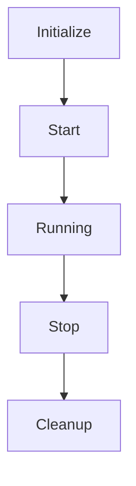

# Application Lifecycle and Request Flow

## Overview

The application follows a structured lifecycle for managing components and handling requests. This document outlines the key stages of the application lifecycle and the request-to-response flow.

## Component Lifecycle

1. **Initialize**: Component setup and dependency injection
2. **Start**: Begin processing and resource allocation
3. **Running**: Normal operation state
4. **Stop**: Graceful shutdown initiation
5. **Cleanup**: Resource release and cleanup

## Request-to-Response Flow

### Flow Components

1. **UnifiedMiddleware**
   - Centralized request processing
   - Context management
   - Error handling
   - Resource cleanup

2. **Request Context**
   - Request ID generation
   - Timing tracking
   - Correlation IDs
   - Request metadata

3. **Validation**
   - Content length checks
   - Content type validation
   - JSON schema validation
   - Field size limits

4. **Rate Limiting**
   - Request rate tracking
   - Quota enforcement
   - Client identification
   - Rate limit headers

5. **Authentication**
   - Token validation
   - Permission checks
   - Role-based access
   - Session management

6. **Route Handler**
   - Business logic
   - Service integration
   - Data processing
   - Response formatting

7. **Error Handling**
   - Error standardization
   - Status code mapping
   - Error context
   - Recovery actions

### Resource Management

The application ensures proper resource management through:

1. **Automatic Cleanup**
   - Connection pooling
   - File handle management
   - Memory optimization
   - Cache invalidation

2. **Error Recovery**
   - Circuit breaking
   - Retry mechanisms
   - Fallback strategies
   - Health checks

3. **Monitoring**
   - Performance metrics
   - Resource usage
   - Error tracking
   - Request tracing