# Conversation System Schema Design

## Overview

This document outlines the schema design for a flexible conversation system that supports multiple modalities, purposes, and AI roles. The system uses both Strapi (for structured data) and Weaviate (for semantic search capabilities).

## Core Schema Components

### 1. ConversationFlowConfiguration

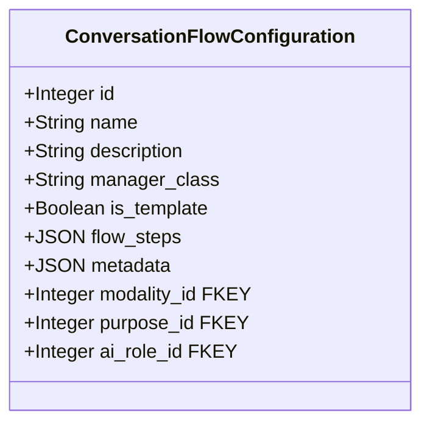

The `is_template` field indicates whether this configuration is a reusable template (true) or a specific instance (false). Templates can be used to create new flow instances with customized parameters.

### 2. FlowConfigurationComponent

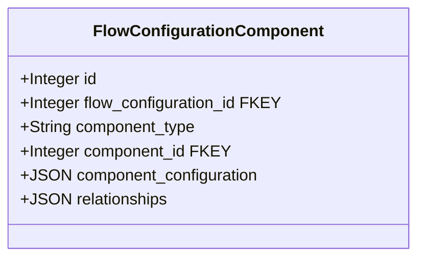

### 3. FlowTemplateCategory

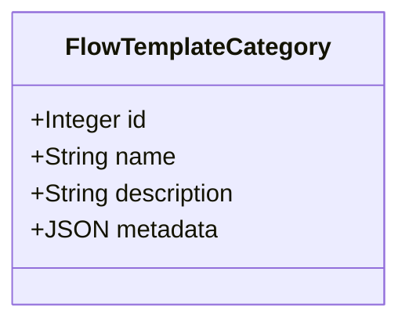

### 4. FlowTemplateVersion

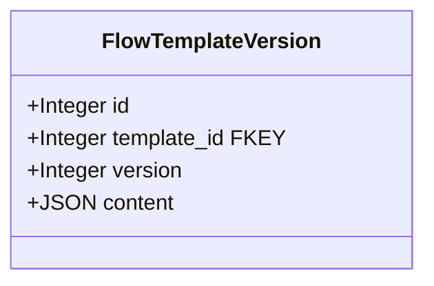

### 5. ContextDocumentType

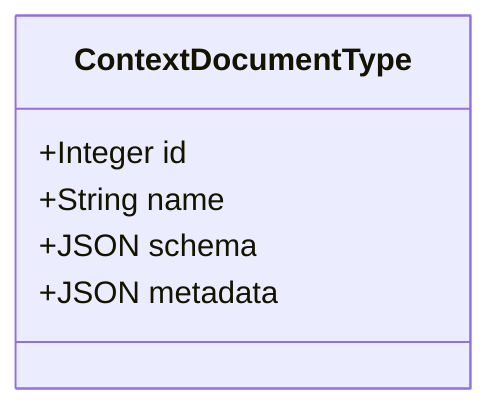

### 6. ContextDocument

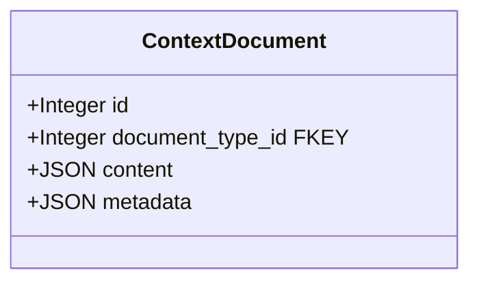

### 7. GenerationRuleTemplate

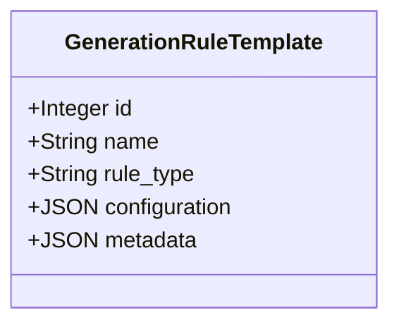

### 8. ConversationPurpose

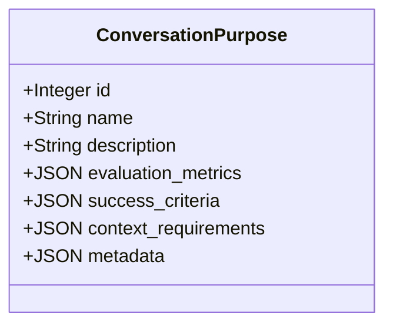

### 9. AIRole

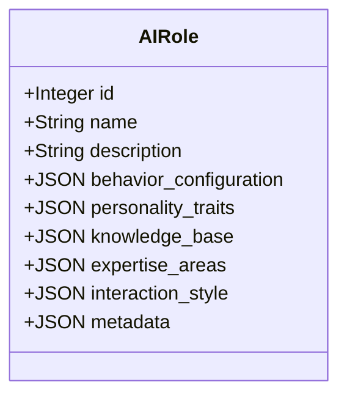


### 10. ConversationModality

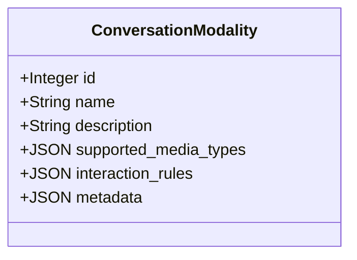

### 12. ConversationSession

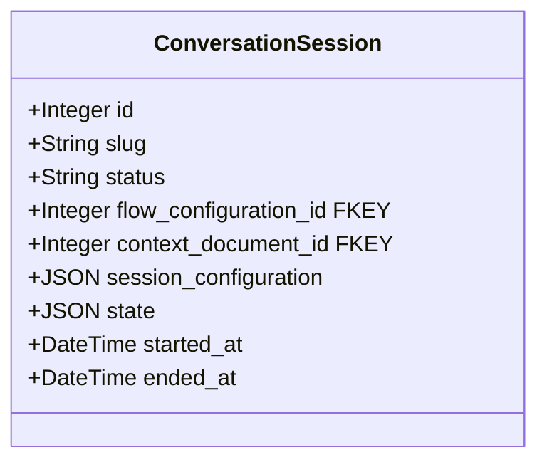

## Schema Relationships

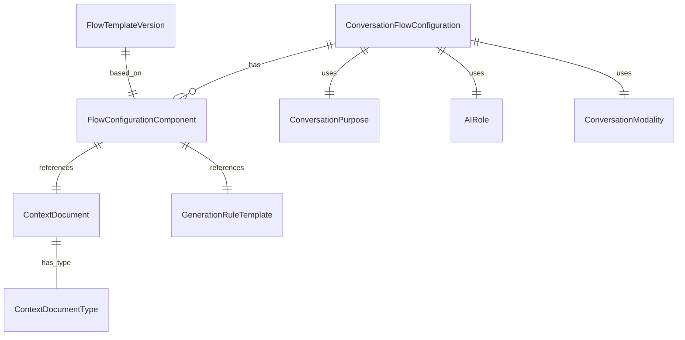

## Step Types and Formats

### 1. Message Step
```json
{
  "id": "step_id",
  "type": "message",
  "content": "Message text or template",
  "next_step": "next_step_id",
  "conditions": {
    "required_context": ["context_doc_1", "context_doc_2"],
    "timeout": 300
  },
  "metadata": {
    "format": "markdown",
    "variables": ["var1", "var2"]
  }
}
```
Used for displaying information or instructions to the user.

### 2. Input Step
```json
{
  "id": "step_id",
  "type": "input",
  "validation": {
    "type": "text|code|mixed",
    "text": {
      "min_length": 50,
      "max_length": 2000
    },
    "code": {
      "languages": ["python", "java"],
      "max_file_size": 100000
    }
  },
  "next_step": "next_step_id",
  "fallback": "fallback_step_id",
  "retry_attempts": 2,
  "timeout": 300
}
```
Used for collecting user input with validation rules.

### 3. Dynamic Generation Step
```json
{
  "id": "step_id",
  "type": "dynamic_generation",
  "component_refs": ["gen_comp_1", "gen_comp_2"],
  "next_step": "next_step_id",
  "generation_rules": {
    "type": "question|feedback|analysis",
    "context_sources": ["doc1", "doc2"],
    "parameters": {
      "temperature": 0.7,
      "max_tokens": 500
    }
  },
  "timeout": 300
}
```
Used for generating dynamic content based on context.

### 4. Analysis Step
```json
{
  "id": "step_id",
  "type": "analysis",
  "component_refs": ["analyzer_1"],
  "next_step": "next_step_id",
  "analysis_rules": {
    "metrics": ["metric1", "metric2"],
    "thresholds": {
      "metric1": 0.7,
      "metric2": 0.6
    }
  }
}
```
Used for analyzing user responses or system state.

### 5. Decision Step
```json
{
  "id": "step_id",
  "type": "decision",
  "conditions": [
    {
      "metric": "score",
      "operator": ">=",
      "value": 0.7,
      "next_step": "success_step"
    },
    {
      "metric": "score",
      "operator": "<",
      "value": 0.7,
      "next_step": "retry_step"
    }
  ],
  "default_step": "fallback_step"
}
```
Used for making flow control decisions based on conditions.

### 6. Feedback Step
```json
{
  "id": "step_id",
  "type": "feedback",
  "component_refs": ["feedback_gen_1"],
  "next_step": "next_step_id",
  "feedback_rules": {
    "style": "constructive|detailed|brief",
    "focus_areas": ["strengths", "improvements"],
    "technical_depth": "basic|intermediate|advanced"
  }
}
```
Used for providing feedback to the user.

## Use Case Examples

### 1. Technical Challenge Interview Flow

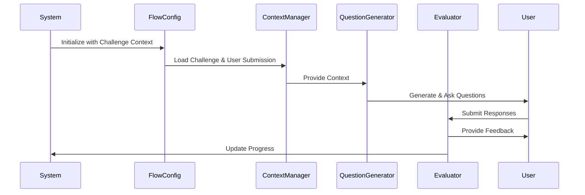

```json
// ConversationPurpose
{
  "id": "challenge_interview_purpose",
  "name": "Challenge-Based Interview",
  "description": "Interview users based on their challenge submissions",
  "evaluation_metrics": {
    "technical_understanding": {
      "weight": 0.4,
      "threshold": 0.7,
      "components": [
        {
          "name": "concept_grasp",
          "weight": 0.4,
          "threshold": 0.7
        },
        {
          "name": "implementation_understanding",
          "weight": 0.3,
          "threshold": 0.7
        },
        {
          "name": "problem_solving",
          "weight": 0.3,
          "threshold": 0.7
        }
      ]
    },
    "communication": {
      "weight": 0.3,
      "threshold": 0.6,
      "components": [
        {
          "name": "clarity",
          "weight": 0.5,
          "threshold": 0.6
        },
        {
          "name": "technical_depth",
          "weight": 0.5,
          "threshold": 0.6
        }
      ]
    },
    "practical_application": {
      "weight": 0.3,
      "threshold": 0.7,
      "components": [
        {
          "name": "code_quality",
          "weight": 0.4,
          "threshold": 0.7
        },
        {
          "name": "best_practices",
          "weight": 0.3,
          "threshold": 0.7
        },
        {
          "name": "scalability",
          "weight": 0.3,
          "threshold": 0.7
        }
      ]
    }
  },
  "success_criteria": {
    "minimum_score": 0.7,
    "required_components": ["technical_understanding", "communication", "practical_application"],
    "time_constraints": {
      "max_duration": 3600,
      "warning_threshold": 3000
    }
  },
  "context_requirements": {
    "required_documents": ["challenge_description", "user_submission"],
    "optional_documents": ["reference_solutions", "learning_outcomes"]
  }
}

// AIRole
{
  "id": "challenge_interviewer",
  "name": "Challenge Interviewer",
  "description": "AI interviewer for challenge-based interviews",
  "role_type": "interviewer",
  "role_configuration": {
    "response_patterns": {
      "questioning": "probing",
      "feedback": "constructive",
      "guidance": "minimal"
    },
    "adaptation_rules": {
      "difficulty_adjustment": "based_on_response",
      "hint_provision": "progressive",
      "time_management": "strict"
    },
    "personality_traits": {
      "professionalism": 0.9,
      "technical_expertise": 0.95,
      "empathy": 0.7,
      "patience": 0.8
    },
    "knowledge_base": {
      "domains": ["software_development", "system_design", "algorithms"],
      "depth": "expert",
      "specializations": ["backend_development", "cloud_architecture"]
    },
    "expertise_areas": {
      "primary": ["system_design", "algorithms"],
      "secondary": ["software_architecture", "performance_optimization"]
    },
    "interaction_style": {
      "tone": "professional",
      "formality": "high",
      "technical_level": "advanced",
      "feedback_style": "detailed"
    }
  }
}

// ConversationModality
{
  "id": "challenge_interview_modality",
  "name": "Challenge Interview",
  "description": "Modality for challenge-based interviews",
  "supported_media_types": {
    "text": {
      "formats": ["plain", "markdown", "code"],
      "max_length": 5000,
      "allowed_attachments": ["code_snippets", "diagrams"]
    },
    "code": {
      "languages": ["python", "java", "javascript"],
      "max_file_size": 100000,
      "validation_rules": ["syntax_check", "style_check"]
    }
  },
  "interaction_rules": {
    "turn_based": true,
    "time_limits": {
      "per_turn": 300,
      "total": 3600
    },
    "content_validation": {
      "code_submission": true,
      "diagram_submission": true,
      "text_explanation": true
    }
  }
}

// ConversationFlowConfiguration
{
  "id": "challenge_interview_flow_1",
  "name": "Challenge-Based Interview Flow",
  "description": "Flow for interviewing users based on their challenge submissions",
  "is_template": true,
  "manager_class": "ChallengeInterviewManager",
  "purpose_id": "challenge_interview_purpose",
  "ai_role_id": "challenge_interviewer",
  "modality_id": "challenge_interview_modality",
  "flow_steps": {
    "steps": [
      {
        "id": "intro",
        "type": "message",
        "content": "Welcome to your challenge-based interview. I'll ask you questions about your submission and the concepts involved.",
        "next_step": "context_analysis",
        "conditions": {
          "required_context": ["challenge_description", "user_submission"]
        }
      },
      {
        "id": "context_analysis",
        "type": "analysis",
        "component_refs": ["context_analyzer"],
        "next_step": "question_generation",
        "analysis_rules": {
          "metrics": ["submission_quality", "technical_depth"],
          "thresholds": {
            "submission_quality": 0.6,
            "technical_depth": 0.6
          }
        }
      },
      {
        "id": "question_generation",
        "type": "dynamic_generation",
        "component_refs": ["question_generator"],
        "next_step": "user_response",
        "generation_rules": {
          "type": "question",
          "context_sources": ["challenge_description", "user_submission", "analysis_results"],
          "parameters": {
            "temperature": 0.7,
            "max_tokens": 500
          }
        }
      },
      {
        "id": "user_response",
        "type": "input",
        "validation": {
          "type": "mixed",
          "text": {
            "min_length": 50,
            "max_length": 2000
          },
          "code": {
            "languages": ["python", "java", "javascript"],
            "max_file_size": 100000
          }
        },
        "next_step": "evaluation",
        "fallback": "timeout_handling",
        "retry_attempts": 2
      },
      {
        "id": "evaluation",
        "type": "analysis",
        "component_refs": ["evaluator"],
        "next_step": "feedback",
        "analysis_rules": {
          "metrics": ["technical_understanding", "communication", "practical_application"],
          "thresholds": {
            "technical_understanding": 0.7,
            "communication": 0.6,
            "practical_application": 0.7
          }
        }
      },
      {
        "id": "feedback",
        "type": "feedback",
        "component_refs": ["feedback_generator"],
        "next_step": "decision",
        "feedback_rules": {
          "style": "constructive",
          "focus_areas": ["strengths", "improvements"],
          "technical_depth": "detailed"
        }
      },
      {
        "id": "decision",
        "type": "decision",
        "conditions": [
          {
            "metric": "technical_understanding",
            "operator": ">=",
            "value": 0.7,
            "next_step": "next_question"
          },
          {
            "metric": "technical_understanding",
            "operator": "<",
            "value": 0.7,
            "next_step": "clarification"
          }
        ],
        "default_step": "completion"
      },
      {
        "id": "clarification",
        "type": "dynamic_generation",
        "component_refs": ["clarification_generator"],
        "next_step": "user_response",
        "generation_rules": {
          "type": "clarification",
          "context_sources": ["user_response", "evaluation_results"],
          "parameters": {
            "temperature": 0.7,
            "max_tokens": 300
          }
        }
      },
      {
        "id": "next_question",
        "type": "decision",
        "conditions": [
          {
            "metric": "questions_asked",
            "operator": "<",
            "value": 5,
            "next_step": "question_generation"
          }
        ],
        "default_step": "completion"
      }
    ],
    "transitions": {
      "intro": ["context_analysis"],
      "context_analysis": ["question_generation"],
      "question_generation": ["user_response"],
      "user_response": ["evaluation", "timeout_handling"],
      "evaluation": ["feedback"],
      "feedback": ["decision"],
      "decision": ["next_question", "clarification", "completion"],
      "clarification": ["user_response"],
      "next_question": ["question_generation", "completion"]
    },
    "timeout_handling": {
      "max_attempts": 2,
      "grace_period": 300,
      "fallback_action": "proceed_to_evaluation"
    }
  }
}

// GenerationRuleTemplate (Question Generator)
{
  "id": "challenge_question_gen_1",
  "name": "Challenge Question Generator",
  "rule_type": "question_generation",
  "configuration": {
    "generation_parameters": {
      "temperature": 0.7,
      "max_tokens": 500,
      "top_p": 0.9
    },
    "question_rules": {
      "types": {
        "concept_understanding": {
          "weight": 0.3,
          "difficulty_levels": ["easy", "medium", "hard"],
          "focus_areas": ["core_concepts", "implementation_details"],
          "time_limit": 300
        },
        "implementation_analysis": {
          "weight": 0.4,
          "difficulty_levels": ["easy", "medium", "hard"],
          "focus_areas": ["code_quality", "design_choices"],
          "time_limit": 600
        },
        "problem_solving": {
          "weight": 0.3,
          "difficulty_levels": ["easy", "medium", "hard"],
          "focus_areas": ["optimization", "tradeoffs"],
          "time_limit": 600
        }
      },
      "distribution": {
        "total_questions": {
          "min": 3,
          "max": 5
        },
        "type_mix": {
          "concept_understanding": {
            "min": 1,
            "max": 2
          },
          "implementation_analysis": {
            "min": 1,
            "max": 2
          },
          "problem_solving": {
            "min": 1,
            "max": 2
          }
        },
        "difficulty_progression": {
          "start": "medium",
          "progression": "adaptive",
          "based_on": ["response_quality", "time_taken"]
        }
      },
      "ordering": {
        "strategy": "mixed",
        "rules": [
          "start_with_concept_questions",
          "alternate_question_types",
          "adapt_based_on_performance"
        ]
      }
    },
    "context_usage": {
      "challenge_description": {
        "required": true,
        "usage": ["learning_outcomes", "evaluation_criteria"]
      },
      "user_submission": {
        "required": true,
        "usage": ["implementation_details", "design_choices"]
      },
      "previous_questions": {
        "required": false,
        "usage": ["avoid_repetition", "progressive_difficulty"]
      }
    },
    "validation_rules": {
      "content_quality": {
        "clarity": 0.8,
        "relevance": 0.9,
        "technical_depth": 0.7
      },
      "answer_verification": {
        "required": true,
        "methods": ["model_checking", "reference_solutions"]
      }
    }
  }
}
```

[Additional use cases and examples would follow the same pattern...]

## Implementation Notes

1. All schemas include a `metadata` field for extensibility
2. Timestamps are stored in UTC
3. JSON fields are used for flexible configuration and state management
4. Relationships are maintained through component references
5. Weaviate schemas include vector embeddings for semantic search
6. Conversation managers are dynamically loaded based on the `manager_class` field
7. Message analysis is performed per message, considering the evaluation criteria
8. Session observers track overall session metrics and progress
9. Flow configurations can be templates or custom instances
10. Message diarization is tracked using stream_id

## Key Design Considerations

1. **Component-Based Architecture**
   - All conversation aspects are configured through components
   - Components can be mixed and matched for different flows
   - Clear separation of concerns between different component types

2. **Template Management**
   - Templates are categorized for easy discovery
   - Version control for template evolution
   - Custom configurations can be created from templates

3. **Context Management**
   - Multiple context sources through components
   - Context combination rules
   - Context-based adaptation

4. **Evaluation System**
   - Comprehensive metrics for different aspects
   - Weighted scoring system
   - Detailed feedback generation

5. **Flexibility and Extensibility**
   - New component types can be added
   - Custom evaluation criteria
   - Adaptive difficulty levels