# Detailed Schema Relationships

This document provides comprehensive visual representations of all schema entities and their relationships using Mermaid diagrams.

## Individual Schema Entities

### ConversationFlowConfiguration

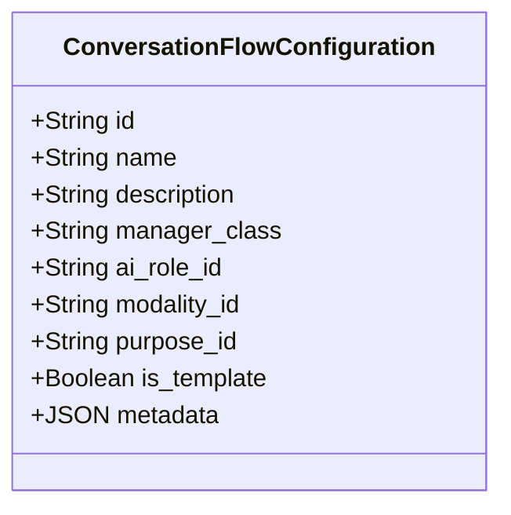

### FlowConfigurationComponent

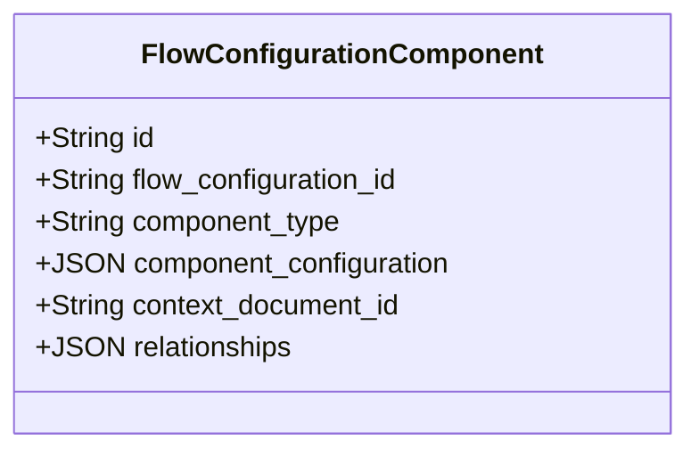

### ContextDocumentType

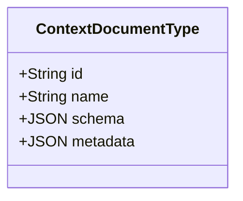

### ContextDocument

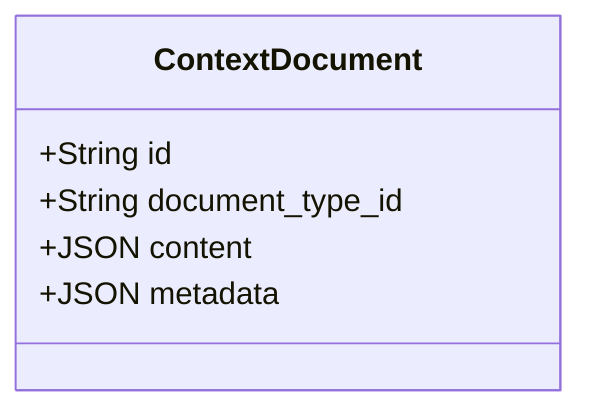

### ConversationModality

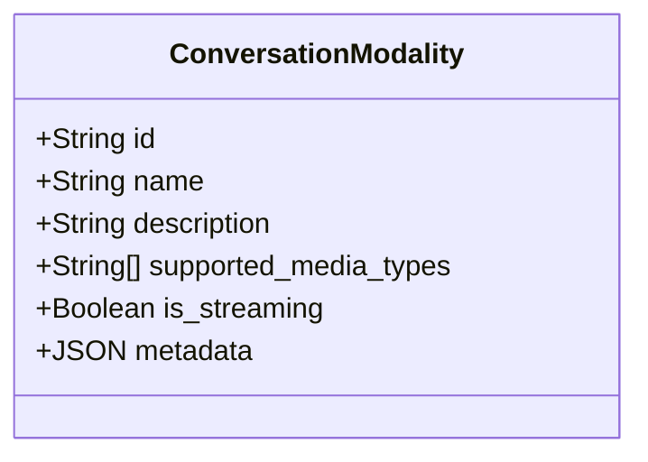

### ConversationPurpose

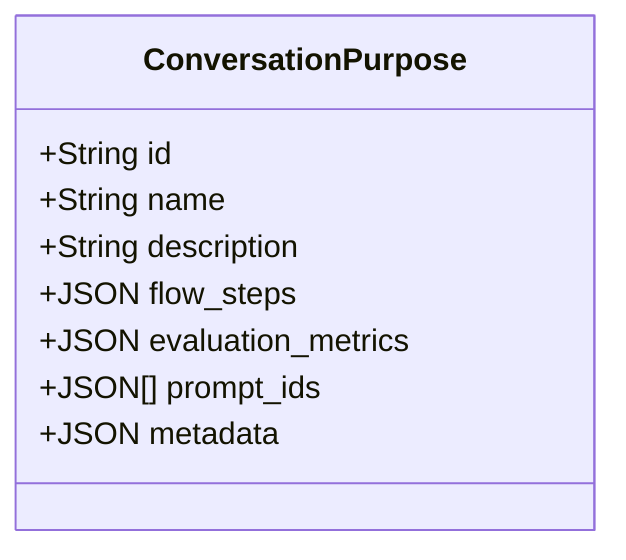

### AIRole

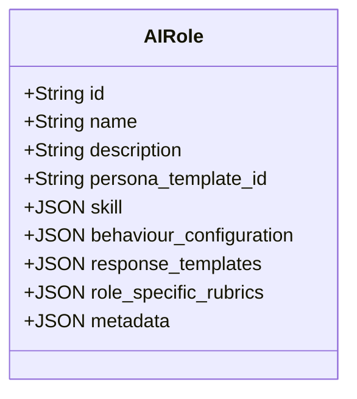

### AIPersonaTemplate

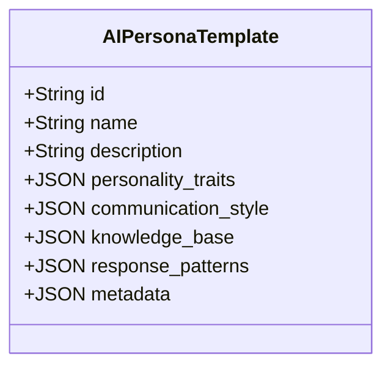

### ConversationSession

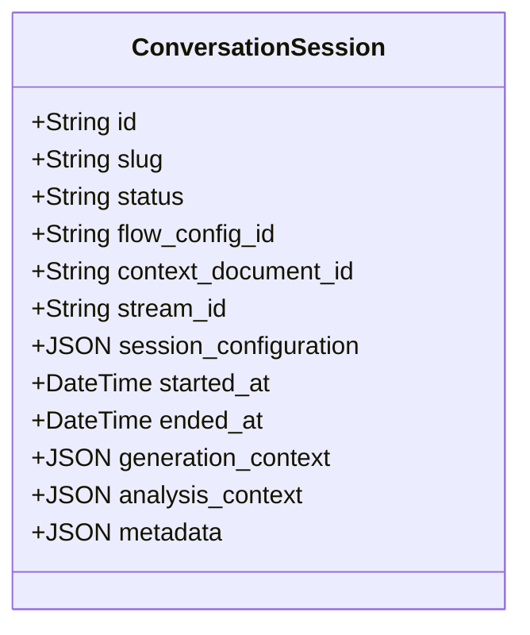

### ConversationMessage

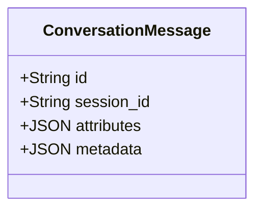

### MessageAnalysis

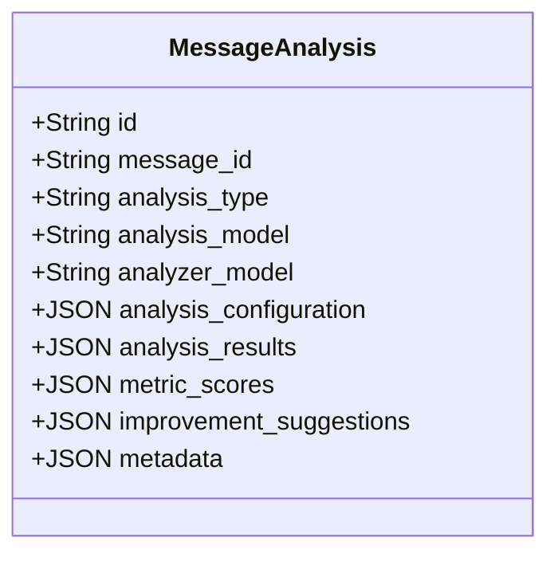

### SessionObserver

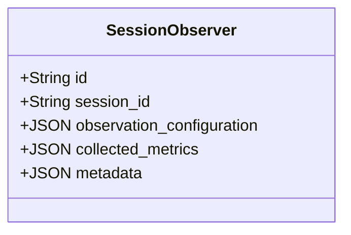

## Complete Entity Relationships

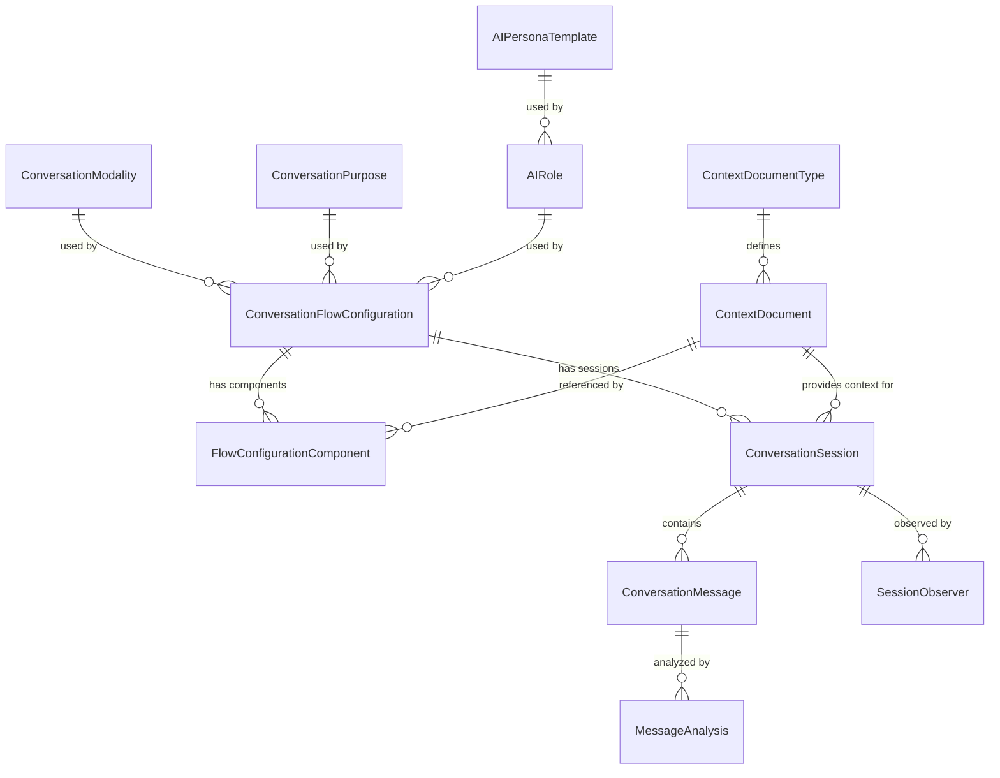

## Detailed Relationship Descriptions

### One-to-Many Relationships

1. **ConversationFlowConfiguration to FlowConfigurationComponent**
   - One flow configuration can have many components
   - Each component belongs to exactly one flow configuration

2. **ConversationFlowConfiguration to ConversationSession**
   - One flow configuration can be used by many conversation sessions
   - Each session uses exactly one flow configuration

3. **ConversationModality to ConversationFlowConfiguration**
   - One modality can be used by many flow configurations
   - Each flow configuration uses exactly one modality

4. **ConversationPurpose to ConversationFlowConfiguration**
   - One purpose can be used by many flow configurations
   - Each flow configuration has exactly one purpose

5. **AIRole to ConversationFlowConfiguration**
   - One AI role can be used by many flow configurations
   - Each flow configuration uses exactly one AI role

6. **AIPersonaTemplate to AIRole**
   - One persona template can be used by many AI roles
   - Each AI role uses exactly one persona template

7. **ContextDocumentType to ContextDocument**
   - One document type can define many context documents
   - Each context document has exactly one document type

8. **ContextDocument to FlowConfigurationComponent**
   - One context document can be referenced by many flow components
   - Each component can reference exactly one context document

9. **ContextDocument to ConversationSession**
   - One context document can provide context for many sessions
   - Each session can have exactly one context document

10. **ConversationSession to ConversationMessage**
    - One session can contain many messages
    - Each message belongs to exactly one session

11. **ConversationSession to SessionObserver**
    - One session can have many observers
    - Each observer is linked to exactly one session

12. **ConversationMessage to MessageAnalysis**
    - One message can have many analyses
    - Each analysis is for exactly one message

## Component Relationships and Dependencies

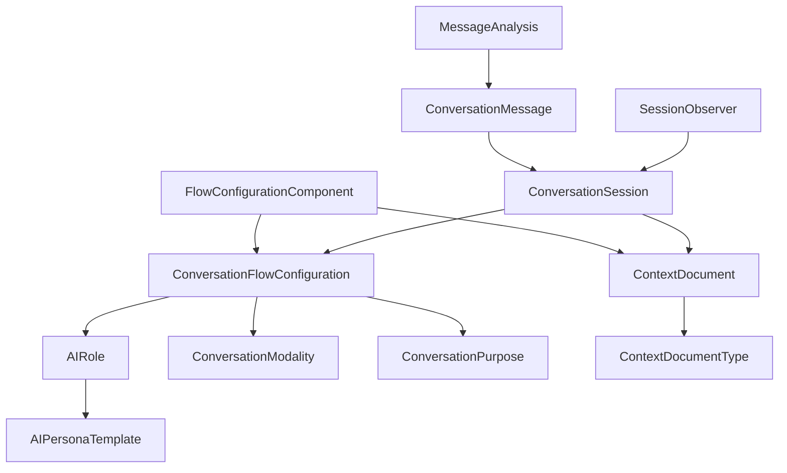

## Data Flow Overview

```mermaid
sequenceDiagram
    participant User
    participant Session as ConversationSession
    participant FlowConfig as ConversationFlowConfiguration
    participant Message as ConversationMessage
    participant Analysis as MessageAnalysis
    participant Observer as SessionObserver
    participant Context as ContextDocument
    
    User->>+Session: Start Session
    Session->>+FlowConfig: Load Configuration
    FlowConfig->>-Session: Configuration Loaded
    Session->>+Context: Load Context
    Context->>-Session: Context Loaded
    Session->>-User: Session Ready
    
    User->>+Message: Send Message
    Message->>Session: Store Message
    Message->>+Analysis: Analyze Message
    Analysis->>-Message: Analysis Complete
    Session->>+Observer: Update Metrics
    Observer->>-Session: Metrics Updated
    Session->>-User: Response
```

This comprehensive schema design supports the complex requirements of a conversation system with:
- Templates and custom configurations
- Multiple modalities (text, audio)
- Various purposes (interviews, counseling, assessment)
- Different AI roles (interviewer, counselor, tutor)
- Context-aware conversations
- Detailed message analysis
- Session observation and metrics 